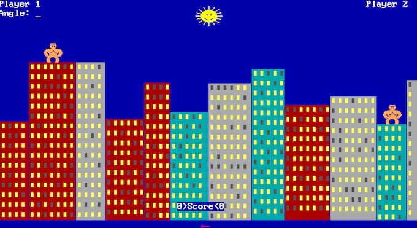
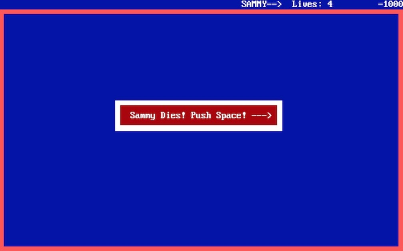
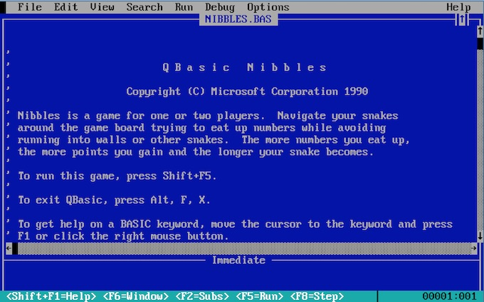
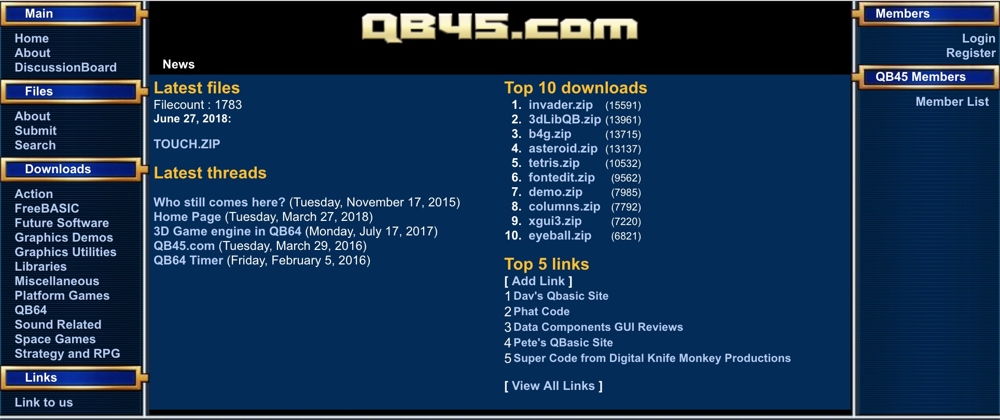
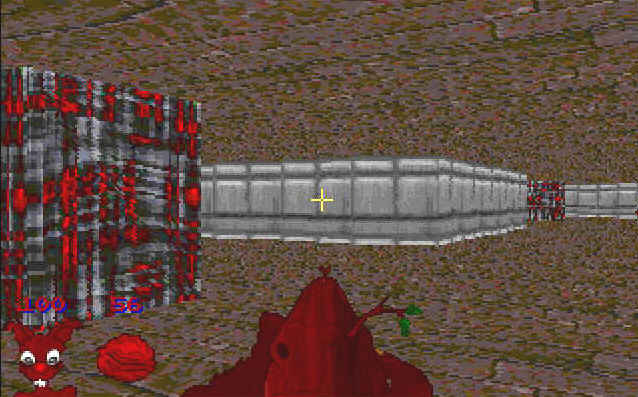

<%
	meta("../../meta.json")
	meta()
	const path = require('path');
	url = url + "/posts/" + path.basename(path.dirname(outputPath)) + "/";
%>
<%= render("../../_partials/post-header.html", { title, image, url }) %>

Three years ago, we had a son. As he grows bigger and smarter, I wonder how I can best introduce him to my favorite pastime: programming. Naturally, being the most ["NIH" dad](https://en.wikipedia.org/wiki/Not_invented_here), I will build my own programming environment for kids. I've previously built programming languages. What could go wrong?

There is a lot of research on how to teach programming. However, having conducted user studies in related areas myself and having taught both kids and adults, I feel that the causes and effects within a learning environment are not entirely scientifically quantifiable. What I do know is how I learned to program, and many of my peers have similar stories.

I thus work under the following (shaky) assumptions: by analyzing my own history, I can identify key elements that helped me successfully learn to program. Since my peers share similar stories, the key elements I find might be applicable not only to myself but to a larger group of people.

It's not my plan to ignore the literature, but I want to augment it with my own experience.

### Saving up

I'd been saving up for a 486 DX 2 with 40MHz, 8MB of RAM, and a whopping 50MB HDD. As a naive 10-year-old in the countryside, without the internet, I had no way of knowing the real cost of a PC. It wasn't obvious to me that my meager savings would only buy a pocket calculator. My parents were saving up in secret as well. Every week, I’d ask my mum if I had saved enough. After two years of this routine, mum and dad solemnly announced, "It is time!" They strapped me into the car and took me to the (now defunct) computer retailer Vobis in the big city. My parents let me put the money on the counter. I completed my first big transaction at the grand old age of 12.

That was in 1995. Years later, I realized that my parents had covered about 99.99% of the asking price. That explained our somewhat rustic, short, annual vacations. It also shed light on why dad sometimes came home late: he’d been earning extra cash fixing cars and doing construction work after his regular job. The damn machine cost my mum and dad a considerable amount of their annual income. I can’t express in words how much this meant and will forever mean to me.

### Playful beginnings

So there I was, machine plugged in, display and keyboard connected. What to do? Play games, of course! Naturally, I couldn't afford to buy them. A relative had connections to a super secret underground channel that'd copy floppies for the cost of a lollipop. I had a lot of floppies, all with labels in terrible handwriting: "Prince of Persia", "DOOM", "Dune II", or "Monkey Island".

Getting games to run in MS-DOS was often hard work (shout-out to my peeps growing up with '80s equipment. I know you had it rougher. No, I'm not getting off your lawn). `CONFIG.SYS` and `AUTOEXEC.BAT` had to be infused with magic spells to go beyond 640kB of RAM. Crashes, and more annoyingly, endless hangs with super loud beeps were a daily occurrence. The machine came with a manual for MS-DOS from which I could piece together the basics. My uncle would show me some tricks of the trade and provide me with the aforementioned magic spells.

Within a year, I could afford a mouse and a double-speed CD-ROM drive. Installing that CD-ROM drive was one of the most terrifying experiences of my life. The prospect of seeing this expensive machine go up in flames paralyzed me. If I had known of my parents' sacrifices, I would have been even more scared to death. It took me a week to take the drive out of its anti-static wrapper. I'd touch the radiator, touch the drive, then put it back in. Eventually, my dad got fed up. "Son, if you don't put it in there, I'm going to put it in there. Do you want a car mechanic to handle your computer?" Under tears (not kidding), I got myself a screwdriver and went to work. I'm happy to report that everything went better than expected. Otherwise, you might not be reading these lines. Thanks, Dad!

<u>Unconsciously, I learned how to use a PC.</u> Not because I wanted to become a programmer, but so I could play all those amazing games.

### Leveling up


<figcaption>GORILLA.BAS, wherein we learend, that bananas can explode.</figcaption>

The first year of owning a PC opened up an infinite number of new worlds to me. PC games were fantastic in their diversity and quality. Sometimes, they even managed to convey great stories. There were jaw-droppers like DOOM and Duke Nukem that hit you with intense action, story be damned. There were zen-like experiences with Myst or Lost Eden. The absurd humor of Day of the Tentacle or Sam and Max would make you laugh out loud. Privateer let you explore the galaxy on your own terms, while Master of Orion had you burn it all down. Slowly but surely, two questions formed in my curious mind: How did they do this? How can I do this?

Coincidentally, my school got its first PCs and (limited) internet access. There were quite a few sites dedicated to game programming, but everything was in English. At the time, that was too much of a <u>language barrier</u> for me. I had to find the answers to my questions elsewhere. This marked the beginning of my transition from consuming German media to consuming mostly English media. Not because I had an interest in the language or using it abroad, but because it was the only way to learn how to write my own games.

Serendipitously, as internet searches were back then, I ended up on a site archiving listings of games written in various BASIC dialects. The listings were collected and digitized from computer magazines I could not buy in Austria. There wasn't much in the way of explanation about what it all meant, but it did include instructions on how to run the games. One such set of instructions explained that the game could be run with a program called QBasic included with MS-DOS 6.22. That's what I ran at home! I copied all the QBasic listings onto a floppy disk and waited for the school day to end.

Back home, I booted my machine, copied the contents of the floppy to the hard drive, and began searching for the mysterious `QBASIC.EXE` mentioned in the instructions. And so it began.

```bash
C:\GAMES\QBASIC.EXE /RUN NIBBLES.BAS
```

### Helpful explorations

Running this magic spell resulted in <u>instant gratification</u>. The command would launch the game [Nibbles](https://www.dosgamesarchive.com/play/nibbles/), an early variant of "Snake," which we all enjoyed on our Nokia phones.


<figcaption>Poor Sammy.</figcaption>

After defeating enough Sammies, I pressed `CTRL + BREAK`, as instructed, and found myself in one of the most iconic programming tools of the nineties: QBasic.


<figcaption>Glory. I had the German version.</figcaption>

The program <u>felt immediately familiar</u>. The `File` and `Edit` menu items, the editing area, and scrollbars were the same as in `EDIT.EXE`, the text editor I used to modify `AUTOEXEC.BAT` and `CONFIG.SYS`. Other parts of the program were more mysterious.

Microsoft provided some initial hints on the first screen: `SHIFT + F5` to restart the game and `F1` for information about any keyword under the cursor. The same information and more was repeated in the bottom bar, which changed depending on the context. <u>A great onboarding experience</u>.

Scrolling through the source code, I was surprised by its descriptiveness. It seemed like something I could learn with practice. What I later understood as variable names were words immediately associated with aspects of the game I just played.

```vbnet
DO
   PlayNibbles NumPlayers, speed, diff$
LOOP WHILE StillWantsToPlay
```

`NumPlayers` I knew from the title screen that asked me to enter a number. The same for `speed`. `diff$` was unclear. But `PlayNibbles` and `StillWantsToPlay` combined with `DO LOOP WHILE` sort of made sense (after consulting a dictionary to look up 'loop' and other words).

Of course, nothing really made sense at this point. I did as Microsoft suggested, moved my cursor on top of `LOOP`, and pressed `F1`.

<video controls loop src="media/f1.mp4" type="video/mp4">
	Sorry, your browser does not support the video tag.
</video>

QBasic came with a <u>full-blown contextual help system</u>. Every keyword and command from the standard library had its own help page. The help pages included examples and were <u>worded in a very beginner-friendly way</u>. When viewing the help for a token, QBasic didn't just throw you into a separate full-screen; it kept the editor on screen, which meant there was <u>no context switching</u>.

All the examples given on the help pages were <u>tiny, self-contained programs</u> that you could copy and paste into a blank `.BAS` file, run, and modify.

<video controls loop src="media/examples.mp4" type="video/mp4">
	Sorry, your browser does not support the video tag.
</video>

I remember spending two nights playing with `LINE`, then discovering `CIRCLE` and friends. The simplicity of the examples and the <u>lack of ceremony</u> to get them running made for <u>fast and instantly rewarding exploration</u>.

The integrated help system did not include a beginner's guide. Fortunately, the listings I downloaded earlier contained a <u>tutorial series of small QBasic programs</u> that iteratively introduced basic programming concepts like variables, data types, control flow, and procedures. I wished I still had the source code.

Instead of an accompanying website, the <u>tutorial text was part of the source code</u>. Some comments would ask you to modify the line following them. Later parts of the tutorial were incomplete, forcing you to apply what you'd learned to <u>solve small challenges</u>. The comments were in English, and my German-English dictionary became my best friend, though it couldn't help me decipher unfamiliar grammar constructs.

Due to my prior PC experience, I was already a somewhat proficient keyboard user. Still, syntax errors were common. QBasic's syntax was line-based. Every time you hit `ENTER`, the completed line would be checked by the parser, and you would get <u>immediate feedback on any syntax errors</u>.

<video controls loop src="media/syntaxerror.mp4" type="video/mp4">
	Sorry, your browser does not support the video tag.
</video>

As my knowledge grew, so did my programs. With bigger programs came bugs that were hard to reason about just by looking at the code. QBasic included a <u>capable debugger</u> that allowed setting breakpoints and evaluating expressions when the program was paused. QuickBasic, QBasic's big brother, let you create up to eight watchpoints with arbitrary expressions and set conditional breakpoints. You could also modify the running program. All this was packaged in the simplest possible UI. The following video shows QuickBasic instead of QBasic.

<video controls loop src="media/debugger.mp4" type="video/mp4">
	Sorry, your browser does not support the video tag.
</video>

Another crucial aspect of creating bigger programs was <u>code navigation</u>. QBasic had an interesting solution: a single `.BAS` file constituted a module. All code outside a procedure was module-level code. When opening a .BAS file, QBasic would only show the module-level code. Procedures were shown on their own screen. QBasic also had some rudimentary <u>search and refactoring functionality</u> in the form of text replacement.

<video controls loop src="media/navigation.mp4" type="video/mp4">
	Sorry, your browser does not support the video tag.
</video>

Six months after opening QBasic for the first time, I became proficient enough to write little text adventures and simple graphical games. Whenever a friend came over, I'd proudly show off my creations. My friends, used to higher-quality games on their GameBoy, SNES, and other devices, were hard to impress. Why couldn't they see the brilliance of my little oeuvres?

I also couldn't convince any of them to learn programming. Only one friend had a PC, but he preferred playing games. While I offered to teach the others at my place, the prospect of spending time in front of a computer and typing what must have seemed like hieroglyphs didn't appeal to them. I felt alone. Worse, I hit a knowledge ceiling.

### Making friends
Programming is not inherently social. Yet, I longed to share my thoughts and work with like-minded people. At the end of 1997, when I was 14, my parents fulfilled another long-time wish: my first guitar. It was the cheapest Spanish concert guitar money could buy, but it was mine! My parents had already spent money on recorder lessons for my sister. Our deal was that they'd buy me a guitar, on the condition that I had to learn to play it without taking lessons. Challenge accepted.

My circle of friends included older peers who were proficient guitar players and happy to mentor me. I finally had people to hang out with, learn from, and share my work with—something programming couldn't offer me. I would occasionally write the odd little program, but my focus shifted almost entirely toward music.

This changed when I entered 5th grade at the gymnasium I attended (somewhat like high school, but you stay until you are 18). We had to choose electives that semester. I signed up for computer science, which turned out to be about Microsoft Office. I told my teacher I already knew all about Office (I didn't) and asked if I could use the time to browse the internet for programming information instead. I was lucky; my teacher was amazing.

She asked me to bring some of my programs to prove I actually knew how to code. Excited, I copied my best creations (a star field simulator and a graphical text adventure) to a floppy and showed them to her before the next lecture. She was blown away and allowed me to essentially skip her class and do whatever I wanted. In addition, she'd give me a key to the IT lab so I could use the computers whenever I had downtime at school. Jackpot.

Invigorated, I hit this new site called [AltaVista](https://en.wikipedia.org/wiki/AltaVista) I had heard about. A big improvement on the old site directories I used to frequent! My head exploded when the first search result for "qbasic games" showed a seemingly unending list of websites and forums, chock-full of source code, programming tips, and most importantly, people.


<figcaption>My 3dLibQB is still second place! The ZIP file is corrupted, you can extract it with jar xzf 3dLibQB.zip.</figcaption>

Feeling proficient enough with my English skills, I signed up for what appeared to be the biggest of all the forums, qb45.com. (This is a partial copy of the old site; sadly, both the download section and the forums no longer contain much from that time). I also submitted my best code for others to enjoy and dissect.

I had finally found a place of like-minded people and a wealth of new information that let me break through my knowledge ceiling. <u>Sharing and getting feedback on code</u> was a fantastic way to improve and learn new concepts. After a while, I started <u>helping others</u> on the forum, which in turn helped me better organize my own thoughts. I also had the good fortune of becoming friends with insanely talented individuals like [Ali Mosavian](https://twitter.com/alimosavian) and Andre Victor (who would later create [FreeBASIC](https://en.wikipedia.org/wiki/FreeBASIC)). Ali introduced me to the wonderful world of assembly programming, an entirely new Pandora's box to keep me up at night.


<figcaption>Avert your eyes, for I have brought affine texture mapping.</figcaption>

The <u>internet community</u> surrounding QBasic and MS-DOS game programming was thriving at the end of the 90s. There was a seemingly unending influx of newcomers, eager to join the ranks of the old guard. And the old guard, even those now working with different technologies for their new projects, still stuck around to show beginners the ropes. People were <u>encouraged to write about their findings</u>, which led to an immense archive of knowledge. You can still find many of these articles on [Phat Code](http://www.phatcode.net/articles.php).

In 2003, I started my brief university career, exposing me to new ideas, including functional programming, compiler engineering, and more theoretical aspects of computing. I wasn't fully formed as a programmer yet, but my <u>exposure to many low-level aspects of computing</u>, forced on me by the sluggishness of QBasic, as well as working on mid-sized projects, gave me a great foundation to build on. While I moved on to new things and technologies, I stayed connected to the community in some form or another until 2006, the year I got my first job. The community somewhat dispersed or found a new home in FreeBASIC.

I was extremely lucky to live through my formative years at the end of the 90s. But I was even luckier to have all these supportive people in my life, from my loving parents to my teacher and even random strangers on the internet who ended up becoming friends for life. I hope I can pay it back in kind.

### So what's next?
I've spent the past two years working on fun side projects in the evenings, as time permits. I'll write about them when I can.

These projects were either geared towards the [public good](https://www.wired.com/story/heisse-preise-food-prices/) or [public entertainment](https://leitkulturomat.marioslab.io/). They aren't quite relevant to my son's growth and learning.

Our son is 3 years old now. That should give me ample time to develop something workable based on the above insights. It's not the first time I've tried this, but now I have the proper motivation.

Discuss this post on [Twitter](https://x.com/badlogicgames/status/1812567575353610536) or [Mastodon](https://mastodon.gamedev.place/@badlogic/112786459075397204).

<%= render("../../_partials/post-footer.html") %>