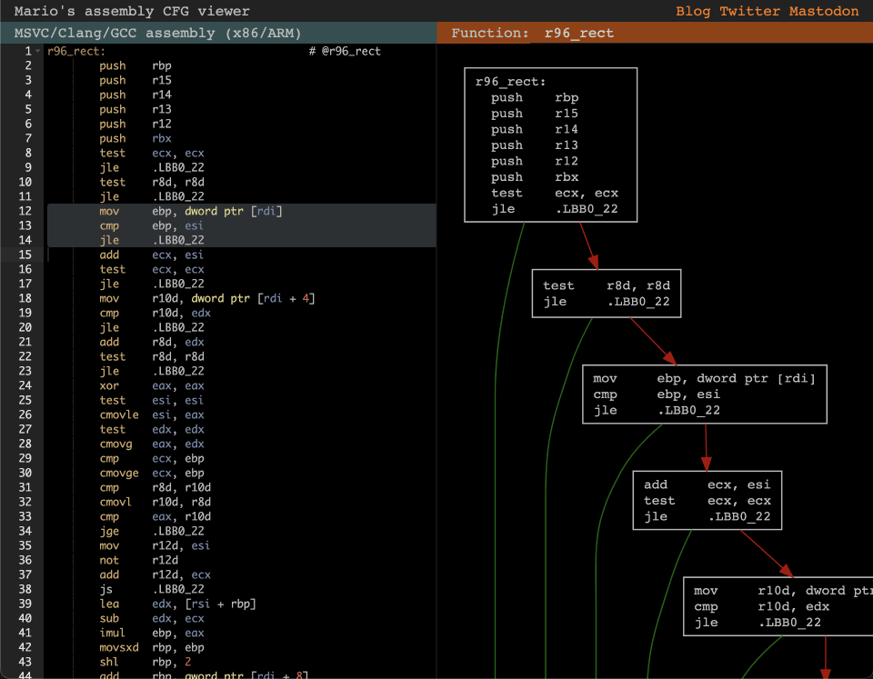
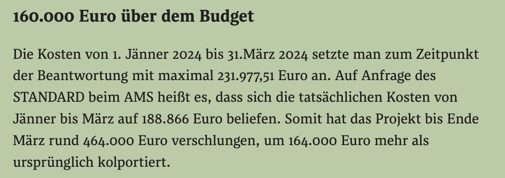
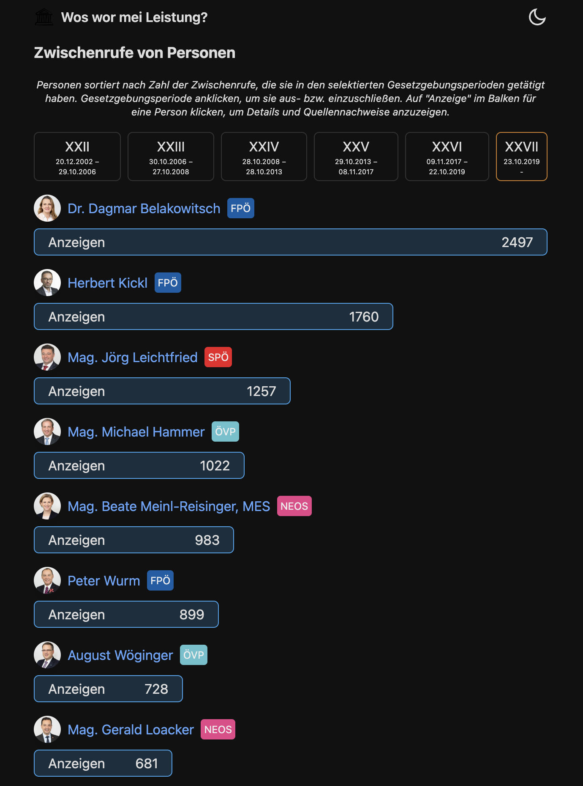

<%
	meta("../../meta.json")
	meta()
	const path = require('path');
	url = url + "/posts/" + path.basename(path.dirname(outputPath)) + "/";
%>
<%= render("../../_partials/post-header.html", { title, image, url }) %>

[Christian Cito](https://x.com/chrcit) wrote [2023 Year in Review](https://www.chrcit.com/articles/2023-year-in-review) a while ago. He's an impressive fellow and a member of our group of naive computer kids who thought they could change the world by building grocery price tracking and comparison platforms to counteract price inflation. More on that later.

I don't actually know his age, but given how little I understand his memes, my guess is that he's about 25 years younger than me. He keeps churning out project after project, both commercial and for the public good, without fitting the stereotype of a basement dweller or an insufferable start-up hustler.

His year in review got me thinking about what my own would look like.

I've been part of the open-source movement since 2009. As I write this, I actually have to press `CMD +` to increase the font size in my editor. That's how old I am.

I've produced and published many projects over the years, some of which could be considered "big" in the software world. Those projects are boring for regular, non-tech folks.

Starting in 2022, my work shifted towards being more accessible to non-nerds. I blame my now 3-year-old, who somehow manages to replace some of my old man grumpiness with a desire to do things that have actual, if limited, meaning in the real world. You know, a dad trying to make the world a better place for his son, naivety be damned.

Buckle up, buttercup. This is going to be a long read. I'm just going to run through all the projects since May 2022 and give you some hopefully entertaining backroom details.

**Table of contents**
%%toc%%

### Cards for Ukraine

I have no idea how geopolitics work, so I will not comment on the political side of the war in Ukraine. Apart from the fact that Putin and his posse of asshats are massive dicks and I hope karma exists and is, in fact, a bitch.

What I do know is that being a parent can suck. And while I can’t relate to how it must feel to flee a country at war, I can relate to how it feels being a parent in a messed-up situation.

Immediately after the war began, [Tanja Maier](https://x.com/tanjamaier17), a Twitter acquaintance of mine, began helping Ukrainian refugees arriving at the train station in Vienna. Not only would she give logistical help to arrivals, but she also helped build a community of Ukrainian refugees around Austria. Through Telegram, a Russian messenger app. Gotta work with what you got, I guess.

She documented the many failings of the state-managed system on Twitter. A system that was initially (and still is to some degree) ill-equipped to handle an influx of refugees adequately. And she'd ask for donations, which she’d convert to €50 grocery vouchers, one voucher per family.

Tanja managed this with pen and paper by hand. As the number of requests on Telegram grew, so did her stress levels, something she mentioned in passing in her tweets.

So I wrote her some stern DMs on May 10, 2022.

<div class="flex flex-col items-center gap-4 mb-4">


</div>

We had a single 30-minute call, where I described what I was about to do and gathered some feedback on the ideas. I think at that point Tanja just took me as another loudmouth who wouldn’t deliver. Who can blame her?

Then I sat down and:

* Built the website, which allowed donors to send us money and refugees to sign up for a voucher. It also includes a management interface to vet submissions, fuzzily deduplicate them, print address labels, etc. Everything except the actual envelope stuffing is automated.
* Got a PayPal account going, the wrong way.
* Requested access to bulk voucher purchases with discounts from the three big grocery chains in Austria. Only one would even reply (and granted us access and discounts).
* Initiated the creation of an association, with all the red tape this entails.
* Initiated the creation of a bank account, which had even more red tape.

Five days later, on May 15, 2022, we went live.

<div class="flex flex-col items-center gap-4 mb-4">
<a href="https://x.com/badlogicgames/status/1525746439200116737"></a>
</div>

By that time, everything was in place except the association establishment confirmation from the state and the bank account, which was contingent on the former.

A week later, we had €30,000 in donations and about 1,100 sign-ups and had already sent out over 500 €50 vouchers to as many families.

<div class="flex flex-col items-center gap-4 mb-4">

</div>

This [huge Twitter thread](https://threadreaderapp.com/thread/1528467892911714310.html) summarizes the craziness of the first week, including our iterative approach to figuring out the logistics, and tons of statistics.

Not everything was peachy. PayPal closed our account. I had already sent out the orders for about €29,000 in vouchers to the grocery chain, but could not access the money to pay for them. So I paid them using my own money. I then had several days of back and forth with PayPal. Well, that's not right. It took me a day to actually get in touch with anyone at PayPal that is not a crappy chatbot. They hide their business contact info for Austria pretty well. Then they made me suffer through the worst possible user interface to file a request for reinstatement. Which went nowhere. After another call, I eventually got not only a human but a human who cared. She told me to send the association papers via the crappy user interface once they are complete, and then give her another call. She couldn’t promise that I'd get the money, but she'd try her best.

About a month later, the association was properly established and I did as she told me. And lo and behold, I actually got the money out of the PayPal account. So that was nice.

What wasn’t nice were the couple of weeks in between getting the account closed down and getting the money back. We got quite a bit of (social) media coverage for our little project, but people could not donate. I cobbled together Stripe integration on the same day PayPal shut us down. But unless we could show Stripe our completed association paperwork, they’d shut us down too.

Eventually, we found an interim solution. [PCs für alle](https://www.pcsfueralle.at/), an association that takes in used PC hardware, refurbishes it, then sends it out to people in need, all for free, offered us to temporarily receive donations for us. That worked out splendidly! Big shout-out to [Peter](https://x.com/pbern12) and his team. Love ya.

Eventually, we got all our ducks in a row and could finally focus entirely on the actual work: managing the donation flow, transparently and with zero overhead. Every cent that comes in goes towards donations. We cover everything else, from IT costs, envelopes, stamps, printer toner, and the man and woman hours we put in. Here’s our little team in action.

<div class="flex flex-col items-center gap-4 mb-4">

</div>

And we also got high-tech transport vehicles.

<div class="flex flex-col items-center gap-4 mb-4">

</div>

We've been doing this since May 2022, so a little over two years. We've been able to send out 5,269 vouchers to as many families so far, equaling over €259,000 in donations.

<div class="flex flex-col items-center gap-4 mb-4">

</div>

All our orders, payments, balances, etc. are [publicly available](https://drive.google.com/drive/folders/1PxOL8A44bIRU1Hdoq87_2iXSLNmnMXQr?usp=drive_link).

A "move fast and break things" project, without the breaking part. And while the project did get quite a bit of media coverage, pretty much all of the donations can be traced back to Tanja's and my writing on Twitter. Which to me is kinda crazy. It's also a reason why I'm still part of that hellhole.

While engagement on other social networks like Bluesky or Mastodon is similar, donations are not. My cost/benefit calculation with regards to staying on Twitter is thus in favor of staying.

### lilray

The remainder of 2022 was pretty uneventful in terms of side projects. The toddler threw new fun and exciting ways at us to fail as parents and my free time was mostly spent on either relaxing or Cards for Ukraine.

But since it's tradition to fuck around with side projects during the Christmas season, I relived some of my youth by building a raycaster engine called [lilray](https://github.com/badlogic/lilray).


It is the same kind of technology that was used in games like Wolfenstein, DOOM, and many other 90s classics. It eventually fell out of favor when PCs became fast enough to draw arbitrary 3D triangle meshes. But it still has a place in my heart for its simplicity.

I got kind of carried away and not only made it work on Windows, Linux, and macOS, but also in the [browser](https://marioslab.io/dump/lilray/). And in MS-DOS. I added an MS-DOS backend to [minifb](https://github.com/emoon/minifb/pull/98), a minimal toolkit to open a window to just poke some pixel colors into a linear memory area. A lovely piece of tech that allows me to feel young again.

### r96 article series


Around the same time, I rediscovered the fun of writing technical articles on a topic that's dear to my heart. After lilray, I figured it might be enjoyable to write a series of articles on rendering tech from the 90s. This culminated in 5 articles that walk you from plotting a pixel to rendering bitmap fonts. Start [here](https://marioslab.io/posts/rendering-like-its-1996/babys-first-pixel/).

As is tradition, I didn't finish the series, which should have culminated in a dissection of lilray's underlying principles. Instead, I got stuck on [line rasterization](https://github.com/badlogic/line-rasterization). You'd think this is a trivial thing, Bresenham this, DDA that. But it really, truly is not. That kind of took the fun out of it, so I quit. Not only the series but writing for my old blog in general.

That said, I still enjoyed the process. It reminded me of the time when I wrote a [770-page tome](https://link.springer.com/book/10.1007/978-1-4302-3043-4) on Android game development in 6 months. That was "fun" too. Never wrote another book either.

If you truly want to jump into that old tech from the 90s, I can recommend Gustavo's various courses on [Pikuma](https://pikuma.com/).

### Mario's BMFG


I needed a bitmap font generator for one of the r96 articles, so I wrote one using web tech. That's it. That's this section. [Enjoy](https://marioslab.io/projects/bmfg/).

### asmcfg


I did some light machine code performance analysis as part of the r96 articles series, but the lack of assembly control flow viewers was disturbing. So I wrote my own. It takes assembly code generated by MSVC, Clang, or GCC for x86 and ARM CPU architectures and tries its best to deduce a control flow graph, which it then renders as a Graphviz dot string or SVG.

It comes as a [library](https://github.com/badlogic/asmcfg) consumable via JavaScript/TypeScript, and as a web app called [Mario's Assembly CFG Viewer](https://marioslab.io/projects/cfg/).

Around the same time, [Compiler Explorer](https://godbolt.org/) added assembly CFG graph viewing. Whoop whoop.

It will still come in handy if I write my own little programming language targeting my own little virtual machine ISA. I'm sure.

### VS Code DOS Development Extension


While working on the r96 article series, I fell into an MS-DOS programming rabbit hole. I ported lilray over to DOS as described above and found the development experience lackluster.

Naturally, I wrote a VS Code extension that would streamline the experience, 21st century style. My proudest achievement is the DOSBox-X fork I had to create to get GDB debugging via my hacked-together serial stub working. Don't ask.

This little project concluded my 2022 streak. The following months were pretty uneventful in terms of side projects. Until ...

### Heisse Preise
Austria's government managed to not manage inflation. This was especially apparent when looking at prices of groceries. In early May of 2023, I had a look at some grocery prices across the two biggest chains in Austria. I was specifically interested in discount store-branded products. Those are generally the brands folks with little financial means will go for, as they are the cheapest.

I extracted the names and prices for those products from the online stores of each chain, then applied some light natural language processing to get pairs of equivalent products. That took 70 lines of code and about 15 minutes of my time.

[51 pairs](https://gist.github.com/badlogic/0ad8fa841a9fbfe25683e5c7cba99808) had the exact same price.


This little insight got me cited in the [Austrian parliament](https://x.com/badlogicgames/status/1661401581097570308) two weeks later. Surprisingly enough, by a member of one of the governing parties. And for the record: Mr. Schnabel has been very supportive of my efforts, and I think he's a cool dude, even if we do not agree on quite a few topics.

A few days after my initial investigation, Mr. Kocher, Federal Minister of Digital and Economic Affairs (and Labour, lol), went on a radio interview, wherein he was asked what his plan was regarding skyrocketing grocery prices. His plan: a grocery price database for the most common goods, managed and made publicly available by some state organization. However, it would take at least until autumn 2023 for this to materialize. You see, it's all very delicate and complicated.

Hearing this, I thought to myself, "how hard can it be?" and cobbled together a prototype the same day. I took the 70 lines of code from my initial investigation, which would scrape product information via each store's search API, and extended it to include all products. Basically changing `Clever` and `S-Budget` to `*`. I'd store the data for all products in a simple JSON file. Finally, I wrote a fugly web interface that would pull the entire file and make products searchable via keywords. Who needs a database, am I right?

All of that took 2 hours. Then I published it on Twitter, quote tweeting the radio station's tweet from the same day featuring Mr. Kocher.


It was merely a proof-of-concept that should illustrate that the data is available and is easily accessible in machine-readable form. After farming some engagement, I took the site down again.

Both stores have terms of services that do not permit scraping and displaying data from their sites. On the other hand, the `<meta>` tags on their site say: "Please, scrape us, put us in your search index, give us traffic." And so Google will happily display data and images from said stores if asked about chocolate milk.

However, I'm not Google, and the whole legal aspect is a gray area. But the plan worked as intended. Political parties, NGOs, and media all approached me to see if there's some way to collaborate. Sadly, except for [Der Wandel](https://www.derwandel.at/), none of them had any interest in being the legal shield for this little project. Yes, this includes the party you, dear reader, are voting for.

After 2 weeks of back and forth without results, I figured the grocery chains wouldn't really care if a shitty web app listed their sales prices. So I put the site back up.

About an hour after I did so, a representative of one of the parties I talked to sent me a breathless DM, telling me they've just integrated the site into their mobile app for party members. It was the same exact party that told me for 2 weeks that they are working hard on getting this out under their name, but never delivered. Now that I'd published it under my name, all the problems on their end mysteriously vanished. Funny.

Meanwhile, since the project was open-source, other programmers started to help out. They'd add scraping for other stores, fix my bugs, and make it look prettier. It was great!

The app gathered prices daily, so slowly, we could build up historical data. I also found some old data from [Dossier](https://www.dossier.at/), an investigative magazine. They scraped grocery prices a few years ago for a limited time. Great! At least some historical data to compare against.

Then a wild anonymous Twitter user appeared in my DMs and handed me full daily price data for all products starting in 2017 for the two biggest grocery chains. I spent a night plugging it into my system. And well.


<figcaption>Daily average price difference across all products relative to 1st of January 2017, for Austria's two biggest grocery chains.</figcaption>

That sure was interesting. I started building out analytics tools to better understand the chains' pricing policies. I won't bore you with the details; you can read up on some of my findings [here](https://docs.google.com/document/d/1NYpX-xhZa9B8hRyLYTdZJ-4VzlF4fsvkvYL1l-SmoCI/edit?usp=drive_web&ouid=102416766951447222370). Here are just a few gems.

Discount store-branded products almost all cost the same across chains. Funnily enough, when pressed about that in an interview, the PR folks from both chains had opposing explanations.

One said, "There is extreme competition in this segment and products obviously do NOT cost the same!" The other said, "Yeah, d'oh, it's the cheapest segment, of course everything costs the same." Interestingly enough, it is also this price segment which saw the biggest price increases over the past 2 years.


<figcaption>Daily average price difference across discount store-branded products relative to 1st of January 2017, for Austria's two biggest grocery chains.</figcaption>

Prices of these discount store-branded products change on the same day or within a handful of days to the same exact price. Not downwards. Upwards.


<figcaption>Prices for 15 discount store-branded eggs for the two biggest chains over time.</figcaption>

The same products cost less in Germany, sometimes significantly so. Chains explain this away with differences in VAT (7% vs. 10% for groceries, 19% vs. 20% for other products) and higher transport costs through the Alps. Yes, really.


Interestingly enough, products produced in Austria and shipped to Germany cost less in Germany as well.

<div class="flex flex-col gap-4 mb-4">


</div>

And shrinkflation, that is, selling less of a product for the same price while sometimes even keeping the same packaging, is a thing too. And we can show it in the data.

<div class="flex flex-col gap-4 mb-4">


</div>

For a few months, media would happily write stories about the ever-increasing grocery prices. See this [selection of TV, radio, and newspaper articles](https://heisse-preise.io/media.html). As a nerd, the [Wired article](https://www.wired.com/story/heisse-preise-food-prices/) obviously has a special place in my heart.

And Austria's competition authority (Bundeswettbewerbsbehörde, or BWB for short) also took notice of our work. And by us, I mean all the grocery price comparison sites that showed up within a month after Kocher's radio interview.

The BWB initially conducted interviews with all of us platform providers, based on which they identified pain points and formulated recommendations for Minister Kocher. In their own words:


Which roughly translates to:

<blockquote>
Following initial insights were gained through the analysis:

* Price transparency is a crucial cornerstone, enabling consumers to make appropriate purchasing decisions based on needs-based and intuitive comparison options.
* Based on the price patterns presented by the platform operators and an initial assessment by the BWB, it is assumed that webshop operators increasingly crawl competitor prices online and accordingly set their own (online) prices.
* The current situation is characterized by asymmetric price information. Thus, companies are already utilizing information to an extent that is not currently available to consumers. Therefore, it is expected that increased price transparency for consumers will intensify competition.

The following recommendations could make a significant contribution to the establishment and strengthening of price comparison platforms in the food sector:

* Food retailers who operate an online shop, possibly also independent of operating an online shop from a certain size onwards, should be obliged to make the price information of the offered food accessible via an Application Programming Interface (“API”).
* The scope of this information should include at least the following details concerning EAN barcode, product name, origin, manufacturer, brand, price, quantity, weight, offer, category, etc.
* Legal frameworks should be created to allow price comparison platforms to establish themselves sustainably.
* Retailers who are not subject to the obligation under point 1 should also be given the opportunity to make their offered products available under the same conditions via an API.
</blockquote>

Which is pretty much what we reported and what we wished for. The BWB's [final report on price comparison platforms](https://www.bwb.gv.at/fileadmin/user_upload/Fokuspapier_Preisvergleichsplattformen_Sept_2023_barrierefrei_14.09.2023.pdf) was published on the 15th of September 2023, which prompted another round of interviews with Minister Kocher, in which he claimed his ministry is already in contact with all of us. Except, we were never contacted by the ministry.


We also expressed this fact on social media. All of us got invitations the following days. Magic.

On the 26th of September 2023, our little gang of price comparison site owners met up in real life for the first time. At the ministry of digital and economic affairs.


<figcaption>The gang. Not in the picture: me.</figcaption>

We didn't learn anything new in this meeting. But they managed to misspell our names and/or websites on the little cards they put on the meeting table.

We left, some of us disillusioned. Not me though, I'm old and had previous experience with governmentals.

Driving back home, I started feeling ill. It being the 4th year of the never-ending pest, I did a COVID test back home. Which turned out positive. Thankfully, the ministry was equipped with the finest of air purifiers, so nobody else I met that day fell ill. Except for my wife a few days later. On her birthday.

Shortly after, the minister started claiming in interviews that it was never his plan for the state to maintain a public database. That'd be stupid, because our platforms already existed.

The BWB also published their [final report on the grocery industry as a whole](https://www.bwb.gv.at/fileadmin/user_upload/PDFs2/Lebensmittelhandel%20Endbericht.pdf), which again included a little section on price comparison sites, reiterating what they already said in the previous report.

Interestingly enough, the final report found no ill-doing with regards to pricing strategy. Those little simultaneous bumps in prices across chains? That's not price fixing. That's "systemic price matching" and A-OK. Also interesting: they chose to illustrate this with a chart from heisse-preise.io. They selected a chart where prices go down simultaneously. Competition!

At the time of release of the final report (October 2023), I was very fed up with the whole topic. I only bothered reading the final report in January. Which was an error on my part.

The price and margin analysis in that report is, shall we say, creative. The report itself pointed that out. It was also not done by BWB, but Österreichische Nationalbank, another state organization with political appointments, whose [head seems to not like publishing scientific results which go against a specific political grain](https://www.derstandard.at/story/3000000222516/vermoegenssteuern-empfohlen-oenb-experten-duerfen-studie-nicht-oeffentlich-praesentieren). And guess who is now being rushed to become the next head of OeNB? Mr. Kocher. And that's the point in the story where I take off my tin foil hat and let things be.

This little project has gotten me in contact with a lot of interesting people. It also gave me some insights into how media functions in this country, for better and sometimes for worse. In the end, the time spent on this did not move the needle for anyone.

To this date, none of the recommendations by BWB have been implemented by Minister Kocher. Seeing as he already has his head in OeNB, it is not likely that anything discussed will materialize until the end of the legislative period.

Folks who are at a financial disadvantage are reliant on the discount store-branded products. They won't gain anything from using the price comparison site, as everything costs the same in "their" price segment. Middle-class and upper-class people simply do not feel the grocery price pain enough to sit down and use a tool like this to save a few euros here and there.

All that said, at its peak, the site got a few thousand unique visitors a day. It's still consistenly hovering around 600 unique visitors. So a few people seem to have found some use in it.

However, that wasn't the only reason for me to continue posting shitty price analysis data on Twitter. You see, after a year of war, people don't care anymore. They need to be entertained anew. I used all those price analysis threads on Twitter to also solicit donations for Cards for Ukraine. And that worked quite well.

As the grocery prices story also got a bit long in the tooth, I had to come up with new ideas to entertain the masses.

### littlefoot


During our summer vacation in 2023, I was bored one night after we put the boy to sleep. So I started designing and implementing a little programming language called [Littlefoot](https://github.com/badlogic/littlefoot/tree/main). For little people, like my boy.

Littlefoot is a prototyping playground for language ideas that could fit my vision of a [programming learning environment](/posts/2024-07-14-dissecting-history/). It doesn't compile to executable code yet but has a finished parser and type checker. Have a look at the [online demo](https://marioslab.io/projects/littlefoot/) which walks you through the language features.

I'll eventually come back to this.

### Bluesky stuff
In Autumn 2023, I became interested in Bluesky, entirely unrelated to Space Karen, of course. Not entirely thrilled with the official software but intrigued by the open protocol, I started to dick around a little.

The first tool I built was [sum-up.xyz](https://sum-up.xyz/?account=badlogic&type=funny&style=dr.+seuss), which uses GPT-3.5 Turbo to summarize your last 50 Bluesky posts in the style of some person or fictional character. It kinda works.

<div class="flex flex-col items-center gap-4 mb-4">

</div>

Bluesky was lacking an equivalent to Twitter's thread reader app, so I built one called [skyview.social](https://skyview.social).

<div class="flex flex-col items-center gap-4 mb-4">

</div>

Next, I was a little perplexed by the lack of good analytics tools. What's the point of participating in social media if you cannot count your imaginary internet points?

So I built [skystats.social](https://skystats.social). Bluesky has since changed their protocol a little, so that little tool has now fallen to bitrot. It was fun while it lasted. Seems like [people had fun with it too](https://bsky.app/search?q=skystats.social).

Finally, I of course had to build my own Bluesky client app. Being very good with names, I called it [Skychat](https://skychat.social). It actually started out as a chat interface for live events under some hashtag, where users can abuse Bluesky posts including the hashtags as a form of live chat.

The concept was making a lot of sense in my head, but not so much for everyone else. So I salvaged the code and made a Bluesky app.

<div class="flex flex-col items-center gap-4 mb-4">

</div>

It has a bunch of features no other Bluesky app had at the time, such as being able to show you who quoted a post, support for videos and GIFs, threaded view and thread reader mode, push notifications and filters, search, and so on. It works in the browser, and can be installed as a mobile app (PWA).

Do not use it, I no longer work on it.

### ORF ON Downloader
As the title says, the nerdiest and most broken of all the tools on here. It's for [techies](https://github.com/badlogic/orfondl).

### Duck Radio

<div class="flex flex-col items-center gap-4 mb-4">

</div>

Someone on Twitter asked for an app that lets you listen to a web radio stream and can "duck" out news broadcasts, because they cannot stomach how messed up the world is, and instead play a different radio station. So I delivered [Duck Radio](https://github.com/badlogic/duckradio).

### Hoassis
<div class="flex flex-col items-center gap-4 mb-4">

</div>

I got my heating bill, which increased, and got fed up. So I wrote a little tool that lets me view daily min/max temperatures for any location in Austria, for multiple years. I don't know what I learned. [But it's a thing](https://hoassis.marioslab.io), and yet another ugly one at that.

### AMS Berufsinfomat
In January 2024, Austria's Arbeitsmarktservice (AMS), an agency that helps unemployed folks get a new job, released the AMS Berufsinfomat. It's a chat app based on GPT that is supposed to answer job-related questions. Naturally, it was a [disaster](https://www.derstandard.at/story/3000000201774/vorurteile-und-zweifelhafte-umsetzung-der-ams-ki-chatbot-trifft-auf-spott-und-hohn). Turns out that deploying unreliable technology like Large Language Models in a sensitive sector like unemployment services is an absolutely terrible idea. Who'd have thought?

Our little group of Twitter friendos dissected its inner workings. AMS Berufsinfomat is based on [AI-Concierge](https://goodguys.ai/en/), which its creators successfully pitched as a chatbot for tourist destination websites. Why do we know? Because [the company deployed the AMS Berufsinfomat codebase to the city of Basel's tourism website](https://x.com/badlogicgames/status/1742640693082820653) as well.


The front-end code, that is, the code responsible for displaying the chatbot interface in your browser, was also partially written by ChatGPT itself. How do we know? Because the code contains tell-tale code comments that only ChatGPT generates as part of a back and forth between it and the developer.


The [code quality in general was trash](https://x.com/badlogicgames/status/1742532248736342346), probably due to the non-judicious use of ChatGPT as a programming buddy. They later obfuscated that code, so it's harder to read, which is quite funny.

The chatbot also didn't require any kind of authentication. Any techie could use their server as a proxy for free ChatGPT access, with a little prompt engineering.

There were also no rate limits in place, so you could just hammer their service (which we didn't do).

And it of course suffers from the same biases pretty much all machine learning models trained on "internet" data suffer from.


When folks pointed out all the shortcomings, which were mostly due to the trivial and naive implementation of the system, Mr. Kopf, head of AMS (no joke), didn't take it too well and insinuated we are all a bunch of clueless idiots (I'm paraphrasing here).


Now, I will not throw that kind of shade at Mr. Kopf in reverse. But what I do know is that I'd likely wouldn't have paid €464.000 for this system.



Interestingly enough, the amount of money funneled towards Good Guys, who wrote the software, can be considered almost market rate. Most of that money actually got funneled towards Bundesrechenzentrum. We know, because Minister Kocher (yes, that guy from above) had to answer a parliamentary inquiry about the whole project and had to [spill the details](https://www.parlament.gv.at/dokument/XXVII/AB/16941/imfname_1616332.pdf).

For shits and giggles, [I rebuilt "AMS Berufsinfomat"](https://x.com/badlogicgames/status/1743063107138736507). I took the same data as AMS Berufsinfomat from a bunch of AMS websites, like [Berufs Kompass](https://www.berufskompass.at/berufskompass/), and built a trivial [retrieval augmented generation (RAG)](https://en.wikipedia.org/wiki/Retrieval-augmented_generation) system. Then I compared its output to that of AMS Berufsinfomat. You be the judge.

<video controls loop src="media/ams-7.mp4"></video>

This took all of two nights. It also wasn't just a quick demo. It is a production system, that is actually used as a support request answering machine, serving many more requests than AMS Berufsinfomat will ever serve. And it doesn't require hundreds of thousands of euros in infrastructure spending. It runs on a potato that costs €30 a month.

So, how can this be done so quickly? The answer is: because the bulk of the work is done by ChatGPT, or rather OpenAI's servers. RAG systems are stupid simple, at least in the case of AMS Berufsinfomat and my own system.

You start by collecting all the documents you want the chatbot to base its answers on. In this case, I just scraped the AMS websites. Next, you cut each document up into smaller chunks, e.g., 2-3 consecutive paragraphs of a document each (there are much better strategies). You then put all those chunks into your (semantic) search engine. That's the preprocessing step, which you repeat every time your documents change. It is trivial and took about an hour for all the AMS sources I used in my Berufsinfomat replica.

Next, you build your website, consisting of what the user sees in the browser (frontend), and a server application that manages user requests (backend). Every time a user enters a question in the frontend, the frontend sends that question to the backend. The backend then searches chunks matching the question in the search engine. Finally, it sends a request to ChatGPT, which looks something like this:

```text
You are a helpful assistant, capable of answering questions about different professions. You will be given supplementary information and a user question. You will answer the user questions only based on the supplemental information. Here is the supplemental information.

... paragraphs of first search result ...
... paragraphs of second search result ...
... paragraphs of third search result ...

Here is the user question:

... user question ...
```

You send that off to ChatGPT's server and hopefully get back an answer that makes sense, which happens more often than not but still fails a lot. That's it.

Anyone who tells you it's more complex than that is full of shit. Anyone who tells you they will "train the AI based on your data" is also full of shit. All everyone does is  automated selecting, copying and pasting of document snippets into the ChatGPT prompt along with the user question. It is that fucking stupid. If your search engine returns the wrong, incomplete or no results, you get garbage answers from the large language model. But it seems everyone is glossing over that simple fact of life, because AI will "change everything, again".

My Berufsinfomat replica is about 400 lines of code in total. Not even a day's worth of work. Add another 2 weeks of work, design meetings, and so on and you got a production-ready system that will still suffer from all those large language model and RAG deficiencies like hallucinations and bias, which you cannot get rid of entirely. Most of the cost will stem from requests to OpenAI. Your own server infrastructure is trivial. AMS Berufsinfomat answered around 190.000 request between January and April 2024. That's roughly 0,0185 requests per second according to my very scientific back of the napkin calculation. That is literally nothing.

Why am I fussing about all of this? Because I'm sick and tired of governmentals botching IT projects and paying through the nose for them. In this specific case, I have friends and relatives who had to suffer through e-AMS, the website every unemployed person in Austria has to use when dealing with AMS.

That piece of shit website still tells you not to press the back button, because it will break otherwise. And yet, the heads of such organizations believe that building trivial hype bullshit for almost half a million euros is a good use of resources, just so they can present themselves as innovators and disruptors, instead of fixing basic-ass shit every one of their "customers" has to actually deal with in real-life.

This also isn't Mr. Kopf's first foray into using bad machine learning models in a sensitive area. His "AMS Algorithm", responsible for deciding how many resources are assigned to an unemployed person by AMS, has become [a literal textbook example](https://www.oeaw.ac.at/ita/projekte/der-ams-algorithmus) of a biased decision-making algorithm within a governmental organization. There's also an [ongoing lawsuit](https://www.derstandard.at/story/3000000206845/entscheidet-die-ki-ueber-jobs-hoechstgericht-laesst-ams-algorithmus-erneut-pruefen) regarding that same algorithm (a biased linear regression model).

It just really grinds my gears.

### Generative AI workshop
As my rant about AMS Berufsinfomat got picked up by media and made the rounds on social media, a bunch of companies contacted me, asking for a workshop on generative AI. I've previously worked in machine learning and was also well-versed in giving workshops. But I simply didn't want to go on that kind of circuit anymore, as it's exhausting work.

So instead, I sat down for a week and created [free as in beer workshop materials](https://github.com/badlogic/genai-workshop/tree/main) for anyone to self-study. Companies who'd like to have me read out all those words in person instead of reading them themselves can, of course, insert coins to get my pretty face on their premises.

The materials are basically a shallow machine learning crash course in the first half, followed by a large language model-focused second half that discusses the basics of their use, including retrieval augmented generation. Plenty of material to get you started. And if you outsource building any of that stuff, the materials will teach you enough to figure out if you are being sold snake oil.

### Exxpress watch counter
[Florian Klenk](https://x.com/florianklenk) is a famous Austrian investigative journalist with a large social media audience. Sometime in January, he started watching the livestream of a state-funded far-right, Putin-loving online "news" site called Exxpress, noting that they barely get any views at all.

<div class="flex flex-col items-center gap-4 mb-4">

</div>

He'd almost religiously report the watch count every few days. I figured I'd automate it for him.

<div class="flex flex-col items-center gap-4 mb-4">


</div>

The site would use the YouTube API to check the live watch count of the Exxpress livestream every 15 seconds, store the result, and display the historical data.

For comparison, I set up a livestream of the watch count website itself (stream-ception) plus a few factoids about Richard Schmidt, head of Exxpress. I then started gathering watch counts for my stream as well as some random gorilla stream.


And what can I say? Both the gorilla livestream and the website livestream were competitive with the state-funded right-wing garbage.

<div class="flex flex-col items-center gap-4 mb-4">

</div>

A week later, the head of Exxpress got fired.


Sad trombone. While I do not think that my little project had anything to do with this decision, I sure had a lot of fun watching everything unfold.

Another interesting tidbit: the Exxpress website embeds the YouTube livestream. The embed autoplays, even if you are a first-time visitor who hasn't accepted their cookie shit yet (in violation of GDPR). Unless you have an ad-blocker. Which nobody on mobile has, which is the default way the very intellectual readers of Exxpress consume their content.


What I'm trying to say is: since we know their YouTube livestream watch count, we also know how many people are reading their site at any given point in time. What a bunch of idiots.

The watch count site has bitrotted, as Exxpress keeps changing their livestream URL. Nothing of value was lost.

### Wuztube
If you give your kid a tablet with YouTube or YouTube Kids and let it run wild, your kid will be exposed to absolute abysmal, brain rotting garbage. YouTube's recommendations will funnel your kid into a black hole of mindless brain-damaging shit like some guy screaming for an hour while slapping a bird. Or they'll recommend videos where other kids review shitty products. The list of garbage is endless.

Now, we do not let our little one watch videos for more than 15 minutes a day. He's usually accompanied by one of us. Every so often, we'll run out of the room he's in, which gives him ample time to switch to another video.

I wanted to have control over what he can select from. So I built [Wuztube](https://github.com/badlogic/wuztube), a kid-friendly video player that uses YouTube in the background.

He will see a list of "sanctioned" videos we pre-selected. We as parents can quickly filter videos by keyword if he has a specific show on his mind.


When he taps a video, it starts playing in fullscreen mode. There is no way to skip around. If he taps the screen or the video is finished, the app goes back to the selection screen. He never sees or gets to click any YouTube recommendations. And he also doesn't see any ads.

Us parents can control his experience, that is, the videos he can select from, by first solving an immensely complex puzzle.


We are then presented with videos and playlists we previously added.


Tapping "Add video, channel, or playlist" lets us add additional media.


The app works in the browser and as a mobile app (PWA). The information about which videos you selected is stored on the device you made the selection on. Since we only use Wuztube on a single device, that's not an issue.

I was initially unsure if such a trimmed-down experience would work. But it does! Amazingly so! The only feature I still want to implement is a video length filter and showing how much time is left in the video that's currently being viewed. Other than that, it serves its purpose well.

Techies among you can take the code and run with it (provided you got a YouTube API key). Sadly, for the rest of you, it's not that simple. The app uses YouTube's services, which cost money and are heavily restricted. I have no plan to making this easily accessible for non-techies. But if you are interested, I'm happy to guide you through the setup.

### Ledit
Reddit's mobile app sucks. Reddit's website sucks. So does Hackernews on mobile. And I figured I'd also start reading some RSS feeds again. So I (re-)built [ledit](https://github.com/badlogic/ledit2).

It's a web client for all the things mentioned above, that doesn't get in my way and lets me inject that sweet, sweet dopamine right into my brain by mindlessly scrolling through garbage.

<div class="flex flex-col items-center gap-4 mb-4">


</div>

You can use it too, both in the [browser](https://ledit2.marioslab.io), or on your mobile phone as a PWA.

### Shit out of luck (SOL)

Many moons ago, I wrote a small video game as a birthday present for my wife. It's a mix of various genres, including point-and-click adventure and Pong-like mechanics. Stef is the protagonist and must save me, the idiot. It's basically a real-life simulator.


As with all software, the game suffered from bitrot and would no longer work. So I ported it over to the latest and greatest tech. You can enjoy it in your [browser](https://marioslab.io/projects/sol).

### Leitkulturomat
One of the governing parties had a brilliant idea: "Let's divert attention from all the real issues by publishing the most ridiculous campaign yet: Leit-kultur."

<div class="flex flex-col items-center gap-4 mb-4">

</div>

I thus created [Leitkultur-o-mat](), so that the people's party can stop spending more money on this garbage.

Instead, real Austrians can now ask a real Austrian chatbot (powered by the American GPT-3.5 Turbo) real Austrian questions. Just in case you start straying from the sanctioned Austrian mindset.

<div class="flex flex-col items-center gap-4 mb-4">


</div>

What does it take to be a real Austrian? Not much, it turns out. Here's the system prompt, i.e., the instructions given to ChatGPT on how to behave.


It's Schnitzel and climate change denying all the way down. We are simple minds.

One interesting bit of trivia: while AMS Berufsinfomat cost roughly half a million Euros while serving a grand total of 193,000 individual answers from January to April 2024, Leitkultur-o-mat cost €70 in total (ChatGPT + server), while serving 35,000 conversations (each consisting of 8 user "questions" on average) in a single week.

I had long-lost friends message me to congratulate me on this masterpiece. [Media picked up on it](https://www.derstandard.at/story/3000000213754/leitkultur). I suppose that's how they got to know it.

Jesus fucking Christ on a stick.

### Twitteria Podcast
I started a [podcast](https://twitteria.at) together with [Alltagsprolet](https://x.com/alltagsprolet) and [BuffsInChucks](https://x.com/buffsinchucks).


We were fortunate to have four great guests so far. It's currently on hiatus but will likely return once summer is over. Maybe.

### woswormeileistung
I scraped the parliament's stenographic protocols and built an API and website around it called [woswormeileistung](https://woswormeileistung.marioslab.io).

The stenographic protocols are largely a mess, so I spent considerable time cleaning the data and making it nice for scientific and journalistic use. I also extract information not available anywhere else:

* Who shouted at what speaker when?
* How often were they absent?
* How many plaques did they hold up during their speeches?
* How many order calls did they receive?

Which makes for some fun statistics.




A couple of journalists and at least one Ph.D. candidate have since made use of the data in some form or another.

Fun aside: until recently the fully finalized stenographic protocols were only available up until mid-2023. The steno team got overwhelmed by all those investigative committee meetings investigating Austrian politics corruption.

### Alkolenker
I got prompted via [tweet](https://x.com/SerialMom_/status/1800896761709605066) by "Serial Mom".


So I delivered [alkolenker.marioslab.io](https://alkolenker.marioslab.io) on the same day.


The site lets you search all police press releases by keyword and state. Serial Mom uses it to monitor alcohol-related accidents. To each their kink, I suppose.

### Wahlomat
The EU parliament elections prompted me to do some light data sciencing.

The first tool is more of an experiment really. It lets you visually explore the EU election programs of all parties.

<video controls loop src="media/wahlomat-2.mp4"></video>

I've described the whole process on [Twitter](https://x.com/badlogicgames/status/1791948524092789108).

The second tool is a simple visualization of EU election participation per Austrian region.


The [Wahlomat website](https://wahlomat.marioslab.io) is where I'll collect election-related tools and visualizations I may build in the future.

### Schulatlas
Dominik from [tag eins](https://www.tageins.at/) got in touch with me, asking whether I could help him extract some data for an article.

Statistik Austria, a state-funded organization in charge of gathering statistics about all things Austria, has a page called "Schulatlas." It visualizes school-related data, such as how many kids exited to what secondary school from a specific primary school. For some dubious reason, that data is not easily accessible.

So I built a [scraper](https://github.com/badlogic/schulatlas) in an afternoon and delivered Dominik the data he asked for.


As a data journalist himself, he took the raw data and created a [great piece on educational inequality in Austria's school system](https://www.tageins.at/bildung-gerechtigkeit-volksschule-ahs-dominik-ritter-wurnig/).

### Horizont collaboration
During the EU election, Austria's press and politics were up in arms about a candidate from the Green party, [who appears to be a bit at war with the truth and likes to invent interesting stories](https://www.derstandard.at/story/3000000219374/worum-es-bei-den-vorwuerfen-rund-um-lena-schilling-gehht).

In any case, we got another round of "Everything and everyone in Austria is ridiculous" and I'll leave it at that.

What did interest me was the engagement [derstandard](https://derstandard.at), the paper publishing the Schilling story, was able to farm with all the Schilling-related articles they pumped out like crazy. So [I scraped some data and visualized it](https://x.com/badlogicgames/status/1795841187431235787).

Here you see the top 200 articles on derstandard.at, sorted by forum comment count. Red dots are articles on Schilling.


The same data, but sorted by date.


Seems to have paid off, as the derstandard forum is an important part of keeping people on the site, so they can get more ads pushed into their eyeballs.

My dearest friend and journalist eextraordinaire [Stefan Binder](https://x.com/binderstefan) saw my excellent tweets and asked for the data, based on which he created an article on [horizont.at](https://www.horizont.at/medien/news/insights-fuer-so-viel-engagement-sorgte-die-causa-schilling-beim-standard-94788).

It's a nice article, presenting both the data and statements by derstandard.at. Totally worth a subscription if you ask me, an unbiased source.

### Meta boy & hobby Chrome extensions
I built a Chrome extension that switches [Brian's Twitter display name](https://twitter.com/BrianCSchmidt)
to "Meta Boy". It's an inside joke.

<video controls loop autoplay src="media/chrome-1.mp4"></video>

[derstandard.at](https://derstandard.at) called me a "hobby programmer" in an article once.


So I built a Chrome extension that would prefix profession names in headlines on [derstandard.at](https://derstandard.at) with "Hobby-", because why not.

<video controls loop src="media/chrome-3.mp4"></video>

### KärntenGPT
The state of Carinthia is known to be at the forefront of technology. In early 2024, they held a press conference detailing their plans on establishing "Kärtner Künstliche Intelligenz." What sounded like a joke initially was [actually a pretty well-thought-out plan of action](https://threadreaderapp.com/thread/1772941999215128979.html), with caveats.

The people responsible actually understood that basing governmental AI initiatives on the services of US American companies is a bad idea. Instead, they opted to self-host various open-source large language models like Llama and Mistral on their own NVIDIA hardware. And on top of that, they'd use open-source software and employ in-house AI experts for integration and custom development. Not bad!

However, the whole marketing surrounding the project announcement was rather cringe. A little birdie sent me a DM with a Facebook screenshot that told us who was responsible for the initial prototype. So I had a little fun on [Twitter and dug deeper](https://x.com/badlogicgames/status/1772565815910351329).

The state commissioned a company called Intranet GmbH, or rather their subsidiary [Bubble Explorer](https://t.co/D7W3pBaLWl), to create an initial chatbot prototype with basic functionality. Here's what the Bubble Explorer website states.

<div class="flex flex-col items-center gap-4 mb-4">

</div>

Curious. The state of Carinthia managed to engage a Silicon Valley start-up with ties to Carinthia (by being a subsidiary of Intranet GmbH, which is located in Carinthia).

The company basically (badly) reskinned [LibreChat](https://www.librechat.ai/), an open-source interface for chatbots, which can be plugged into any of the myriad of chatbot services like OpenAI. Well, I guess that's one way of making good use of your "presence in the epicenter of Silicon Valley." Just resell other people's stuff.

So I dug deeper. This is their San Francisco office.


A fucking P.O. box. That one ex-Googler who's a co-founder and is supposedly operating the Silicon Valley side of the start-up must be a very tiny man to fit into one of these boxes. Rumor has it that the actual software development is done by a single person located in an office around Wörthersee. It's all very Austrian.

In any case, [media picked up my Twitter threads again](https://www.kleinezeitung.at/kaernten/18314189/ki-des-landes-kaernten-sorgt-fuer-lob-kritik-und-spott). A couple of weeks later, I got an email with a mysterious-sounding PDF attachment.


I was invited to be an informant for a governmental meet-up. Fancy. Not so fancy: they demanded I do all this without compensation.


Despite inquiries from my end, I got no heads-up on what was expected from me. Thankfully, I fucking LOVE my country, so I went there regardless on my own dime.

The meeting itself was rather uneventful. Mr. Inzko laid out his plan in front of a couple of political stakeholders. Every now and then I was roped in to answer related questions, basically "is Mr. Inzko bullshitting us?" To which I could firmly reply with a "No, but."

The "but" usually boiled down to managing expectations. The plan involved various visions, such as AI compensating employees leaving their state job due to retirement, or providing AI-powered first-level phone support. Something that may fall down on its face due to the lack of dialect-understanding AI models. Regardless, the overall plan was good. Everyone was very nice and forthcoming to me, and everyone left the meeting content as far as I can tell, including political opponents.

View all this as a cautionary tale of where shitposting can lead you in life.

### blargh & mariozechner.at

I've built another static site generator called [blargh](https://github.com/badlogic/blargh). It powers this website. It functions like PHP, but with JavaScript instead of PHP.


I'm happy with how it turned out and will not take any further questions. Thank you.

My [old blog](https://marioslab.io) is still online, and will continue to be so until I get my lazy ass up and port all the old articles over to this new blog. So, never.

### What now?
As you can see, I've kept busy at night over these past 2 years. The magic of using my evenings for side projects instead of watching TV shows.

While the above may look excessive, keep in mind that most of these projects are unpolished turds. It's easy to be productive if you don't need to sell your shit.

The only thing that really mattered in terms of side projects was Cards for Ukraine. Most of the follow up projects I created to solicit donations. Pretty much all Twitter threads showcasing a new thing would end in "And if you are entertained, pleaes donate to [cards-for-ukraine.at](https://cards-for-ukraine.at)".

It worked. Thank you all.

We'll see if my old brain can think of entertaining or even educational content in the future.

Discuss this post on [Twitter]() or [Mastodon]().

<%= render("../../_partials/post-footer.html") %>