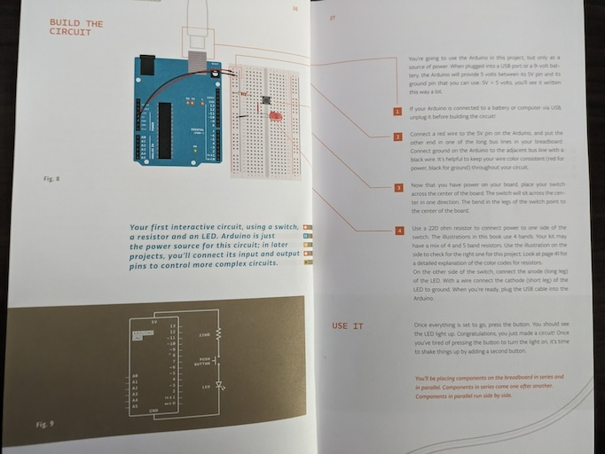

<%
	meta("../../meta.json")
	meta()
	const path = require('path');
	url = url + "/posts/" + path.basename(path.dirname(outputPath)) + "/";
%>
<%= render("../../_partials/post-header.html", { title, image, url, description, caption, date }) %>

**Table of contents**

%%toc%%

I've always been into software. I can barely attach a 9V battery and would probably kill myself trying to jump-start a car. Hardware just never grabbed my interest—there's so much to explore in software.

My son just turned 3, and I don't want him using computers or screens yet. He gets to watch a [pre-selected video](/posts/2024-07-15-two-years-in-review/#toc_15) twice a day (you can guess when), but otherwise, we keep him away from screens.

We do buy the occasional electronic toy. His [Tonibox](https://tonies.com/de-de/tonieboxen/) is probably the device he uses the most.

On paper, it's a fantastic little device. It's an audio player with a toddler-friendly interface. Long-press an ear to turn it on or off, press the long ear to increase volume, and the small ear to decrease it. To play music or a story, place a figure called a Tonie on top of the box. The first time you do this, it downloads the media, identified via an RFID tag inside the figure, and caches it. Tilt the box left or right to fast forward or rewind, and smack its sides to skip tracks. You can also load your own media on "creative Tonies." No [privacy issues](https://medium.com/@paul.klingelhuber/first-quick-security-impressions-of-the-toniebox-d609656634ac) have been found.

It's not perfect though. The slapping and tilting mechanisms barely work or need a lot of force—maybe our Toniebox is just faulty. The speakers are terrible, even worse than cassette players from the '80s and '90s. While there's a huge selection of Tonies, most aren't great. He mostly listens to stuff we load onto the creative Tonies.

One of the grandparents also got him a [tiptoi](https://www.ravensburger.de/de-DE/produkte/tiptoi), which is similar but for interactive books.

You buy the tiptoi pencil and a book with tags inside. Hold the pencil over a tag to play audio, like explanations or animal noises. There are also simple games, like "tip all the dogs on this page." It's okay, but we prefer reading to him ourselves, though he enjoys it.

The last electronic device he used was this little guy.

It's a super cheap "robot" that's supposed to follow black lines on paper and navigate a maze. It can't really do either. You can press the button on its chest to record a short audio snippet, which it plays back with a shifted pitch.

He laughed his ass off for almost an hour doing just that, and so did we. He even got creative, giving the robot instructions, which obviously didn't work. This wouldn't have happened with the Tonibox. The robot's form factor, silly movements, and pitch shift made it fun.

It got me thinking. I don't want to make more software-only display things for him, like [his little video player](/posts/2024-07-15-two-years-in-review/#toc_15). I want to introduce him to the digital world with tangible, physical things. And I don't want to rely on companies to provide these. I want to build them myself. Maybe, eventually, he'll join in the fun of building.

So that's my plan: build small electronic gadgets for the boy.

Except, I know fuck all about electronics. But I do know how to write code, which should help me get up to speed quicker than someone without any prior programming knowledge.

## Who am I writing this for?

I'll be documenting my journey through electronics here. Mainly for myself, as a diary of what I read, tried, succeeded at, and failed at. It might also be useful for my boy if he decides to learn these things one day.

From forums and subreddits, I see many people like me: proficient coders wanting to get into electronics with little or no prior knowledge, aiming to build small gadgets.

So, I'll share my learning path, documenting:

* Books, videos, and other educational resources I found useful (or not)
* Parts, kits, and tools and whether they're any good (or necessary)
* Software to build and design stuff (and which ones I stopped using or didn't find helpful)
* Projects I built, including schematics (or photos, because how the fuck do you create schematics?), code, and a short video demo

During the day, I read books or search resources during breaks. When the boy sleeps, I build things or check out software tools, giving me 1-3 hours a day to learn, experiment, and document as outlined above.

Every night I work on this, I'll write a blog post. That's the plan. Sometimes, I'll probably postpone the writing, making it more of a do-night, write-night thing.

**It is NOT my goal to teach you electronics!**

That'd be a terrible idea. But I hope to save you some time wading through all the low-quality information out there.

Throughtout these posts, I'll also add callouts in form of "Lesson learned" notes to highlight things I think are really important. Just `CTRL+F` or `CMD+F` them.

## Where to start?

Where to start? Luckily, I have many qualified people in my circle of social media friends. So I reached out on [Twitter](https://x.com/badlogicgames/status/1814014120489795853) and [Mastodon](https://mastodon.gamedev.place/@badlogic/112809058254707818).

And as expected I got a ton of great suggestions. Here's what I ended up with.

## Educational resources

There were many book suggestions, with [The Art of Electronics](https://artofelectronics.net/) being a popular one.

It's over a thousand pages. Here's page 9.

It does not fuck around. The software equivalent might be [Types and Programming Languages](https://www.cis.upenn.edu/~bcpierce/tapl/), which also doesn't fuck around. But neither book is well-suited for absolute beginners like myself.

[Practical Electronics for Inventors](https://www.oreilly.com/library/view/practical-electronics-for/9781259587559/) was another suggestion. Skimming through a very legal copy online, it seems to be a great reference for components and circuits, but not immediately useful for a beginner. It might come in handy later (I bought a legal copy and you should too, if you can afford it).

Another popular suggestion was electronics books by [Forrest Mims](https://www.ersbiomedical.com/Forrest-Mims-Series_ep_126.html), specifically [Getting Started in Electronics](https://www.ersbiomedical.com/assets/images/Getting%20Started%20in%20Electronics%20By%20Forrest%20Mims%20-%20Basic%20Electronics%20by%20Radio%20Shack%20Engineers%20-%20Electronics%20for%20dummies%20(handwritten).pdf).

It's a handwritten book, 128 pages. The tone is very informal, with a lot of cute hand-drawn illustrations.

It's kind of like "Practical Electronics for Inventors" for toddlers (read: me).

Another resource I found on my own was [Lessons in Electrical Circuits](https://www.ibiblio.org/kuphaldt/electricCircuits/DC/index.html).

For some reason, this one stuck with me. I worked through chapters 1-8, which cover mostly theory with some practical aspects. It's been the best for learning theoretical fundamentals so far.

I also briefly looked at [Teach Yourself Electricity and Electronics](https://www.mhprofessional.com/teach-yourself-electricity-and-electronics-seventh-edition-9781264441389-usa). It's like "Lessons in Electrical Circuits"-light. A bit too light for my taste, so I didn't spend much time on it.

Thankfully, there were some hands-on book suggestions too. [Make: Electronics](https://www.makershed.com/products/make-electronics-3rd-edition-print) is a very popular choice.

This book flips things by having you do practical tasks first and then delves into the theory. It requires purchasing components for each section, which wasn't something I wanted to do. Thankfully, I found a kit that contains all the components mentioned in the book (see next section). I've only skimmed it so far, but it looks promising! I especially like how it starts by teaching you how not to kill yourself with electricity.

[Make: Learning Electronics with Arduino](https://www.makershed.com/products/make-learn-electronics-with-arduino) is another hands-on book from the Make series.

It guides you through creating various small projects based on [Arduino](https://arduino.cc). Arduino is both a line of microcontrollers and kits, as well as the company behind them. It's a popular platform for beginners. The book walks you through simple projects like lighting up an LED, focusing more on the building part than theory. It's great for a motivated 10-year-old or anyone new to electronics and programming. For me, it's a list of small projects to work through.

The final book I read comes with the [Arduino Starter Kit](https://store.arduino.cc/products/arduino-starter-kit-multi-language).

This book is light on theory and walks you through 15 projects of increasing complexity, each introducing new components or more complex circuits. It explains complex circuits as "here's how to assemble this thing that will do X," which isn't great. Nonetheless, it's the book that got me started with practical stuff because it comes with a kit full of components and an [Arduino Uno microcontroller](https://store.arduino.cc/products/arduino-uno-rev3).

Since I'm going with Arduino for now, the [Arduino Learn site](https://docs.arduino.cc/learn/) is an invaluable resource for API documentation and basic guides for the entire Arduino ecosystem. I suggest to start [at the beginning](https://docs.arduino.cc/learn/starting-guide/getting-started-arduino/).

In summary:

- For theory on electricity and circuits, I'll wreck my brain with "Lessons in Electric Circuits" and "Getting Started in Electronics." That should give me a solid, albeit basic, foundation.
- For practical aspects, I'll go through the "Arduino Starter Kit Project Book," "Make: Electronics," and the Arduino Learn site.

## Parts, Kits, Tools

Since I don't know what I'm doing yet and buying individual components seems tedious and scary, I decided to start with complete kits that accompany the books above.

I began with the [Arduino Starter Kit](https://store.arduino.cc/products/arduino-starter-kit-multi-language).

I didn't take a picture of the contents, but the store page shows what's inside. It includes an Arduino UNO (an 8-bit microcontroller), basic electrical components like resistors, capacitors, buttons, and potentiometers, various sensors, a motor, an LCD, and a small breadboard. It also comes with the projects book mentioned above.

Since Arduino is open-source, there are many cheaper alternatives. I decided to try one and bought the [Elegoo Arduino UNO R3 Ultimate Starter Kit](https://www.amazon.de/Elegoo-Vollst%C3%A4ndige-Ultimate-Tutorial-Mikrocontroller).

This gave me additional components compatible with Arduino not found in the official kit, plus another Arduino UNO.

I also bought the [Make: Electronics 3rd Kit 1 & 2 Ultimate Bundle](https://www.amazon.com/Make-Electronics-Intermediate-Component-Experiments/dp/B09HL84X33?th=1) from ProTechTrader.

I likely overpaid for a bunch of cheap stuff, but it includes the book, a multimeter, a soldering iron, an Arduino UNO, and many reusable components. I haven't touched this one yet, as I want to complete the Arduino Starter Kit projects first.

My office space is set up for programming, meaning a bare table, a monitor, and a dim desk lamp. So, I ordered [the cheapest magnifying glass + light + arm combo](https://www.amazon.de/-/en/dp/B0BLGD8D3G?psc=1&ref=ppx_yo2ov_dt_b_product_details) I could find on Amazon.

Finally, I bought a [bit set + screwdriver](https://www.amazon.de/-/en/dp/B08NWJH6TD?psc=1&ref=ppx_yo2ov_dt_b_product_details) and [a set of tweezers](https://www.amazon.de/-/en/dp/B079K874CQ?psc=1&ref=ppx_yo2ov_dt_b_product_details), both from iFixIt and both overpriced.

Here's what I paid for everything:

- Arduino Starter Kit - €95.90
- Make: Electronics 3rd Kit 1 & 2 Ultimate Bundle - €357.11 (import tax!)
- Elegoo Arduino Uno R3 Super Starter Kit - €45.42
- Jubor Magnifying Glass with Light and Stand - €36.29
- iFixIt bit set and screwdriver - €15.12
- iFixIt tweezers - €15.07

The total cost of my buying spree: **€564.91**. Ouch.

Truthfully, the Arduino Starter Kit is all you need to get started. You might even get by with the cheaper Elegoo kit and a very legal digital copy of the Arduino Starter Kit Projects Book for a total of €45.42. But daddy likes toys and has too much disposable income.

> **Lesson learned**: Don't go on a buying spree. Get the most basic stuff and work through it first. Chances are, you might stop after your first LED circuit.

## Software

I'm targeting Arduino boards for now, which can be programmed using C++. The compiler used depends on the board's CPU. The Arduino UNO, with its 8-bit AVR CPU, uses GCC 7.3.0 configured for the gnu++11 standard. The standard library isn't complete, lacking a full STL implementation, which is fine given the 4KB of RAM limit. [Orthodox C++](https://gist.github.com/bkaradzic/2e39896bc7d8c34e042b) is a suitable paradigm for this.

One of Arduino's unique selling points are the extremely easy-to-use APIs for interacting with the microcontroller via pins and USB (using a serial protocol).

Each pin has a number, mode (read/write), and type (digital/analog, though analog ones can be used as digital too). You use functions like [`digitalRead(pin)`](https://www.arduino.cc/reference/en/language/functions/digital-io/digitalread/), [`digitalWrite(pin, value)`](https://www.arduino.cc/reference/en/language/functions/digital-io/digitalwrite/), and [`analogRead(pin)`](https://www.arduino.cc/reference/en/language/functions/analog-io/analogread/).

There are also first- and third-party libraries with simple APIs for specific components like sensors, motors, and displays. I haven't looked into dependency management yet, but it's probably just copying library code into the source tree or using an IDE that manages it.

The implementation of these APIs is more complex, similar to DOS programming with interrupts and ports. See this implementation of the [`tone()` function](https://github.com/bhagman/Tone/blob/master/Tone.cpp) as an example. You need to special-case for various chipsets, just like in DOS audio or graphics programming.

I installed the [Arduino IDE](https://www.arduino.cc/en/software) but found it lacking as a seasoned developer. Instead, I use the [PlatformIO](https://platformio.org/) extension in VS Code, where I spend most of my programming time.

The PlatformIO extension has a project creation wizard with a custom file browser (annoying). Click the alien face in the sidebar to create a new project, select your board (Arduino UNO for me), and specify a project location. It downloads and caches the necessary toolchain. A new VS Code instance opens. Click the alien again to see tasks like building, uploading, and monitoring the Arduino's serial output. Your program source goes into `src/`, and third-party libraries into `libs/`. That's it!

PlatformIO supports (remote) debugging for devices that can handle it, though the Arduino UNO likely isn't one of them due to its 4KB of RAM. So, it's `printf()` debugging, or rather `Serial.println()` debugging, sending ASCII chars from the board to your computer via USB, which PlatformIO prints to the console.

The only issue is that it relies on the Microsoft C++ extension for auto-completions and code navigation, which I don't find great. It also clashes with my beloved [Clangd](https://marketplace.visualstudio.com/items?itemName=llvm-vs-code-extensions.vscode-clangd) extension. I tried to make them work together but failed.

For educational purposes, I found [CircuitJS](https://www.falstad.com/circuit/circuitjs.html) to be super useful.

It's a circuit simulator that lets you draw simple (and complex) circuits and experiment with them digitally, allowing you to see what a resistor does to voltage and current, etc. I used it to re-create circuits from "Lessons in Electrical Circuits" to help build my intuition—still working on that part.

The final two pieces of software I found interesting were [Tinkercad](https://www.tinkercad.com/circuits) and [Wokwi](https://wokwi.com/). Both let you simulate microcontroller-based circuits in the browser. Note that Wokwi doesn't seem to perform a proper electrical simulation; you can't probe circuits for voltage, current, or resistance. Tinkercad does perform such simulations, but probing is cumbersome compared to CircuitJS. Both are great for quickly trying out a microcontroller-based circuit if you're away from your physical hardware.

With everything set up, I could start work on my first project.

## Project - Blinky LEDs, or "Where the fuck is the 220 ohm resistor?"

My goal is to digest the books above to learn the theory of electrical circuits and electronics while working through simple, practical projects described in the "Arduino Starter Kit Projects Book" and some I come up with myself.

I spent the first night working through the first project in the book, "Getting to know your tools". It is the "Hello, world!" of electronics: getting an LED to light up when a button is pressed. No coding involved. Here's the description from the book:

Just slap the wires and components onto the breadboard and use the Arduino as a 5V power source. Easy! Or so you'd think.

One of the components is a 220 ohm resistor. The resistor's properties (resistance in ohms and tolerance in %) are color-coded. The kit didn't include any resistors with the colors shown in the book. Turns out, resistors can be coded with 4 or 5 bands. The book showed a 4-band 220 ohm resistor (red, red, brown). The kit contained a mix of 4- and 5-band encoded resistors, but none seemed to match the 220 ohm resistors on the Arduino resistors help page, aptly titled [Where is the 220 Ohm resistor](https://support.arduino.cc/hc/en-us/articles/360012963800-Where-is-the-220-Ohm-resistor). Compare for yourself:

The blue resistors in the first image seemed closest to the 5-band 220 ohm resistor on the sheet. But to my eyes, they could also have been the 10k ohm resistors.

At the time, I had only received the Arduino Starter Kit, which doesn't come with a multimeter. So I had no way to measure the resistance on the resistors in the kit.

> **Lesson learned**: Get a multimeter before starting out with electronics.

And then: success!

With my big brain (and following the projects book to a T), I managed to slap a second button on the board.

Plugging those little legs into the breadboard is extremely finicky. My sausage fingers are not made for this. At the time of building the circuit, I hadn't received the tweezers yet. They make a huge difference!

> **Lesson learned**: If you have sausage fingers, get tweezers before starting out with electronics.

Another observation: my slight farsightedness makes it tedious to look at the breadboard, even though I wear glasses. This stuff is tiny! Using the magnifying glass + light arm makes this a lot better!

> **Lesson learned**: Ensure you have good work light, and if you are farsighted, consider a magnifying glass, even if you wear glasses.

And that concluded night one.

## Up next
With everything in place, I can now move on to bigger projects. I actually already have, but that would break the narrative of this blog post.

[Next time](/posts/2024-08-05-electronic-nights-2/), I'll walk through what I learned about basic circuits.

<%= render("../../_partials/post-footer.html") %>