<%
	meta("../../meta.json")
	meta()
	const path = require('path');
	url = url + "/posts/" + path.basename(path.dirname(outputPath)) + "/";
%>
<%= render("../../_partials/post-header.html", { title, image, url, description, caption, date }) %>

**Table of contents**

%%toc%%

[Last time](/posts/2024-07-25-electronic-nights-1), I discussed my motivation to learn electronics, and resources I found to get started.

The goal for the second electronic night was to understand basic circuits.

This post will mostly focus on the projects and the little theory I learned while doing them. Note that **I'm not trying to teach electronics here**. I do not know what I'm doing! Please read the educational resources provided in this and the other articles of this series. I'm merely documenting what I've learned in my own words, as that helps me structure my mental model and deepen my understanding. You've been warned.

All the projects below use parts from the [Arduino Starter Kit](https://store.arduino.cc/products/arduino-starter-kit-multi-language), except for the [crocodile clamps](https://www.amazon.de/s?k=alligator+clips&crid=OONBJ6WBEFUV&sprefix=alligator+clips%2Caps%2C116&ref=nb_sb_noss_1) and a 9V battery. See the ["Parts, Kits, Tools" section](../2024-07-25-electronic-nights-1/#toc_3) in the last post for more options.

## Educational Resources
By pure chance, I stumbled across a Reddit thread that mentioned the book ["Electronics for Beginners: A Practical Introduction to Schematics, Circuits, and Microcontrollers"](https://link.springer.com/book/10.1007/978-1-4842-5979-5) by Jonathan Bartlett.

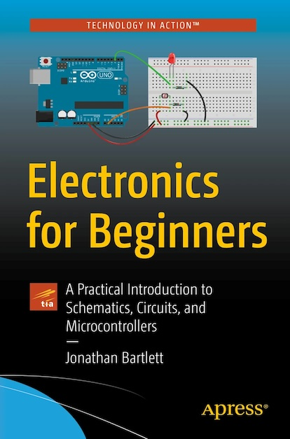

Honestly, out of all the books I've read so far, this one is by far the best! It has the perfect mix of practical and theoretical information, combined with clear and concise explanations, comprehensive review sections after each chapter which you could turn into a cheatsheet, and questionnaires. It is really, really good! The only minor downside is that some of the solutions given in the [solutions book](https://github.com/johnnyb/efbsolutions) don't seem to be entirely correct, with some even missing.

While I'm not a big fan of videos, I also found EEVblog's playlist [Electronics Tutorial - DC Fundamentals](https://youtube.com/playlist?list=PLvOlSehNtuHtVLq2MDPIz82BWMIZcuwhK&si=AGIN4DWWDdRT4vY0) to be super informative, if you can live with the presenter's style. Highly recommended.

I also found Ben Eater's [Digital Electronics Tutorial](https://youtube.com/playlist?list=PLowKtXNTBypETld5oX1ZMI-LYoA2LWi8D&si=pZiWWU792USJojLt) to be super insightful. It walks you from basic LEDs to bipolar junction transistors and the most basic of logic gates.

## Project: Learning by Killing an LED

I attached an LED to a 9V battery. Here is the result:

<video controls loop src="media/leddead.mp4"></video>

The LED is burnt out. Why? Let’s break it down with some high-school-level physics. I'll highlight some important things to remember in **bold**.

Atoms have **electrons** (negative charge) and protons (positive charge). Normally, they are balanced and electrically neutral. Some materials can release electrons, creating free electrons that can move around. These materials are called **conductors** and include metals like copper, aluminum, and gold. On the other hand, **insulators**, such as rubber, glass, and plastic, do not allow free electrons to move easily.

Free electrons move when there is a **difference in charges (voltage)** between two regions within or connected by conductive material. Voltage creates an electric field that exerts a force on the free electrons, causing them to move from the region with excess electrons to the region with fewer electrons. This movement of electrons is what we call **electric current**.

> **Note:** This is a heavily simplified model; the real-world process is much more complex. All I want is to slap a few buttons and lights together, so this model is sufficient for my needs. For now. Please consult a book for more in-depth and accurate physical models.

In the 9V battery, chemical reactions separate charges, creating a region with excess electrons (negative) and a region with a deficit of electrons (positive). If we connect them via a conductor, electrons start to move due to the voltage. Here's a simple diagram:

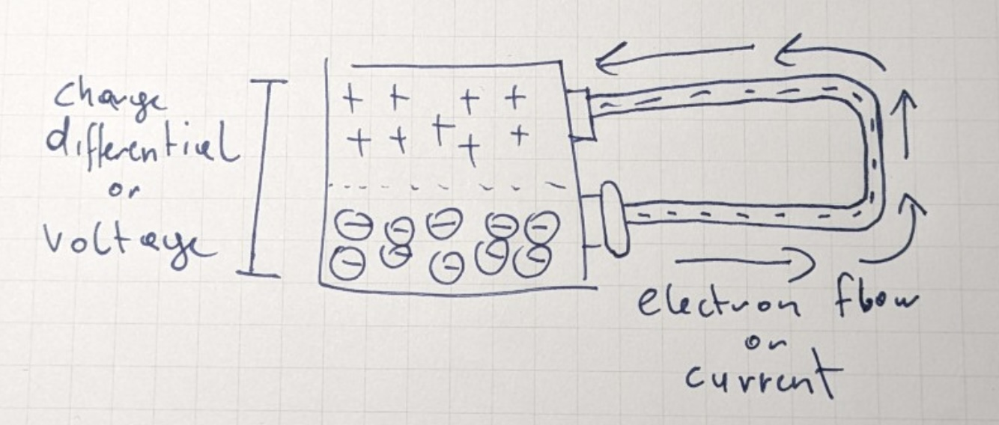

The wire is a conductor, so electrons within it easily dislodge from their atoms. The positive pole of the battery attracts these electrons, pulling them into the battery to fill in their electron "holes." This creates a chain reaction where electrons move from one copper atom to the next, eventually pulling electrons from the negative pole of the battery.

Inside the battery, chemical reactions transfer electrons from the positive pole back to the negative pole, maintaining the charge differential and allowing continuous current flow. This unbroken loop is also known as a **circuit**.

The chemical reactions inside the battery consume reactants, which eventually deplete. Once exhausted, the battery can no longer maintain the charge differential, leading to its discharge.

So, the electrons flow from the negative pole of the battery to the positive pole. Because of Benjamin Franklin, we ignore this entirely and pretend the current flows from the positive pole to the negative pole. This is called **conventional current**.

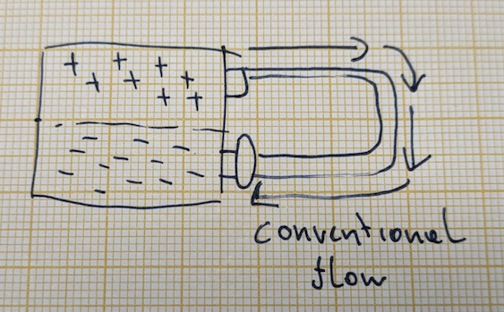

Pretty much everything in practical electrical engineering uses this convention, so I'll be using it as well.

A battery provides **direct current (DC)**, that is, the current always flows in the same direction. Other power sources may produce **alternating current (AC)**, such as wall outlets. Here, the positive voltage potential switches back and forth between the two poles. This causes the current to flow in one direction for a while, then in the other, at some frequency, e.g., 60Hz.

From what I could gather so far, digital circuits largely run on DC, so I'll focus on that.

The circuit above is a **short circuit**: the electrons can move more or less unhindered between the poles through the battery at full force. In the best case, this will quickly discharge the battery. In the worst case, it starts a fire or causes an explosion.

But why? When electrons pass through the battery, its materials provide some **resistance** to the moving electrons. Think of electrons bumping against the battery's atoms. The energy absorbed through resistance must be dissipated somehow, usually through heat, light, or chemical reactions. The more electrons that pass through the battery, the more heat is generated, which can cause the battery to overheat.

> **Lesson learned:** It is always a bad idea to bridge the terminals of a voltage source, such as a battery. Especially with your own squishy, conductive body. Don't do it.

But resistance isn't all bad. In fact, it's how we can extract work from an electrical circuit! Resistance in a light bulb's filament generates light and heat. Resistance in the heating elements of a toaster converts electrical energy to heat for toasting bread.

So, did the resistance of the LED to the current kill it? Well, yes and no. To understand, we first need to quantify the properties of our simple circuits and their components:

- **Voltage**: The difference in charges between two points, like between the poles of the battery or across a component, expressed as a single value measured in volts (V).
- **Current**: The number of electrons passing through a point in the circuit per second, measured in amperes (A).
- **Resistance**: The amount of pushback a material or component exerts against the electron flow, measured in ohms (Ω).

An LED is actually a very low-resistance component. As a type of [diode](https://en.wikipedia.org/wiki/Diode), its mission objective is to let as much current through in one direction while preventing it from flowing in the opposite direction. An LED has **polarity**, meaning it matters which way it is connected to a voltage source. The longer leg of the LED needs to be connected to the positive pole, and the shorter leg to the negative pole. You can also check where on the LED the flat part is, which is the side the shorter leg (cathode) is.

Just looking at the puny LED in the video above should tell you that it likely has its limits. These limits can be found in its [data sheet](https://www.sparkfun.com/datasheets/Components/LED/COM-09590-YSL-R531R3D-D2.pdf).

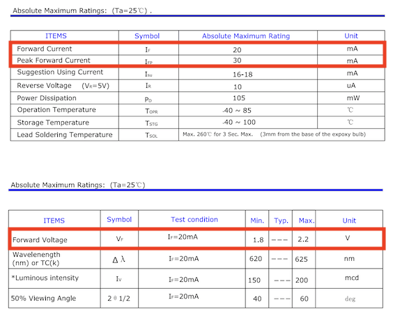

The row "Forward Current" tells us how much current in milliamperes (1/1000th of 1 ampere) the LED can take if the current flows in the correct direction (forward). The LED can handle a maximum of 20mA sustained and can tolerate the occasional spike up to 30mA, called "Peak Forward Current."

Since the LED offers hardly any resistance to the current, the circuit essentially becomes a short circuit. That means the 9V battery can unload the maximum current it can provide through the LED, which is usually somewhere in the range of 500mA to 1500mA. That's a lot more than what the LED can handle.

But we can fix it with a little math and a component called a resistor.

*Queue cheesy TNG joke*

## Project: Resistance is futi... fruitful

Here's a resistor.

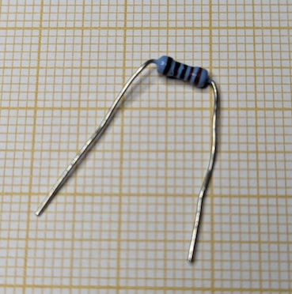

It has some color bands on it which encode its resistance, given in ohms ($\Omega$). This one is a 5-band resistor, with the colors red, red, black, black, brown. There are also 4- and 6-band resistors. You can use [online tools](https://www.digikey.at/en/resources/conversion-calculators/conversion-calculator-resistor-color-code) to decode them, learn how to decode them manually, or use a [multimeter](https://en.wikipedia.org/wiki/Multimeter) to measure a resistor's resistance. This one is a $220 \, \Omega$ resistor.

> **Lesson learned**: I find it hard to see the actual colors on these things, even with a magnifying glass. Buying and learning how to use a [multimeter](https://en.wikipedia.org/wiki/Multimeter) to measure them has paid off. Putting them in labeled boxes also helps.

It is a resistor's job to resist the current flowing through it. Its effects can be modeled via this equation:

$$
I = \frac{V}{R}
$$

This equation is known as [Ohm's law](https://en.wikipedia.org/wiki/Ohm%27s_law). $I$ is the current in amperes flowing through the resistor. $V$ is the voltage across its terminals. And $R$ is its resistance. If we know two quantities, we can calculate the third.

If we attach the resistor above to a 9V battery, we know two quantities: voltage across the resistor (9V) and resistance ($220 \, \Omega$). Plugging that into the equation gives us:

$$
I = \frac{9V}{220 \, \Omega} = 0.040 \, A = 40 \, mA
$$

Is putting the resistor across the battery terminals safe? Let's find out.

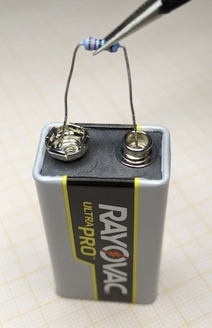

Nothing exploded. But the resistor got noticeably warm. Here's what its [data sheet](https://www.yageo.com/upload/media/product/app/datasheet/lr/yageo-mfr_datasheet.pdf) says.

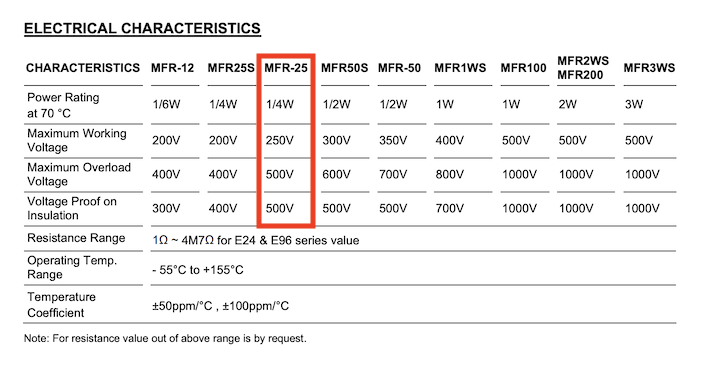

With 9V across it from the battery, we are in safe territory regarding voltage. But what about the power rating of $1/4W$ (where $W$ stands for watts)? There's another mathematical model for that.

$$
P = I \times V
$$

To calculate the power $P$ the resistor experiences in watts, we can multiply the current through it by the voltage across it.

$$
P = 0.04A \times 9V = 0.36W
$$

That's a little over the $0.25W$ the resistor is rated for. Whoops. Maybe I can fix it by placing two resistors in series, that is, behind each other? Maybe together, they can slow down the current even more?

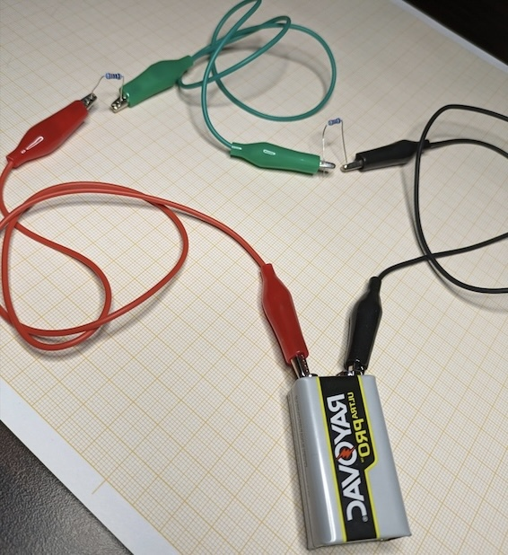

The resistors did not get warm, which I guess means that they both throttled the current.

We can model what's happening here mathematically. But before we do, let me switch to a different representation of that circuit. All those crocodile clips get unwieldy.

Here's the same circuit as a [schematic circuit diagram](https://en.wikipedia.org/wiki/Circuit_diagram).

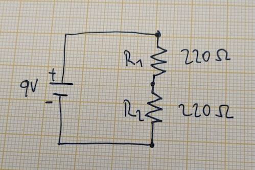

The symbol on the left represents the 9V battery. I've also labeled the positive and negative poles. $R_{1}$ and $R_{2}$ are the two resistors, $220\Omega$ each. The symbols you see here are standardized, more or less. My hand drawing is bad, so the zig-zag lines don't quite match up with the standardized symbol. You get the idea.

What is the current through this circuit? We can't directly apply Ohm's law, as we have two resistors, not one. Luckily, there are three rules we can apply to a series circuit that help us reduce series circuits to a single resistor. Here's rule number one:

> **Series circuit rule 1: Resistors in series can be replaced with a single resistor with a resistance equal to the sum of their resistances.**

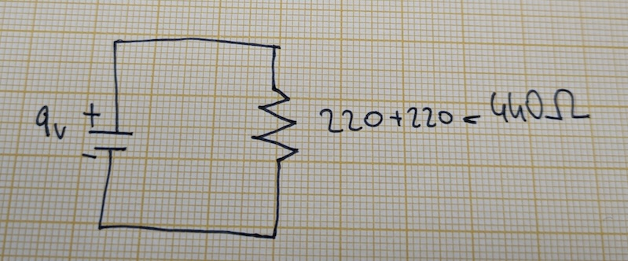

More generally, for $n$ resistors in series, the equivalent total resistance is:

$$
R_{total} = R_{1} + R_{2} + \ldots + R_{n}
$$

To calculate the current for this circuit, we pretend the two $220 \, \Omega$ resistors are actually just one $440 \, \Omega$ resistor. We can apply Ohm's law to calculate the current for this circuit:

$$
I = \frac{V}{R_{total}} = \frac{9}{440} = 0.02045A = 20.45mA
$$

This is the current flowing through the entire series circuit, which leads to rule number two:

> **Series circuit rule 2: The current in a series circuit is the same everywhere.**

That is, the current through resistor $R_{1}$ is the same as through resistor $R_{2}$ and is also the same through the wires: $20.45mA$.

Since we now have the current going through each resistor and know their resistances, we can again apply Ohm's law to calculate the **voltage drop** across each resistor.

For that, we need to apply some basic algebra to transform $I = \frac{V}{R}$ into $V = I \times R$. Here's the voltage drop across $R_{1}$:

$$
V_{R_{1}} = I \times R = 0.02045A \times 220\Omega \approx 4.5V
$$

Since the current through $R_{2}$ and its resistance are equal to those of $R_{1}$, its voltage drop is also $4.5V$. Here's what that looks like:

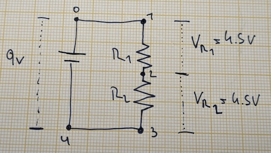

Which leads to rule number three:

> **Series circuit rule 3: The sum of voltage drops across all components in a series circuit equals the voltage between the points at the beginning and end of the series circuit.**

The supply voltage is the voltage measured across points 1 and 3 above. Think of it as the input and output voltage of the series circuit. We can see that the voltage drops across each resistor add up nicely to the $9V$ supply voltage.

This rule is a direct consequence of [Kirchhoff's voltage law](https://en.wikipedia.org/wiki/Kirchhoff%27s_circuit_laws), which can help analyze more complex circuits with regards to voltages in a circuit. For this simple circuit, rule 3 is all we need.

Speaking of voltages and points, the above schematic illustrates another thing. There is no voltage drop between points 0 and 1, nor between points 3 and 4. These are common points, meaning they are at the same electric potential. Or put another way: there is no load between those points, so no voltage drop occurs.

Generally, the voltage drop between any two points along a circuit that have no load between them will be 0, no matter if the points are connected through a straight-line wire or something more complicated. Unless the wire gets very long, then the wire's own resistance comes into play again.

Now that we have the voltage drop for each resistor, we can also calculate the power through each of them. Calculating it for $R_{1}$:

$$
\begin{aligned}
	P_{R_{1}} & = I_{R_{1}} \times V_{R_{1}} \\
			  & = 0.02045A \times 4.5V \\
			  & = 0.092W
\end{aligned}
$$

That is way below the maximum $0.25W$ power rating of the resistors, which explains why they didn't heat up.

How does all this help us fix the broken LED circuit? We can use a resistor in series with the LED to limit the current going through the LED, preventing it from blowing up. For this, we need to calculate the required resistance of that resistor. Here's what we know:

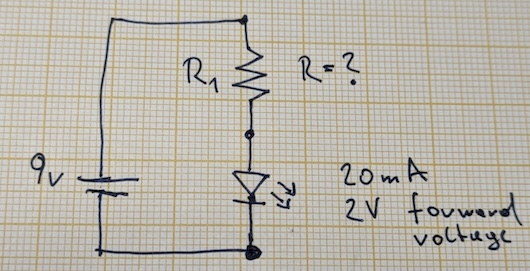

The little triangle with arrows is the symbol for an LED. The tip of the triangle points in the direction it will let current through (remember the conventional current direction). I've added a mysterious quantity "forward voltage" of $2.2V$.

LEDs do not conform to Ohm's law. Their voltage drop cannot be calculated as we did above for the resistors. The resistor model does not apply to LEDs. Instead, an LED's voltage drop is fixed and called "forward voltage." For the LED to conduct current, the voltage across it must be at least as high as its forward voltage. The LED will "eat" that fixed amount of voltage, leaving the rest for the remainder of the series circuit. We can use this fixed voltage drop to analyze the circuit.

The voltage drops in a series circuit must sum up to the total voltage across the series circuit. This allows us to calculate the voltage drop across the resistor:

$$
 V_{supply} = 9V, V_{LED} = 2.2V
$$

$$
V_{supply} = V_{R_{1}} + V_{LED}
$$

Which, after some rearranging, gives

$$
V_{R_{1}} = V_{supply} - V_{LED} = 6.8V
$$

for the voltage drop across the resistor.

For full brightness, the LED needs to be supplied with $20mA$ of current. The current $I$ is the same anywhere in the circuit, including through the resistor. We can thus use Ohm's law to calculate the resistor's resistance after rearranging $I = \frac{V_{R_{1}}}{R}$:

$$
R = \frac{V_{R_{1}}}{I} = \frac{6.8V}{0.02A} = 340\Omega
$$

Great success! Except, I only have $220\Omega$ resistors at my disposal. Using just one will not limit the current enough ($I = \frac{6.8V}{220\Omega} = 0.03A = 30mA$).

But I can use two in series, which can be viewed as a single resistor with a resistance of $2 \times 220\Omega = 440\Omega$. This will limit the current to:

$$
I = \frac{V_{R_{1}}}{R} = \frac{6.8V}{440\Omega} = 0.015A = 15mA
$$

So, a bit below the LED's suggested operational current of $20mA$. The LED will be a little dimmer than it could be. Better than blowing it up!

I'm tired of the crocodile clips, so I'm going to use the breadboard to build this circuit.

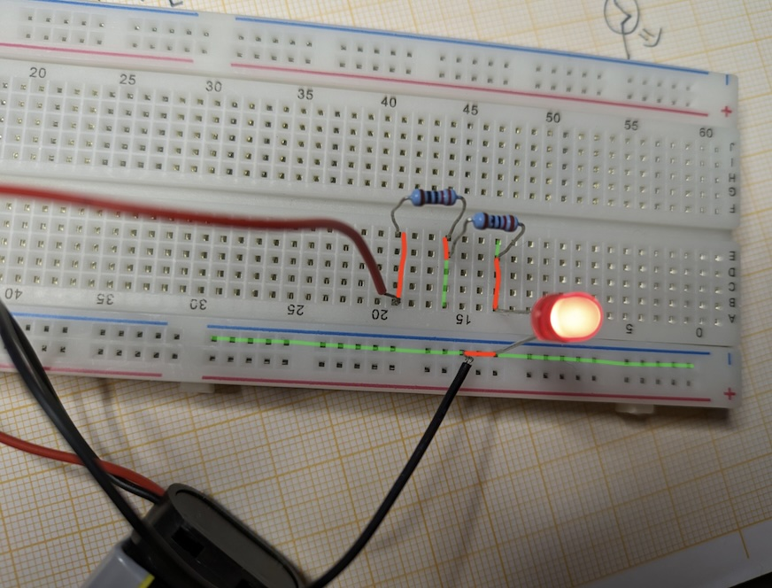

Underneath the plastic cover of the breadboard, there are metal strips. The holes on top of these strips let you insert wires or component leads, which connect to the strips when pushed in far enough. This effectively connects the wires or component leads, like the legs of resistors and the LED, to the corresponding metal strips.

The horizontal metal strips at the top and bottom of the breadboard are called "power rails." These are typically used to connect your power source. In this setup, I've only connected the negative pole to the power rail.

The vertical strips in the main area of the breadboard are where you connect your components. Each column of five holes in a column is connected internally, making it easy to connect components together in a circuit.

The same setup is found in the upper half of the breadboard. It is not connected to the bottom half.

I've traced the parts of the breadboard that are used as wires to connect the components in red. It may take a bit to get used to how the connections are made. This setup is much more compact compared to using crocodile clip cables. For a more detailed explanation, here's a [breadboard deep dive](https://www.sciencebuddies.org/science-fair-projects/references/how-to-use-a-breadboard).

## Project: There. Are. Four. LEDs!
With one LED done, I wanted to see what happens if I place multiple LEDs in series. Here's what I started with.

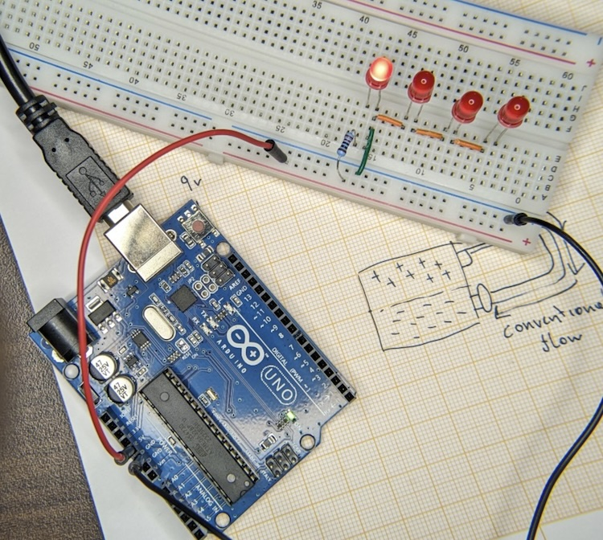

The Arduino has a $5V$ pin and a ground pin, equivalent to a battery's positive and negative poles, except at lower voltage and lower maximum current ($500mA$ when the Arduino is powered via USB like above). I plugged jumper wires into the pins and respective power rail on the breadboard.

Next, I wired the $220\Omega$ resistor to the positive power rail and one of the columns of the breadboard. At the top of the same column, I plugged in the longer leg of the first LED. I then connected 3 more LEDs in series.

The green wire closes the circuit between the $5V$ and ground pin. By moving it between the lights, I can select how many lights I want to actually supply with current. In the configuration above, current only flows through the first LED. The remaining LEDs are not connected to ground, so no current can flow through them. They are not part of the circuit loop. Here's the setup as a schematic.

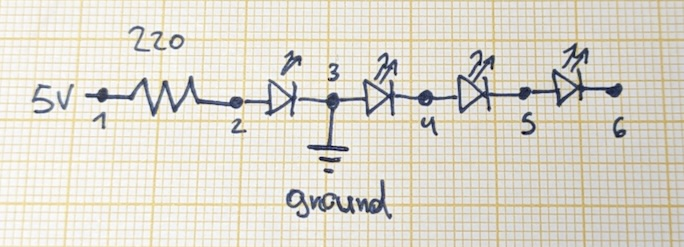

The loop isn't apparent from the schematic. I made it more obvious in this version.

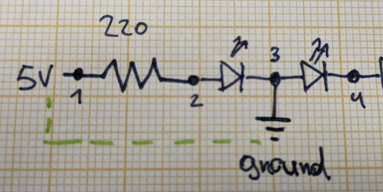

Generally, if a schematic has a voltage source and ground symbols, we can consider them to be "connected" internally and thus form a loop. This is kinda nice, as it simplifies the schematics quite a bit. But it can also be a little confusing.

All the ground symbol really represents is a point with no electrical potential. It serves as a reference point to measure voltages relative to another point on the circuit.

The current will flow through points 1, 2, and 3 down to ground. It will not flow through the remaining LEDs on the right, as they are not part of the loop by being connected to the ground. Or put another way: the current will go the path of least resistance, which is down to the ground.

I can add another LED to the circuit by moving the wire connecting to ground to points 4, 5, or 6. Here's what happens.

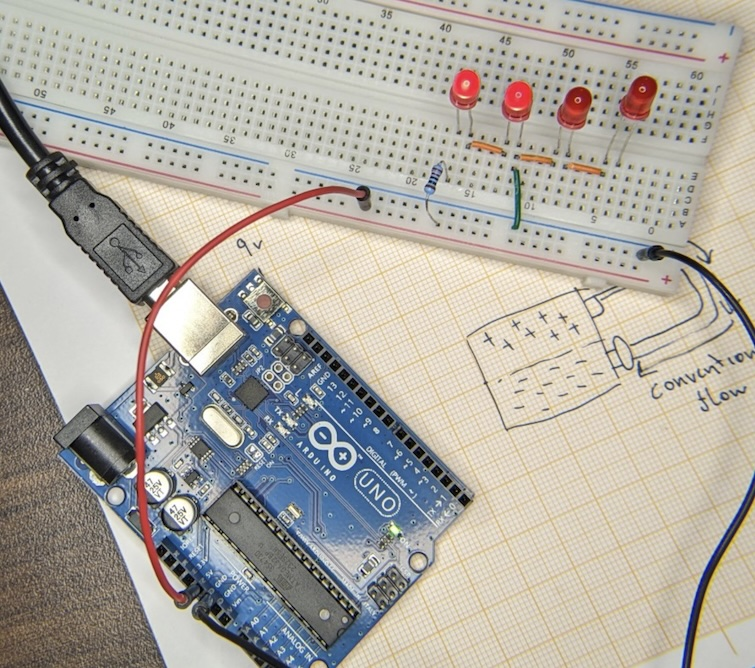

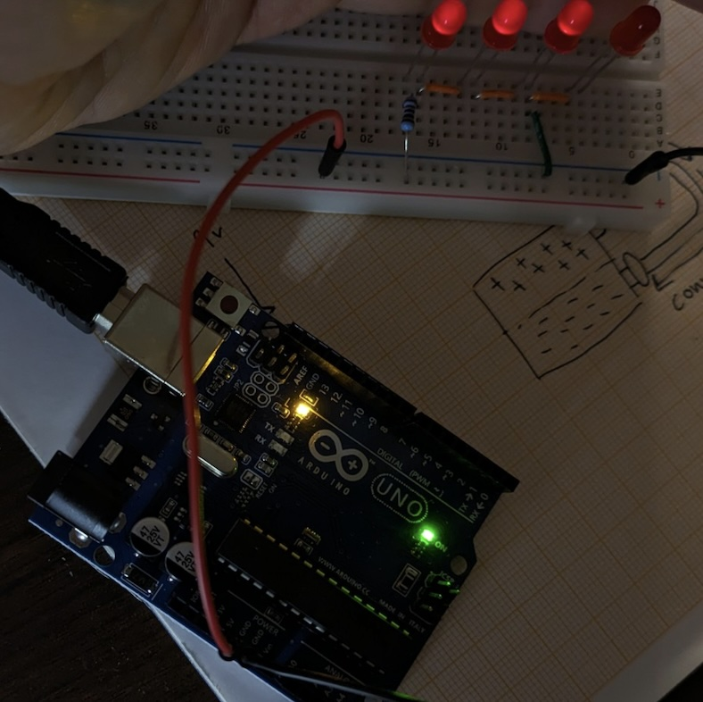

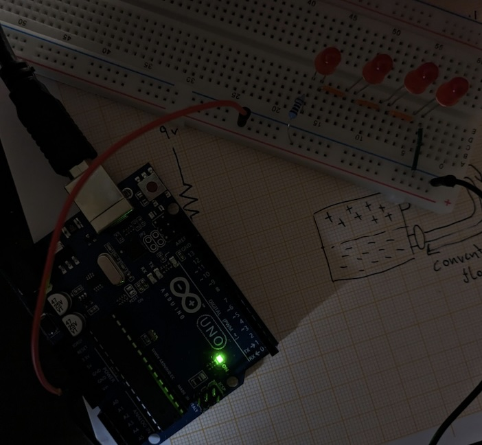

The more LEDs I add, the dimmer they get. When all 4 LEDs are part of the loop, none of them light up. Why is that?

Each LED drops 1.8V of voltage, leaving less voltage for the resistor. This means the amount of current that goes through the resistor is also less. We've already seen this in the last project, where we subtracted $V_{LED}$ from the supply voltage before calculating the resistor values.

We can express this mathematically:

$$
I = \frac{V_{supply} - V_{LED1} - V_{LED2} \ldots - V_{LED_{n}}}{R}.
$$

For 1 LED, we have:

$$
\begin{aligned}
	I & = \frac{V_{supply} - V_{LED1}}{R} \\
	  & = \frac{5V - 1.8V}{220\Omega} \\
	  & = \frac{3.2V}{220\Omega} \\
	  & = 0.01454A = 14.54mA
\end{aligned}
$$

For 2 LEDs, we have:

$$
\begin{aligned}
	I & = \frac{V_{supply} - V_{LED1} - V_{LED2}}{R} \\
	  & = \frac{5V - 1.8V - 1.8V}{220\Omega} \\
	  & = \frac{1.4V}{220\Omega} \\
	  & = 0.007A = 7mA
\end{aligned}
$$

For 3 LEDs, we are exceeding the available supply voltage ($5V < 1.8V + 1.8V + 1.8V$) already, so the LEDs will not (or only very minimally) let through current anymore.

With every LED we add, the current diminishes, which will lower the brightness of the LEDs. And each LED eats away at the supply voltage, eventually not leaving enough for current to run through at all.

I've also simulated this circuit in [CircuitJS](https://www.falstad.com/circuit/circuitjs.html?ctz=CQAgjCAMB0l3BWcMBMcUHYMGZIA4UA2ATmIxAUgpABZsKBTAWjDACgAlEJmvEQmt2KF+gqlRpUk4qNARsATt16iQ2FKqoo0bMIQ3rVrDQJAaAJgwBmAQwCuAGwAuTBw3PgoXmJHZ6NxqragqYW1vbOru6eMj5++mYoIYLqVKEglraOLm4eELGw8QZoqjR6QRnh2VF53rK+bADm4GAmgoGtfOJsQA).

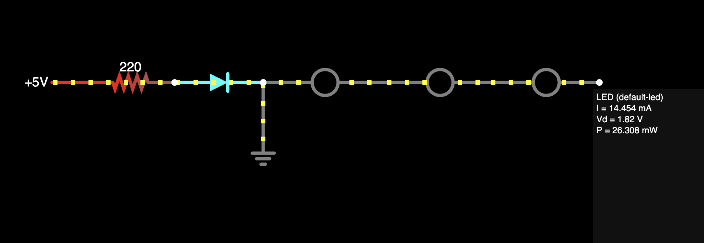

The results there aren't exactly the same but in the same ballpark. CircuitJS has a more sophisticated model of the LED, which accounts for minor changes in the LED's actual voltage drop.

> **Lesson learned**: LEDs are not ideal as an introductory component if you, the beginner, want to understand more than how to plug them into a breadboard. They seem to be hard to model and thus understand.

## Project: LEDs in Parallel

Ohm's law, the resistor model, the LED model, and series circuit rules let me analyze and construct simple series circuits. Based on that, I assume I just need to learn about more component models and how to deal with more complex circuit layouts, including those with things in parallel.

So what if I stick all the LEDs on the board in parallel?

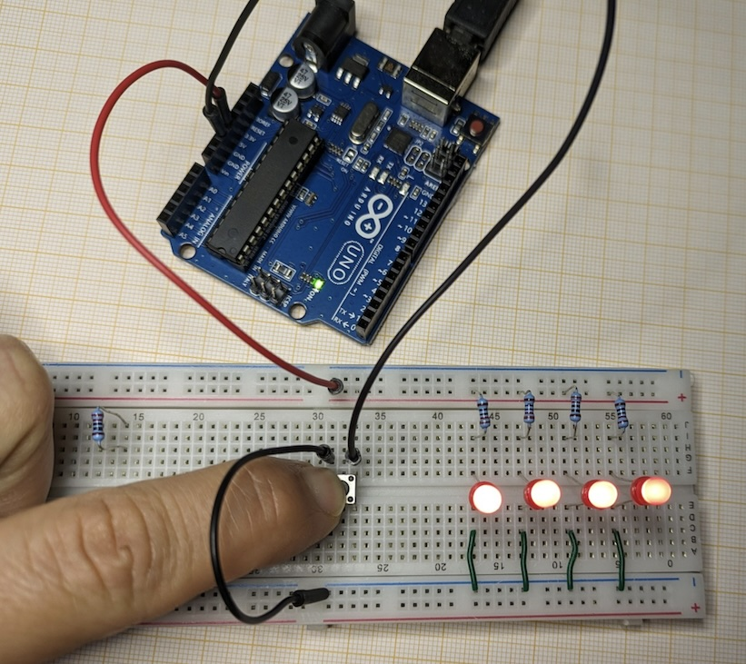
<figcaption>Yeah, maybe not the best way to wire this. I'm still learning.</figcaption>

All LEDs have full brightness! What's going on? Here's the schematic view.

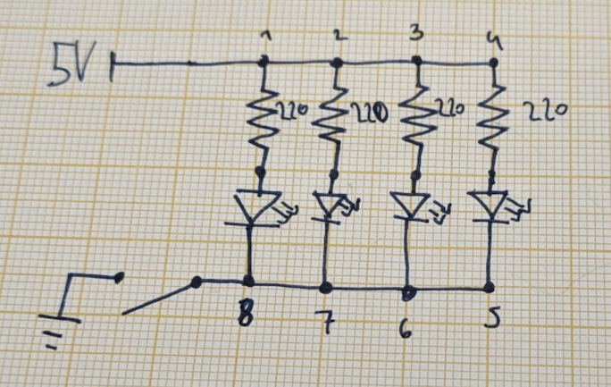

The symbol before ground is a switch symbol. The thing I use on the breadboard is a pushbutton, which has its own symbol, but I think the switch is clearer. If the pushbutton is not pressed, then there's no connection to ground, and thus no current. Nothing lights up. Let's assume the button is being pressed for the rest of this section, so point 8 directly connects to ground.

In this **parallel circuit**, we have 4 **parallel branches**, each with a $220 \Omega$ resistor and a red LED with a forward voltage of $1.8V$. The key insight is that they all feed off of the same voltage potential. The points 1, 2, 3, and 4 are all at $5V$ relative to ground, so that is also the voltage across each branch!

That is, the voltage drop between points 1 and 8 is $5V$, so is the voltage drop between points 2 and 7, 3 and 6, and 4 and 5! This gives us the first rule of parallel circuits.

> **Parallel circuit rule 1: The voltage across each branch in a parallel circuit is the same.**

Let's rearrange the schematic to make this point clearer. I've omitted the switch before ground.

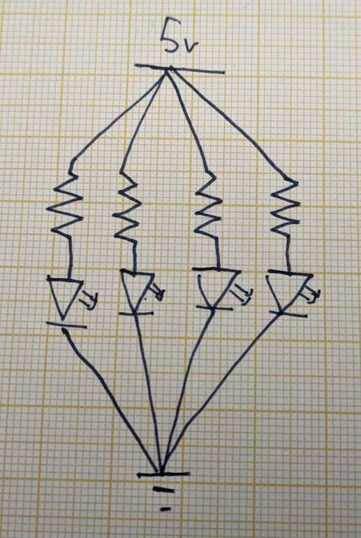

Points 1, 2, 3, and 4 can be coalesced into a single point. They are **common points** at the same charge potential. The same can be done for points 5, 6, 7, and 8. They too are at the same charge potential. From this, it follows that the voltage across each branch must be the same: $5V$!

This has consequences for our LEDs. Each now gets enough supply voltage for its forward voltage of $1.8$, irrespective of how many LEDs are connected in parallel.

And that is why they can all light up like that! But what about the current through each branch? We know the voltage across each branch ($5V$), so we can treat each branch as a series circuit! Since we have the same components in each branch, the calculation is the same for each.

First, we need to calculate the voltage drop across the resistor, taking the LED's forward voltage $V_{LED} = 1.8V$ into account. We did that in the last projects. I call the voltage across a branch $V_{branch}$. Think of it as the supply voltage for that branch. Then we can apply Ohm's law to calculate the current through the resistor, and thus the entire branch.

$$
\begin{aligned}
	I_{branch} & = \frac{V_{branch} - V_{LED}}{R} \\
	  & = \frac{5V - 1.8V}{220\Omega} \\
	  & = 0.01454A = 14.54mA
\end{aligned}
$$

Now we can apply the second rule of parallel circuits.

> **Parallel circuit rule 2: The total current entering and exiting the parallel circuit is equal to the sum of branch currents.**

Since all branches have the same components and thus currents, the total current entering and exiting the parallel circuit is:

$$
\begin{aligned}
	I_{total}  & = I_{branch_{1}} + I_{branch_{2}} + I_{branch_{3}} + I_{branch_{4}} \\
			   & = 4 \times I_{branch} \\
			   & = 4 \times 0.01454A \\
			   & = 0.05816A \\
			   & = 58.16mA
\end{aligned}
$$

Another way this could be phrased is: the sum of currents going into and out of a junction must equal zero (provided the current is a signed quantity reflecting the direction towards or away from the junction). This is [Kirchhoff's current law](https://en.wikipedia.org/wiki/Kirchhoff%27s_circuit_laws), which can help analyze more complex circuits. For the parallel circuit above, it's sufficient to know rule 2.

Since we now know the voltage across the entire circuit $V_{total} = V_{branch} = 5V$ and the current flowing through the circuit $I_{total} = 58.16mA$, we can calculate its equivalent resistance using Ohm's law. We basically reduce the entire parallel circuit to a single resistor.

$$
R_{total} = \frac{V_{total}}{I_{total}} = \frac{5V}{0.05816A} = 85.96\Omega
$$

Huh, that's weird. That total resistance of the entire parallel circuit is smaller than the resistance of the $220\Omega$ resistors? If we think about it for a little, it makes sense. The current now has more paths to flow through. While each individual branch may limit the current through resistance, summed up, more current can go through all branches together compared to a single branch. This means the resistance of the total current must be smaller as well.

We already calculated the total resistance of the parallel circuit using Ohm's law because we knew both the voltage across and current through the circuit. We might not always know that. There's a second way to calculate the total parallel circuit resistance if we know the resistances of each of its $n$ branches.

$$
R_{total} = \frac{1}{\frac{1}{R_{branch_{1}}} + \frac{1}{R_{branch_{2}}} + ... + \frac{1}{R_{branch_{n}}}}
$$

Think of it as **parallel circuit rule 3**. How can we calculate the branch resistances? We know the voltage across each branch ($5V$) and the current flowing through each branch ($14.45mA$). So we can treat them like a resistor and apply Ohm's law.

$$
\begin{aligned}
	R_{branch} & = \frac{V_{branch}}{I_{branch}} \\
		& = \frac{5V}{0.01454A} \\
		& = 343.87\Omega
\end{aligned}
$$

Plugging that into the equation for the total resistance above gives:

$$
\begin{aligned}
	R_{total} & = \frac{1}{\frac{1}{R_{branch_{1}}} + \frac{1}{R_{branch_{2}}} + \frac{1}{R_{branch_{3}}} + \frac{1}{R_{branch_{4}}}} \\
		& = \frac{1}{4 \times \frac{1}{R_{branch}}} \\
		& = \frac{1}{4 \times \frac{1}{343.87\Omega}} \\
		& = 85.96 \Omega
\end{aligned}
$$

Which is the same result we got above when we pretended the entire parallel circuit is equivalent to a single resistor!

So, all the LEDs light up because:
* Each branch has enough voltage across it ($5V$) to satisfy the LED's forward voltage requirement of $1.8V$
* Each branch can draw as much current as it needs to light up the LED at full brightness because the current is only limited by a single, freely choosable resistor.

How much power does this circuit draw? We can calculate that by using the current and voltage quantities for the entire circuit.

$$
\begin{aligned}
	P_{total} & = I_{total} \times V_{supply} \\
 			  & = 0.05816A \times 5V \\
			  & = 0.2908W
\end{aligned}
$$

Neat! Using the series and parallel circuit rules in conjunction with Ohm's law allows us to calculate the voltages, currents, resistances, and power consumption across paths in a complex circuit.

Check out the [simulated version of the circuit](https://www.falstad.com/circuit/circuitjs.html?ctz=CQAgjCAMB0l3BWcMBMcUHYMGZIA4UA2ATmIxAUgpABZsKBTAWjDACgAlEXGkYwkChpV+UMcOpUp0BGwDmghAMwpFA7GjGQ2AdzWCMqlHjwHV2gE7dCp0dhvgMAqijRsrdVaM+Pngtx6i3qJgTmKulhSEIgJKVKF+EWxghKr2pgnWpiqCIAAmDABmAIYArgA2AC5M5Qx54FpQsOwpqj6ZPjmqBSUV1bX1EFJNkC2ptCFhNKJd+UVlVTV1DcMwo8njcb5RLoa5PQv9y0NazbrckLx2DqLaeul8Aj63589PQc6vHzuPUOdbOWmyj2dwmwLaGjMfz0nT2DxyoPhcIQRhBbAAztwUVDjNkQWISuV0Qw2EA.). The voltage drop for an LED is assumed to be $1.82V$ there, so the quantities for voltages, currents, and power are slightly different from the results above. Same ballpark though!

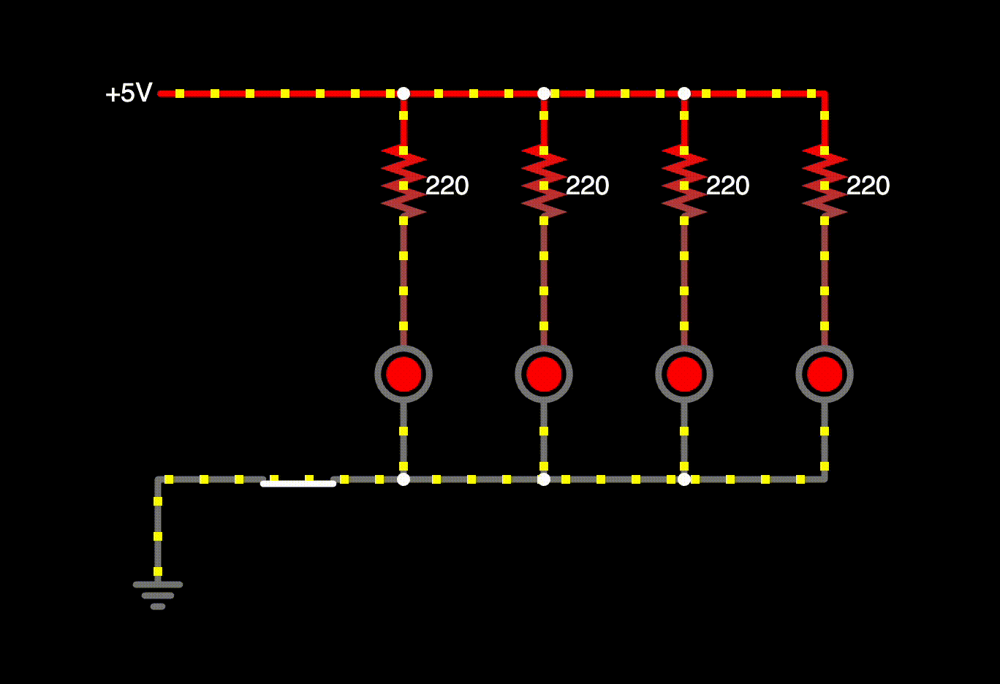

You can see how the current splits up and recombines. If you hover over individual elements, you can also view voltage drops. You can also click on switches to open and close them.

> **Lesson learned**: It takes a bit of practice to know where to start analyzing and designing even simple circuits. Working my way through examples in the educational resources I linked to, simulating things in CircuitJS, and analyzing my own circuits helped me build some intuition in that regard. I suggest you do the same! There's no short-circuiting practice.

## Up Next
With a very high-level understanding of basic circuits, I considered myself well-equipped enough to finally explore the Arduino and its pins, culminating in a simple "Simon Says" game.

<%= render("../../_partials/post-footer.html") %>