<%
	meta("../../meta.json")
	meta()
	const path = require('path');
	url = url + "/posts/" + path.basename(path.dirname(outputPath)) + "/";
%>
<%= render("../../_partials/post-header.html", { title, image, url, description, caption, date }) %>

**Table of Contents**
<div class="toc">
%%toc%%
</div>

[Last time](/posts/2024-08-05-electronic-nights-2), I basically relived physics class as experienced by 16-year-old teens in high school. With my basic understanding of circuits and the models I can use to analyze and construct them, it is now time to do some programming. More specifically: programming that lets me modify elements in the circuit.

The goal of this night is to animate some LEDs and read button states. I'm still only using what's in the [Arduino Starter Kit](https://store.arduino.cc/products/arduino-starter-kit-multi-language).

## Educational Resources
I haven't found any new noteworthy educational resources.

## Software
I'm going to use the Visual Studio Code [PlatformIO extension](https://platformio.org/) to write the little programs for the Arduino. I've already described super basic usage in the [first post](/posts/2024-07-25-electronic-nights-1/#toc_4). Since this is geared towards software developers who want to learn electronics, I leave it up to you, dear reader, to read the fine manual.

## Project: Programmatically Blinking LEDs
Here's the Arduino Uno Rev 3.

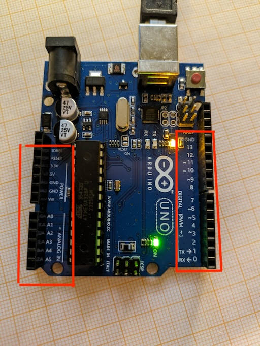

I've highlighted the important bits called **pins**. On the left side, we have a 3.3V and 5V pin. We can connect those to the positive power rail on a breadboard, which will provide voltage to the circuit on the breadboard. There are also two ground pins, which we can connect to the negative power rail to provide grounding and close the circuit loop.

The remainder of the highlighted pins are what's called [General-Purpose Input/Output (GPIO) pins](https://en.wikipedia.org/wiki/General-purpose_input/output). We can programmatically read or set the voltage on those pins. If we connect an LED, we can control whether it is on by setting the voltage. If we connect a button to a pin, we can check if there's voltage on the pin, which indicates that the button has closed the circuit toward that pin. A pin can either read or set voltages but can't do both at the same time. A pin thus has a **pin mode**, which is either "input" or "output," or "read" or "write."

Digital pins, the ones on the right labeled 0 to 13, are only concerned with whether there is voltage or not, so basically on or off, one or zero.

Analog pins, the ones on the left labeled A0 to A5, can also only "output" full voltage or no voltage and are thus essentially digital in output mode. However, in input mode, they use what's called an [Analog-to-Digital Converter (ADC)](https://en.wikipedia.org/wiki/Analog-to-digital_converter) to convert the voltage level coming in on the pin into a value between 0 and 1023. On top of that functionality, they can be used like any of the digital pins.

Each of these pins can output $20mA$ of current, at a maximum voltage of $5V$. Obviously, we shouldn't "input" more voltage or current on a pin either when the pin is in input mode.

The Arduino Uno Rev 3 and its pins can be programmed with C++. Arduino provides a framework of libraries to interact with those pins and peripherals, such as LCD displays, connected to those pins. The core functionality is wrapped up in [`Arduino.h`](https://github.com/arduino/ArduinoCore-avr/blob/master/cores/arduino/Arduino.h) (for the AVR chipset found on the Arduino Uno Rev 4).

The Arduino framework requires your program to provide two functions:

* `void setup()`: called on startup, used to set things up, e.g., pin modes.
* `void loop()`: called periodically, used to implement the actual logic of the program.

The basic Arduino program scaffold thus looks like this:

```cpp
#include <Arduino.h>

void setup() {

}

void loop() {

}
```

These are called from the usual [`main()` function](https://github.com/arduino/ArduinoCore-avr/blob/321fca0bac806bdd36af8afbc13587f4b67eb5f1/cores/arduino/main.cpp#L33), which the Arduino framework abstracts away from you.

It looks like this:

```cpp
int main(void)
{
	init();

	initVariant();

#if defined(USBCON)
	USBDevice.attach();
#endif

	setup();

	for (;;) {
		loop();
		if (serialEventRun) serialEventRun();
	}

	return 0;
}
```

Pretty basic.

The task for this project is to make four LEDs light up in some pattern, e.g., one after the other. The circuit looks like this:

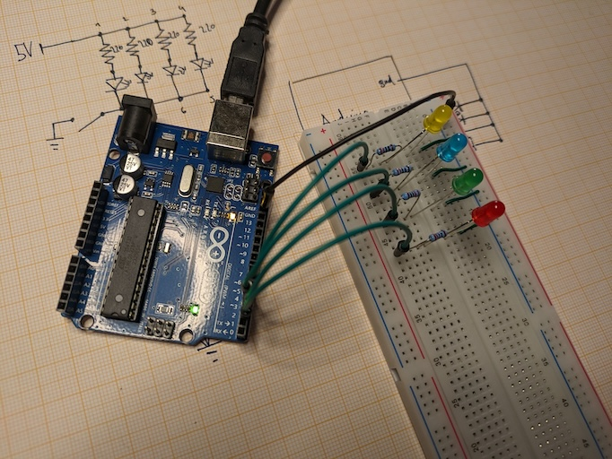

And since this view isn't great, here's the corresponding schematic:

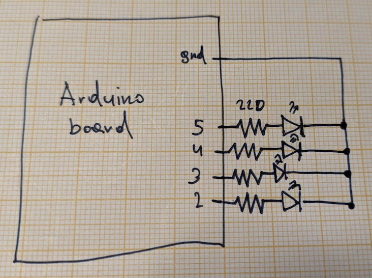

The entire circuit is a parallel circuit consisting of four serial circuit branches which lead back to ground. Each branch consists of a $220 \Omega$ resistor and an LED. The first branch is connected to digital pin 2, the second to digital pin 3, and so forth.

All that's left to do is to programmatically set the pins to output mode, then set the pins to high ($5V$) or low ($0V$), depending on which LED we want to light up.

For that, we need two functions:

* [`pinMode(uint8_t pin, uint8_t mode)`](https://www.arduino.cc/reference/en/language/functions/digital-io/pinmode/): configures a pin's mode. `pin` specifies the pin number (0-13 for digital, `A0` to `A5` for analog). `mode` can be `INPUT`, `OUTPUT`, or `INPUT_PULLUP`.
* [`digitalWrite(uint8_t pin, uint8_t value)`](https://www.arduino.cc/reference/en/language/functions/digital-io/digitalwrite/): sets the voltage on a pin to either `HIGH` ($5V$) or `LOW` ($0V$).

Let's make all four LEDs light up.

```cpp
#include <Arduino.h>

void setup() {
  pinMode(2, OUTPUT);
  pinMode(3, OUTPUT);
  pinMode(4, OUTPUT);
  pinMode(5, OUTPUT);

  digitalWrite(2, HIGH);
  digitalWrite(3, HIGH);
  digitalWrite(4, HIGH);
  digitalWrite(5, HIGH);
}

void loop() {
}
```

First, we set all pins to be in output mode, then we set the voltage on each pin to `HIGH`, which provides $5V$ to each branch of the circuit. I put everything into `setup()` as there's no reason to set the voltages on the pins over and over again in `loop()`. Once set, the voltage on a pin will stay the same until a different voltage is set.

As expected, the LEDs light up nicely.

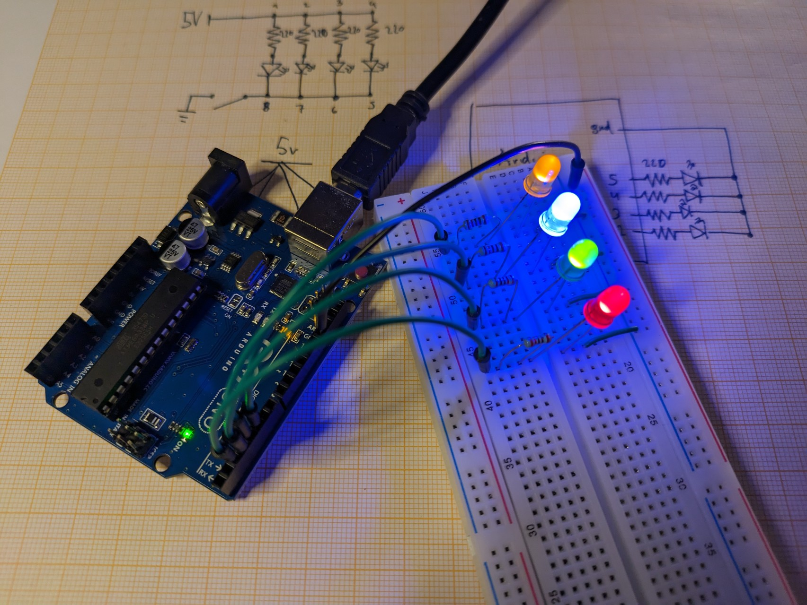

They are quite bright, actually. I wonder...

### Interlude: How I Broke My First Multimeter
The circuit above has a problem. Let's look at an isolated branch.

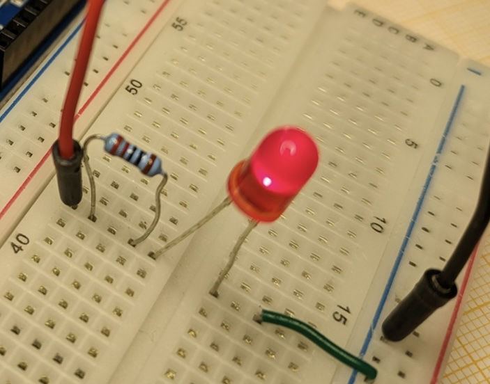

Imagine I cut the board open and viewed it from the side. It would kinda look like this (minus the clamps holding the leads):

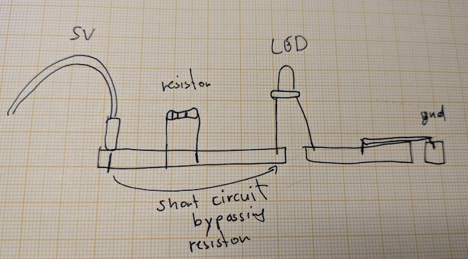

I've accidentally created a short circuit between the 5V pin on the Arduino and the LED, bypassing the resistor. The leads of the wire, the resistor, and the LED are all connected to the same metal bar inside the breadboard. So the electrons will basically bypass the resistor. The circuit draws as much current as it can from the Arduino.

How did I find out? For practice, I measured the current of the entire circuit with my multimeter, placing it in series with the ground pin on the Arduino and the ground cable going out of the ground rail on the breadboard. The multimeter showed a draw of around $356mA$, which shouldn't happen with a $220 \Omega$ resistor in front of each LED! I played around with this setup for a few minutes, thinking the multimeter was wrong.

Well, eventually, the multimeter stopped showing any kind of current. And it smelled a little funny. Here's the front of the multimeter.

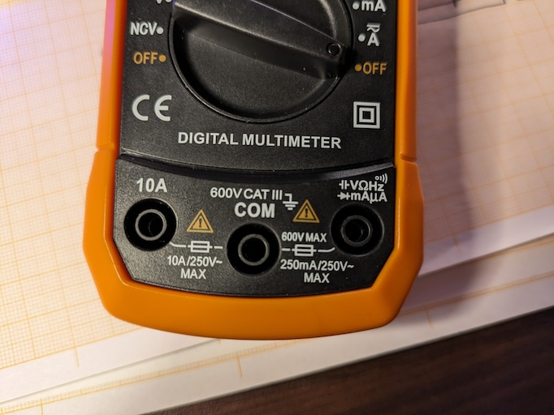

It has two ratings, $10A$ on the left port, and $250mA$ on the right port. For my measurements, which should give a current way below 1A, I used the right one. It is rated for $250mA$. I drove $356mA$ through it. The little symbol above the $250mA$ label indicates that there's a fuse in there. And that fuse must have triggered, interrupting the internal circuit, so I can no longer measure currents on that port.

I then proceeded to open up the multimeter to investigate.

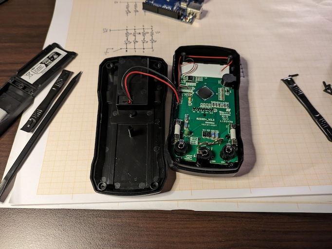

I took out both fuses but was a little confused. They both seemed fine? The fuse depictions in the books I read all had a little window that would allow you to judge whether the fuse was still good. These didn't.

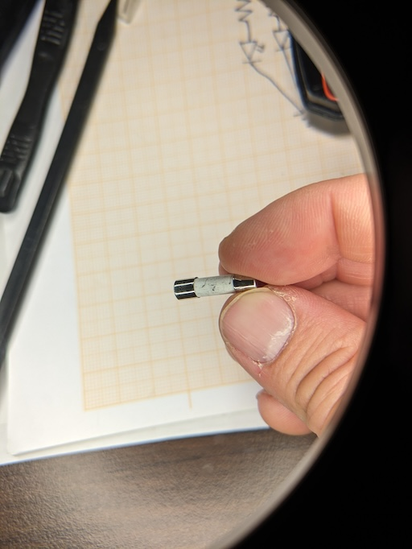

How can I test if the fuse is actually working without a multimeter? Well, I still had the resistor, the LED, a battery, and wires. So I tested the $250mA$ fuse.

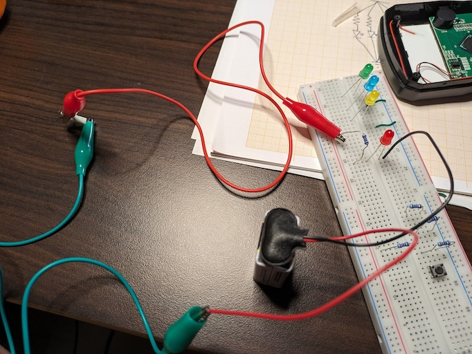

And indeed, it was broken. For good measure, I also tested the $10A$ fuse from the other port, just in case I messed up this test circuit as well.

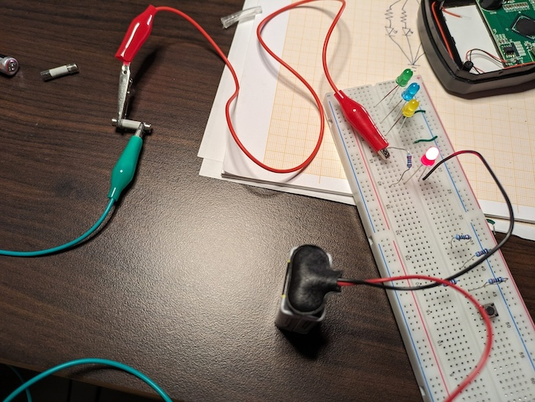

The LED lit up, so the fuse (and the test circuit) was good. I just debugged my first electronic device!

The port with the broken fuse is also used to measure voltages and resistance. So I tested if measuring voltages worked by putting the multimeter in parallel to the test circuit, giving me the voltage drop across the entire circuit, which is equal to the supply voltage.

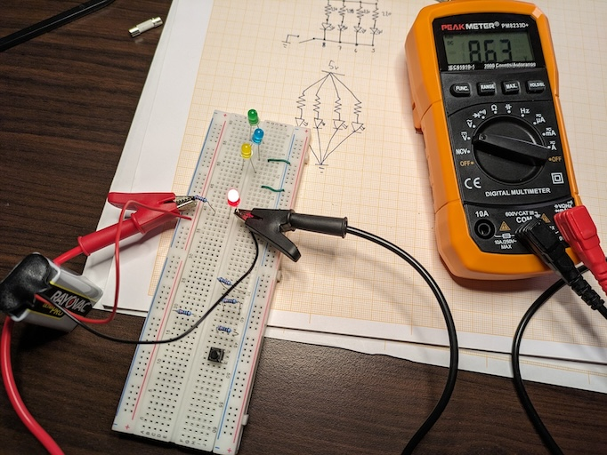

Then, I redesigned the LED circuit without short circuits and measured the current through it by using the multimeter's $10A$ port, again putting it in series between the last LED and ground.

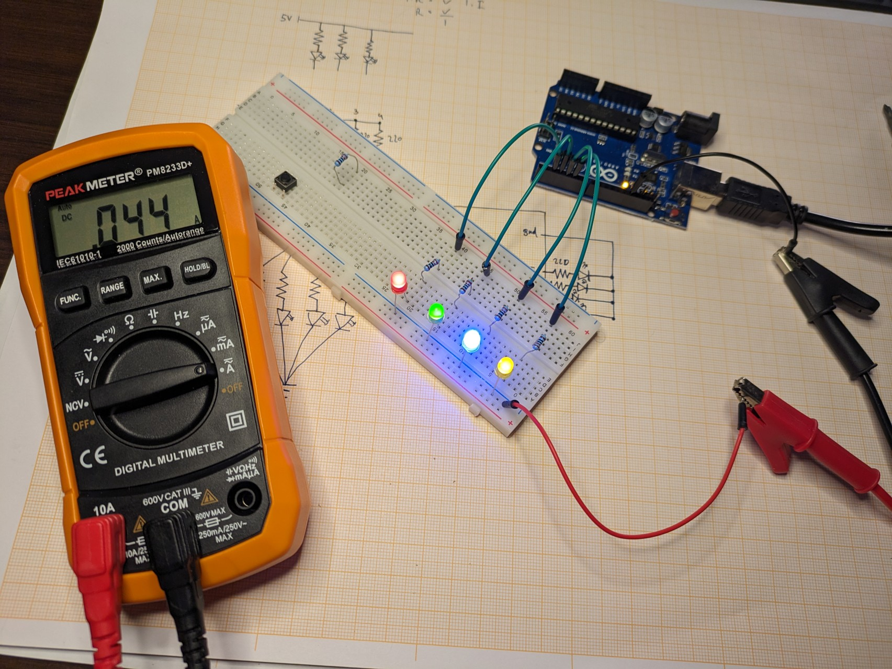

Now the circuit drew $44mA$, which is in line with what's expected. Each branch has a $220 \Omega$ resistor and an LED with a voltage drop of around $2V$. The pin is at $5V$ relative to ground, which is the voltage across the branch. The current through each branch is thus $I_{branch} = \frac{5V - 2V}{220} = 0.01363A = 13.63mA$. Since the current of a parallel circuit is the sum of the currents through its branches, the total current of the circuit is $4 \times 13.63mA = 52mA$. That is in the same ballpark as what I measured with the multimeter. The difference is likely explained by the differently colored LEDs having voltage drops slightly higher than the assumed $2V$.

Tomorrow, I shall buy my first replacement fuse. How exciting!

## Project: Animating LEDs the Horrible Way
For my "Simon Says" project, I want to be able to do a little LED animation, that is, turn LEDs on and off in some pattern. That requires some timing.

The simplest way to do some sort of timing is via the [delay(unsigned long ms)](https://www.arduino.cc/reference/en/language/functions/time/delay/) function. It's basically a busy wait, stalling the program for the specified amount of milliseconds. Here's the [implementation](https://github.com/arduino/ArduinoCore-avr/blob/321fca0bac806bdd36af8afbc13587f4b67eb5f1/cores/arduino/wiring.c#L106) from the Arduino framework.

```cpp
void delay(unsigned long ms)
{
	uint32_t start = micros();

	while (ms > 0) {
		yield();
		while ( ms > 0 && (micros() - start) >= 1000) {
			ms--;
			start += 1000;
		}
	}
}
```

The call to `yield()` gives background tasks a chance to do their thing. Other than that, this is basically a busy wait or spin lock. Not great, but let's go with that for now.

Given the schematic above with 4 LEDs in parallel connected to pins 2-5, I want each LED to light up for $250 ms$, while the others are off. Since this is pretty trivial, I'll just smack you with the full code for the program.

```cpp
#include <Arduino.h>

constexpr uint8_t led_pins[] = {2, 3, 4, 5};
constexpr uint8_t num_leds = sizeof(led_pins) / sizeof(led_pins[0]);

void leds_setup() {
  for (int i = 0; i < num_leds; i++) {
    pinMode(led_pins[i], OUTPUT);
  }
}

void leds_set_all(uint8_t value) {
  for (int i = 0; i < num_leds; i++) {
    digitalWrite(led_pins[i], value);
  }
}

void setup() {
  leds_setup();
}

void loop() {
  for (int i = 0; i < num_leds; i++) {
    leds_set_all(LOW);
    digitalWrite(led_pins[i], HIGH);
    delay(250);
  }
}
```

I've made the number of LEDs basically configurable, including what pins they are attached to, via the `led_pins` and `num_leds` compile-time constants. The `leds_setup()` function sets all the LEDs' pins to output mode, and the `leds_set_all()` function lets me set the voltage on every pin to a specific value at once.

The main program starts with a call to `setup()`, which sets up the pin modes.

In `loop()`, for each LED pin, I first set the voltages to LOW for all pins, turning all LEDs off. Then I set the current pin's voltage to HIGH and wait for $250 ms$ to give the LED time to shine before moving on to the next pin.

Once the `for` loop is completed, we'll give control back to the `main()` function, which will call `loop()` again. The sequence of LEDs lighting up and shutting off will continue indefinitely. Here's the result.

<video src="media/circuit-6.mp4" controls loop></video>

It does what it's supposed to do, but it also has a problem: we can't do anything else while `delay()` blocks the CPU. That includes reading button states, our next goal. Let's fix that.

## Project: Lighting up LEDs the Slightly Less Horrible Way
The Arduino framework offers a function that any game developer will appreciate: [`unsigned long millis()`](https://www.arduino.cc/reference/en/language/functions/time/millis/). It returns the number of milliseconds elapsed since the Arduino board began running the program.

We can use this to implement time-based animations of our little [LED organ](). An animation consists of frames. Each frame defines the state of the LEDs and the frame's duration in milliseconds.

```cpp
template<size_t N>
struct LedAnimationFrame {
  uint8_t led_states[N];
  unsigned long duration;
};
```

An animation is then just a series of frames. Here's the animation from the last project expressed as frames.

```cpp
LedAnimationFrame<num_leds> frames[] = {
  {1, 0, 0, 0, 250},
  {0, 1, 0, 0, 250},
  {0, 0, 1, 0, 250},
  {0, 0, 0, 1, 250},
  {0, 0, 0, 0, 0xffffffff},
};
```

The last frame isn't really a frame of the animation. It marks the end of the array of frames, similar to a `\0` at the end of a string in C. I abuse the `duration` field for that by setting it to `0xffffffff`. Note that instead of `HIGH` and `LOW`, I'm using `1` and `0`. That's what those defines map to anyway, and it's easier to read in my opinion.

To play back those frames, I need to keep track of what frame I'm on and how much time has elapsed since I started "displaying" that frame on the LEDs. If the elapsed time is greater than the frame duration, I switch to the next frame. If I hit the frame with a duration of `0xffffffff`, I wrap around to the first frame.

Here's how I codified this:

```cpp
template <size_t N> struct LedAnimation {
  uint8_t led_pins[N];
  LedAnimationFrame<N> *frames;
  unsigned long last_time;
  int current_frame;

  LedAnimation(const uint8_t _led_pins[N], const LedAnimationFrame<N> *_frames)
      : frames(_frames), last_time(0xffffffff), current_frame(0) {
    for (size_t i = 0; i < N; i++) {
      led_pins[i] = _led_pins[i];
    }
  }

  void update() {
    unsigned long time = millis();

    // First time we update, set things up and show the first frame.
    if (last_time == 0xffffffff) {
      last_time = time;
      current_frame = 0;
      for (size_t i = 0; i < N; ++i) {
        digitalWrite(led_pins[i], frames[current_frame].led_states[i]);
      }
      return;
    }

    // Has this frame been shown long enough? Switch to the next.
    if (time - last_time >= frames[current_frame].duration) {
      last_time = time;
      current_frame++;

      // Last frame reached? Wrap around.
      if (frames[current_frame].duration == 0xFFFFFFFF) {
        current_frame = 0;
      }

      // Display the frame.
      for (size_t i = 0; i < N; ++i) {
        digitalWrite(led_pins[i], frames[current_frame].led_states[i]);
      }
    }
  }

  void reset() {
    current_frame = 0;
    last_time = 0xffffffff;
  }
};
```

The magic happens in `update()`. It has some special logic for the case where we haven't shown a frame yet. Otherwise, it checks how much time has elapsed since we changed the LED states and if we need to switch to the next frame.

It's not perfect, of course. For example, if `duration` is `250` and `time - last_time` is, e.g., `260`, the code will dutifully switch to the next frame, but it will also "lose" the 10 milliseconds we "overshot" the current frame. Also, if `time - last_time` is bigger than the current frame's and the next frame's duration combined, we still switch to the next frame, instead of to the frame after that.

I want to keep this as simple as possible and ignore those edge cases. The `reset()` function sets the animation back to the first frame.

I can now rewrite the last project's program using this new fancy abstraction.

```cpp
#include <Arduino.h>

constexpr uint8_t led_pins[] = {2, 3, 4, 5};
constexpr uint8_t num_leds = sizeof(led_pins) / sizeof(led_pins[0]);

template <size_t N> struct LedAnimationFrame {
  uint8_t led_states[N];
  unsigned long duration;
};

template <size_t N> struct LedAnimation {
  uint8_t led_pins[N];
  LedAnimationFrame<N> *frames;
  unsigned long last_time;
  int current_frame;

  LedAnimation(const uint8_t _led_pins[N], const LedAnimationFrame<N> *_frames)
      : frames(_frames), last_time(0xffffffff), current_frame(0) {
    for (size_t i = 0; i < N; i++) {
      led_pins[i] = _led_pins[i];
    }
  }

  void update() {
    unsigned long time = millis();

    // First time we update, set things up and show the first frame.
    if (last_time == 0xffffffff) {
      last_time = time;
      current_frame = 0;
      for (size_t i = 0; i < N; ++i) {
        digitalWrite(led_pins[i], frames[current_frame].led_states[i]);
      }
      return;
    }

    // Has this frame been shown long enough? Switch to the next.
    if (time - last_time >= frames[current_frame].duration) {
      last_time = time;
      current_frame++;

      // Last frame reached? Wrap around.
      if (frames[current_frame].duration == 0xFFFFFFFF) {
        current_frame = 0;
      }

      // Display the frame.
      for (size_t i = 0; i < N; ++i) {
        digitalWrite(led_pins[i], frames[current_frame].led_states[i]);
      }
    }
  }

  void reset() {
    current_frame = 0;
    last_time = 0xffffffff;
  }
};

LedAnimationFrame<num_leds> frames[] = {
    {1, 0, 0, 0, 250}, //
    {0, 1, 0, 0, 250}, //
    {0, 0, 1, 0, 250}, //
    {0, 0, 0, 1, 250}, //
    {0, 0, 0, 0, 0xffffffff},
};
LedAnimation<num_leds> animation(led_pins, frames);

void setup() {
  for (int i = 0; i < num_leds; i++) {
    pinMode(led_pins[i], OUTPUT);
  }
}

void loop() { animation.update(); }
```

Alrighty, 75 lines of code to turn on some LEDs instead of the original 28. The physical output is the same, so I'm omitting a video here.

While the code is obviously larger, it's now also much easier to add additional animations. I've stuffed the LED-related code into a header file called `leds.h`, which leaves us with:

```cpp
#include <Arduino.h>
#include <leds.h>

constexpr uint8_t led_pins[] = {2, 3, 4, 5};
constexpr uint8_t num_leds = sizeof(led_pins) / sizeof(led_pins[0]);

LedAnimationFrame<num_leds> frames[] = {
    {1, 0, 0, 0, 250}, //
    {0, 1, 0, 0, 250}, //
    {0, 0, 1, 0, 250}, //
    {0, 0, 0, 1, 250}, //
    {0, 0, 0, 0, 0xffffffff},
};
LedAnimation<num_leds> animation(led_pins, frames);

void setup() {
  for (int i = 0; i < num_leds; i++) {
    pinMode(led_pins[i], OUTPUT);
  }
}

void loop() { animation.update(); }
```

25 lines of code. Plus, it's very easy to add new animations or change the existing one. Observe.

```cpp
...

LedAnimationFrame<num_leds> frames[] = {
    {1, 0, 0, 0, 250}, //
    {0, 1, 0, 0, 250}, //
    {0, 0, 1, 0, 250}, //
    {0, 0, 0, 1, 250}, //
    {0, 0, 1, 0, 250}, //
    {0, 1, 0, 0, 250}, //
    {0, 0, 0, 0, 0xffffffff},
};
LedAnimation<num_leds> animation(led_pins, frames);

...
```

With a few more frames added, I've got my own shitty [KITT](https://en.wikipedia.org/wiki/KITT). Fantastic.

<video src="media/circuit-7.mp4" controls loop></video>

Let's read some button states!

## Interlude: Serial Plotter
There's no way to debug a C++ program running on the Arduino Uno. Well, there is, by buying additional [hardware](https://www.microchip.com/en-us/development-tool/atatmel-ice), wiring things up, and... losing hair.

It would be nice to get some insight into what is going on in the C++ program that runs on the microcontroller.

This is usually done via the [serial port](https://en.wikipedia.org/wiki/Serial_port). Two devices connected via a serial port exchange information bi-directionally, one bit at a time, at some agreed-upon transfer rate measured in bits per second, also known as [bauds](https://en.wikipedia.org/wiki/Baud). If you're interested in the protocol details and how it's actually implemented electrically, you'll find plenty of information on the internet.

When connecting an Arduino Uno to a computer via USB, they can communicate via a serial port. The computer can read and write to the serial port, and so can the program running on the Arduino.

On the Arduino side, you can use this incantation:

```cpp
#include <Arduino.h>

void setup() {
  // Initialize the serial connection, specifying the baud rate
  Serial.begin(9600);
  Serial.println("Hello world");
}

...
```

On the computer side, you need a serial port library for your language of choice that lets you enumerate serial ports and read from and write to them. For NodeJS, [SerialPort](https://serialport.io/) is pretty easy to use and comprehensive.

The computer and the Arduino need to agree on the baud rate when initiating the communication; otherwise, they don't sync up the data stream properly. In this case, the baud rate is 9600 bits per second, or 1200 bytes per second. Not a lot.

We can abuse the serial port for [printf() debugging](https://blog.jetbrains.com/idea/2022/10/cultivating-good-printf-debugging-habits/). I'm not a fan, but it's all we've got in this environment.

In the C++ program on the Arduino, we can strategically log the values of variables via `Serial.print()` or `Serial.println()`:

```cpp
Serial.print("variable: ");
Serial.print(value);
Serial.println();
```

There's no `printf()` that takes a format string, and I'm too lazy to write one.

When reading from the input pins on an Arduino, you generally get time series data—that is, a stream of voltages, either 0 and 1 for digital pins, or 0 to 1023 for analog pins.

Imagine connecting a temperature sensor to an analog pin, which will set a voltage between $0V$ and $5V$, mapping to some temperature range the sensor can handle. You could then periodically, e.g., every few hundred milliseconds, measure the current temperature by reading the voltage on the pin. Since the sensor is connected to an analog pin, we'll get a value between 0 and 1023 through the analog-to-digital converter, which we can then map to the sensor's temperature range, as specified in the sensor's data sheet.

What if we want to plot this data over time? We could wire up a display to the Arduino and enhance the C++ program to interface with the display to draw the historic temperature data. But that feels like a lot of work. I also don't know how to do that yet.

Instead, I can plot the data on the computer the Arduino is connected to. All I need to do is use some software that opens the serial port to the Arduino and waits for the C++ program running on the Arduino to send over values it can then plot.

You'd think PlatformIO would have a feature like that. But it doesn't. The Arduino IDE has a tool called "Serial Plotter," but it is extremely limited.

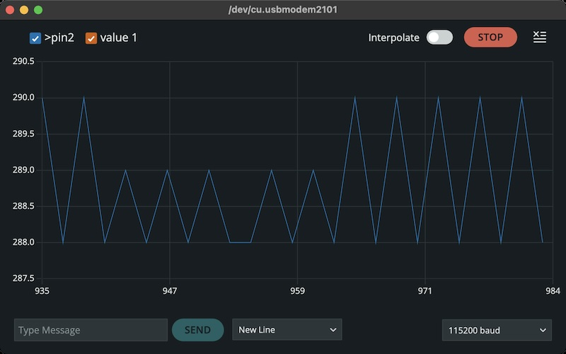

All you need to do in your C++ program running on the Arduino is:

* Open a serial port via `Serial.init(baudRate);`
* Write out one or more variable name/value pairs using the format `>name:value,name2:value,...\r\n`

The plotter will then receive those lines, parse them, and plot a line for each variable encountered.

The plotter is not very functional. You cannot zoom in or out, and the number of samples appears to be fixed. You also cannot view historical data, e.g., by panning around left and right. To see the current value of a variable, you have to hover your mouse. You can't have multiple plots. And so on. It also doesn't integrate with VS Code, and I don't want to run multiple programs when working on my microcontroller code.

For VS Code, there is [Teleplot](https://github.com/nesnes/teleplot-vscode?tab=readme-ov-file), which is much more capable. I gave it a try, but it didn't really click with me for various reasons.

So I did what any programmer would do, and just went full NIH. I spent the night writing my own VS Code [serial plotter extension](https://marketplace.visualstudio.com/items?itemName=badlogicgames.serial-plotter). It is ugly but works exactly as I want it to work.

I can deploy this to the Arduino:

```cpp
void setup() {
  Serial.begin(112500);
}

float angle = 0;
void loop() {
  Serial.print(">");

  Serial.print("var1:");
  Serial.print(cos(angle));
  Serial.print(",");

  Serial.print("var2:");
  Serial.print(cos(angle + PI / 2) * 0.1);
  Serial.print(",");

  Serial.print("var3:");
  Serial.print(cos(angle + PI / 4) * 1.2 + 2);
  Serial.println(); // Writes \r\n

  Serial.println("This is totally ignored");
  delay(100);

  angle += PI / 10;
}
```

Then press `CMD + P` and select `Serial Plotter: Open Pane` from the command palette, select the serial port, and press start.

<video src="media/serial-plotter.mp4" controls loop></video>

You can find the source code on [GitHub](https://github.com/badlogic/serial-plotter). You can also install it from the [VS Code Marketplace](https://marketplace.visualstudio.com/items?itemName=badlogicgames.serial-plotter).

It's not pretty but does exactly what I want in the most minimal way possible. And I wrote all the code, so I have an easy time modifying it should I need more features.

## Up Next
Well, I didn't get to reading button states as I got distracted writing software. And this post is getting a bit long in the tooth. Let's postpone all things buttons to the next post. The serial plotter will come in handy.

<%= render("../../_partials/post-footer.html") %>