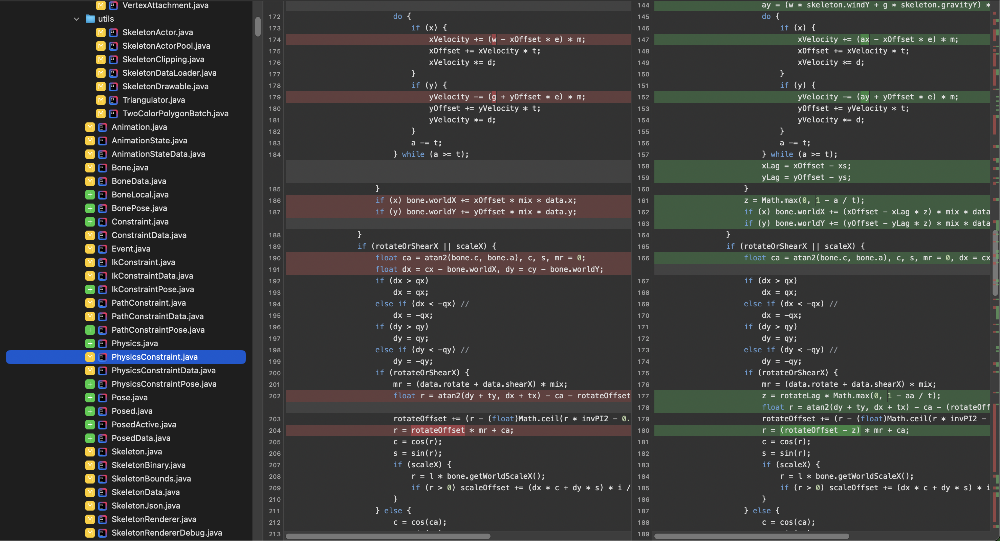

<%
	meta("../../meta.json")
	meta()
	const path = require('path');
	const fs = require('fs');
	url = url + "/posts/" + path.basename(path.dirname(outputPath)) + "/";

	function stripHeader(content) {
		const headerEnd = content.indexOf('*****************************************************************************/');
		if (headerEnd !== -1) {
			return content.substring(headerEnd + '*****************************************************************************/'.length).trimStart();
		}
		return content;
	}
%>
<%= render("../../_partials/post-header.html", { title, image, url, description, caption, date }) %>

Like most of you, I've been dabbling in what people call "agentic engineering." Truth is, there's not much engineering happening. We're basically throwing shit at the wall and hoping something sticks.

Using LLM coding tools like Claude Code to spin up throwaway greenfield projects or bang out ad hoc scripts? Pretty great experience. But try using them on a big, established codebase, or the-production-app-formerly-known-as-greenfield-project without breaking everything? That's where things get painful.

## Feeling the pain
For bigger codebases, the main issue is context, or rather, the lack of it. These tools don't have the full picture of your project. Maybe you haven't given them that overview, or maybe their context window is too small to hold all your interconnected components. But there's more to it.

Even with recent improvements like 'reasoning', which is really just the old 'think step by step' trick, with more scratch space to attend to, LLMs still can't follow execution flow all that well. They're especially lost with anything beyond sequential scripts: multiple processes, IPC, client-server architectures, concurrent execution within the same process. Even when you manage to cram all the context they need, they'll still generate code that doesn't fit your system's actual architecture.

LLMs also lack taste. Trained on all code on the web (and likely some private code), they generate, to oversimplify, the statistical mean of what they've seen. While senior engineers strive for elegant, minimal solutions that reduce bugs and complexity, LLMs reach for 'best practices' and spit out over-engineered garbage. Let them run wild and you'll get code that's hard to maintain, hard to understand, and full of places for bugs to hide.

Then there's context degradation. As your session progresses and pulls in more files, tool outputs, and other data, things start falling apart around 100k tokens. Benchmarks be damned. Whatever tricks LLM providers use to achieve those massive context windows don't work in practice. The model loses track of important details buried in the middle of all that context.

Worse still, many tools don't let you control what goes into your context. Companies like Cursor that aren't LLM providers themselves need to make a margin between what you pay them and what they pay for tokens. Their incentive? Cut down your context to save money, which means the LLM might miss crucial information or get it in a suboptimal format.

Claude Code is different. It comes straight from Anthropic with no middleman trying to squeeze margins. With the Max plan, you get essentially unlimited tokens (though folks like [Peter](https://twitter.com/steipete) manage to get rate limited even with three or four accounts). You still don't have full control: there's a system prompt you can't change, additional instructions get sneakily injected into your first message, the VS Code integration adds unwanted crap, and all the tool definitions eat up context and give the model plenty of rope to confuse itself with. But this is the best deal we're getting, so we work with what we have. (Anthropic, please OSS Claude Code. Your models are your moat, not Claude Code.)

# How do we tame this agentic mess?

What we need when using coding agents on bigger codebases is a structured way to engineer context. By that I mean: keep only the information needed for the task of modifying or generating code, minimize the number of turns the model needs to take calling tools or reporting back to us, and ensure nothing important is missing. We want reproducible workflows. We want determinism, as much as possible within the limits of these inherently non-deterministic models.

I'm a programmer. You're probably a programmer. We think in systems, deterministic workflows, and abstractions. What's more natural for us than viewing LLMs as an extremely slow kind of unreliable computer that we program with natural language?

This is a weird form of metaprogramming: we write "code" in the form of prompts that execute on the LLM to produce the actual code that runs on real CPUs.

Yes, I know LLMs aren't actually computers (though there are some papers on arXiv...). The metaphor is a bit stretched. But here's the thing: as developers, we're used to encoding specifications in precise programming languages. When we interact with LLMs, the fuzziness of natural language makes us forget we can apply the same structured thinking. This framework bridges that gap: think "inputs, state, outputs" instead of "chat with the AI" and suddenly you're closer to engineering solutions instead of just hoping for the best.

## Thinking of LLMs as Shitty General Purpose Computers

In traditional software, we create programs by writing code and importing libraries. A program takes inputs, manipulates state, and produces outputs. We can map these concepts to our LLM-as-shitty-computer metaphor like this:

**Program** is your prompt, written in natural language. It specifies initial inputs, "imports" external functions via tool descriptions, and implements business logic through control flow: sequential steps, loops, conditionals, and yes, even goto. Tool calls and user input are I/O.

**Inputs** come from three sources: prepared information (codebase docs, style guides, architecture overviews) either baked into the prompt or loaded from disk, user input during execution (clarifications, corrections, new requirements), and tool outputs (file contents, command results, API responses).

**State** evolves as the program runs. Some lives in the context, but we treat that as ephemeral: compaction will eventually wipe it (trololo). Plus, you'll quickly hit context limits with any substantial state. So we serialize to disk using formats LLMs handle well: JSON for structured data, where the LLM can surgically read and update specific fields via `jq`. Markdown for smaller unstructured data we can load fully into context if needed. The payoff? You can resume from any point with a fresh context, sidestepping the dreaded compaction issue entirely.

**Outputs** aren't limited to generated code. Just like traditional programs produce console output, write files, or display GUIs, our LLM program uses tool calls to create various outputs: the actual code, diffs, open files in an editor for us, codebase statistics, summaries of changes, or any other artifact that documents what the program did. These outputs serve multiple purposes: helping you review the work, providing input for the next steps in the workflow, or simply showing the program's progress.

Let's see how this plays out in practice.

## A Real World Example: Porting the Spine Runtimes

After experimenting with toy projects, I felt ready to apply this approach to a real codebase: the [Spine runtimes](https://github.com/EsotericSoftware/spine-runtimes).

[Spine](https://esotericsoftware.com) is 2D skeletal animation software. You create animations in the editor, export them to a runtime format, then use one of many runtimes to display them in your app or game. We maintain runtimes for C, C++, C#, Haxe, Java, Dart, Swift, and TypeScript. On top of these, we've built integrations for Unity, Unreal, Godot, Phaser, Pixi, ThreeJS, iOS, Android, web, and more.

Here's the painful part: between releases, the runtime code changes. We implement new features in our reference implementation (spine-libgdx in Java, which powers the editor), then manually port those changes to every other language runtime. It's tedious, error-prone work. Math-heavy code needs exact translation, and after hours of porting, your brain turns to mush. Bugs creep in that are hell to track down.



And no, transpilers won't work for this (trust me, I made money doing compilers.). We need idiomatic ports that preserve the same API surface in a way that feels natural for each language.

Between releases 4.2 and 4.3-beta, the Java reference implementation  saw significant changes:

```bash
$ git diff --stat 4.2..4.3-beta -- '*.java' | tail -1
  79 files changed, 4820 insertions(+), 4679 deletions(-)
```

Here's how I'd approach this with my manual workflow:

1. Open the changeset in Fork (my git client) and scan through all changed files
2. Plan the porting order based on the dependency graph: interfaces and enums first (they're usually independent), then try to port dependencies before the classes that use them, hoping to maintain some compilability
3. Pick a type to port in Java, open a side-by-side diffs, check if the type already exists in the target runtime or needs creation from scratch
4. Port changes line-by-line, method-by-method to the target language
5. Watch the illusion of order crumble: the dependency graph is cyclic, so there's no perfect porting order that keeps everything compiling (note to self: it would be nice if we had an acyclic type dependency graph)
6. Can't test individual pieces because a skeletal animation system needs all its parts working in concert
7. Port everything blind, then face a wall of compilation errors and bugs introduced because my brain was fried after hours of human transpilation

This is especially fun when porting from Java to C, the language pair with the biggest type system and memory management mismatch.

What makes this tractable is that we maintain the same API surface across all runtime implementations. If there's a class `Animation` in Java, there's also a class `Animation` in C#, C++, and every other runtime, in a corresponding file. This one-to-one mapping exists for 99% of types. Sure, there are quirks like Java files containing dozens of inner classes, but the structural consistency is there.

Here's an example of one of the more math-heavy types, `PhysicsConstraint`:

<style>
.code-preview {
    max-height: 400px;
    overflow-y: auto;
    position: relative;
}
.code-preview pre {
    margin: 0;
}
.code-preview::after {
    content: '';
    position: absolute;
    bottom: 0;
    left: 0;
    right: 0;
    height: 60px;
    background: linear-gradient(to bottom, transparent, var(--color-background));
    pointer-events: none;
}

/* Disable line wrapping for markdown code blocks since port.md is manually wrapped */
pre code.language-markdown {
    white-space: pre;
    overflow-x: auto;
}

/* Normalize spacing after lists */
ul, ol {
    margin-bottom: 1em;
}

/* Ensure consistent spacing for nested lists */
ul ul:last-child,
ol ol:last-child,
ul ol:last-child,
ol ul:last-child {
    margin-bottom: 0;
}
</style>

**Java (PhysicsConstraint.java)**
<div class="code-preview">

```java
<%= stripHeader(fs.readFileSync(path.join(path.dirname(inputPath), "media/PhysicsConstraint.java"), 'utf8')) %>
```

</div>

**C++ Header (PhysicsConstraint.h)**
<div class="code-preview">

```cpp
<%= stripHeader(fs.readFileSync(path.join(path.dirname(inputPath), "media/PhysicsConstraint.h"), 'utf8')) %>
```

</div>

**C++ Implementation (PhysicsConstraint.cpp)**
<div class="code-preview">

```cpp
<%= stripHeader(fs.readFileSync(path.join(path.dirname(inputPath), "media/PhysicsConstraint.cpp"), 'utf8')) %>
```

</div>

Much of this porting work is mechanical and can be automated, like getters and setters, transferring documentation from Javadoc to docstrings, or ensuring the math matches. Some of the porting work requires a human brain, like translating Java generics to C++ templates, a task LLMs aren't very good at. What LLMs are good at is helping me double-check that I ported every line faithfully. This presented the perfect opportunity to apply my little workflow experiment to a real-world task on a real-world, largish codebase.

## The "Port Java to X" Program

Time to write our program. We're essentially encoding my manual workflow into a structured LLM program. The goal: go through each Java type that changed between two commits and port it to a target runtime (like C++) collaboratively with the user.

Instead of me manually opening diffs, tracking dependencies, and porting line-by-line while my brain melts, we'll have the LLM handle the mechanical parts while I stay in control of the decisions that matter.

The final result of this program design can be found in the [spine-port repository](https://github.com/badlogic/spine-port). The program itself is stored in a file called [`port.md`](https://github.com/badlogic/spine-port/blob/main/port.md). When I want to start or continue porting, I start Claude Code in the spine-port directory and tell it to read the `port.md` file in full and execute the workflow. That starts the "program".

In the following sections, we'll walk through each section of this program.

### Initial Input and State

Every program needs input data and initial state to work with. The `port.md` file starts by defining the data structure that serves as both:

```markdown
# Spine Runtimes Porting Program

Collaborative porting of changes between two commits in the Spine runtime
reference implementation (Java) to a target runtime. Work tracked in
`porting-plan.json` which has the following format:

​```json
{
  "metadata": {
    "prevBranch": "4.2",
    "currentBranch": "4.3-beta",
    "generated": "2024-06-30T...",
    "spineRuntimesDir": "/absolute/path/to/spine-runtimes",
    "targetRuntime": "spine-cpp",
    "targetRuntimePath": "/absolute/path/to/spine-runtimes/spine-cpp/spine-cpp",
    "targetRuntimeLanguage": "cpp"
  },
  "deletedFiles": [
    {
      "filePath": "/path/to/deleted/File.java",
      "status": "pending"
    }
  ],
  "portingOrder": [
    {
      "javaSourcePath": "/path/to/EnumFile.java",
      "types": [
        {
          "name": "Animation",
          "kind": "enum",
          "startLine": 45,
          "endLine": 52,
          "isInner": false,
          "portingState": "pending",
          "candidateFiles": ["/path/to/spine-cpp/include/spine/Animation.h", "/path/to/spine-cpp/include/spine/Animation.cpp"]
        }
      ]
    }
  ]
}
​```
```

This data structure is the central state that tracks our porting progress. The `porting-plan.json` file serves as both the initial input and the persistent state for our LLM program. Let's break down what each part means:

**metadata**: Configuration for the porting session:
- `prevBranch` and `currentBranch`: The git commits we're porting between
- `spineRuntimesDir`: Where all the runtime implementations live
- `targetRuntime`, `targetRuntimePath`, `targetRuntimeLanguage`: Which runtime we're porting to and where to find it

**deletedFiles**: Java files that were removed and need corresponding deletions in the target runtime

**portingOrder**: The heart of the plan. Each entry represents a Java file that changed and contains:
- `javaSourcePath`: The full path to the Java source file
- `types`: An array of all classes, interfaces, and enums in that file, each with:
  - `name`: The type name (e.g., "Animation")
  - `kind`: Whether it's a class, interface, or enum
  - `startLine` and `endLine`: Where to find it in the Java file
  - `isInner`: Whether it's an inner type
  - `portingState`: Tracks progress: "pending" or "done"
  - `candidateFiles`: Where this type likely exists in the target runtime

The `portingState` field is crucial: it's how the LLM tracks what's been done across sessions. When I stop and restart later, the program knows exactly where to pick up.

But how do we generate all this structured data? Before the LLM can start porting, we need to analyze what changed between the two versions and prepare the data in a format the LLM can efficiently query. I wrote [`generate-porting-plan.js`](https://github.com/badlogic/spine-port/blob/main/generate-porting-plan.js) to automate this preparation:

```bash
./generate-porting-plan.js 4.2 4.3-beta /path/to/spine-runtimes spine-cpp
```

This script does several things:

1. **Runs git diff** to find all Java files that changed between the two commits
2. **Uses [`lsp-cli`](https://github.com/badlogic/lsp-cli)** to extract complete type information from both the Java reference implementation and the target runtime
3. **Analyzes dependencies** to create a porting order (enums before interfaces before classes)
4. **Finds candidate files** in the target runtime where each type likely exists
5. **Outputs a structured JSON file** that the LLM can read from and write to efficiently via `jq`.

Why pre-generate all this data instead of having the LLM explore the codebase as it goes?

**Determinism**: The same inputs always produce the same plan. LLM exploration might miss files, use wrong search patterns, or get lost in the directory structure. Pre-generation ensures complete, accurate, and reproducible results.

**Context efficiency**: The pre-generation saves tokens and turns by not needing the LLM to perform all the steps that `generate-porting-plan.js` does: running git diff, analyzing dependencies, extracting type information, finding candidate files. That's a lot of tool calls and context that would otherwise be wasted.

**Speed**: Generating the plan takes seconds. Having the LLM explore the codebase would take orders of magnitude longer.

This transforms an open-ended exploration problem into structured data processing. Instead of "figure out what changed and how to port it," the LLM gets "here's exactly what changed, where it lives, and where it should go."

No tokens and turns wasted. The context contains only the information we need.

### The Function Library

The next section of `port.md` defines the tools available to our LLM program. Just like traditional programs import libraries, our LLM program needs tools to interact with the world.

```markdown
## Tools

### VS Claude
Use the vs-claude MCP server tools for opening files and diffs for the user
during porting.

​```javascript
// Open multiple files at once (batch operations)
mcp__vs-claude__open([
  {"type": "file", "path": "/abs/path/Animation.java"},    // Java source
  {"type": "file", "path": "/abs/path/Animation.h"},       // C++ header
  {"type": "file", "path": "/abs/path/Animation.cpp"}      // C++ source
]);

// Open single file with line range
mcp__vs-claude__open({"type": "file", "path": "/abs/path/Animation.java", "startLine": 100, "endLine": 120});

// View git diff for a file
mcp__vs-claude__open({"type": "gitDiff", "path": "/abs/path/Animation.cpp", "from": "HEAD", "to": "working"});
​```
```

**VS Code Integration** keeps the human in the loop. The LLM doesn't just modify files in the background; it opens them in my editor so I can see what's happening. This uses [vs-claude](https://marketplace.visualstudio.com/items?itemName=MarioZechner.vs-claude), an extension I wrote that implements the Model Context Protocol (MCP), turning VS Code into the LLM's display device.

```markdown
### Progress Tracking

Monitor porting progress using these jq commands:

​```bash
# Get overall progress percentage
jq -r '.portingOrder | map(.types[]) | "\(([.[] | select(.portingState == "done")] | length)) types ported out of \(length) total (\(([.[] | select(.portingState == "done")] | length) * 100 / length | floor)% complete)"' porting-plan.json

# Count types by state
jq -r '.portingOrder | map(.types[]) | group_by(.portingState) | map({state: .[0].portingState, count: length}) | sort_by(.state)' porting-plan.json

# List all completed types
jq -r '.portingOrder | map(.types[] | select(.portingState == "done") | .name) | sort | join(", ")' porting-plan.json

# Find remaining types to port
jq -r '.portingOrder | map(.types[] | select(.portingState == "pending") | .name) | length' porting-plan.json
​```
```

**Progress Tracking** functions that I can ask the LLM to run at any time. When I want to know how far we've gotten, I tell the LLM to execute one of these queries. They're pre-written and tested, ensuring the LLM uses efficient patterns instead of crafting its own potentially buggy versions.

```markdown
### Compile Testing

For C++, test compile individual files during porting:

​```bash
./compile-cpp.js /path/to/spine-cpp/spine-cpp/src/spine/Animation.cpp
​```

For other languages, we can not compile individual files and should not try to.
```

**Compile Testing** includes language-specific build commands. Notice the explicit warning about other languages. This prevents the LLM from wasting time trying to compile individual TypeScript or Haxe files, which would fail. It's defensive programming: explicitly state what not to do. Though with our non-deterministic computer, there's always a chance it'll try anyway.

### The Main Workflow

Now we get to the heart of our program: the actual porting logic with its loops, conditionals, and human checkpoints.

```markdown
## Workflow

Port one type at a time. Ensure the target runtime implementation is functionally
equivalent to the reference implementation. The APIs must match, bar idiomatic
differences, including type names, field names, method names, enum names,
parameter names and so on. Implementations of methods must match EXACTLY, bar
idiomatic differences, such as differences in collection types.

Follow these steps to port each type:

### 1. Setup (One-time)

DO NOT use the TodoWrite and TodoRead tools for this phase!

1. Read metadata from porting-plan.json:
   ​```bash
   jq '.metadata' porting-plan.json
   ​```
   - If this fails, abort and tell user to run generate-porting-plan.js
   - Store these values for later use:
      - targetRuntime (e.g., "spine-cpp")
      - targetRuntimePath (e.g., "/path/to/spine-cpp/spine-cpp")
      - targetRuntimeLanguage (e.g., "cpp")
```

Like any traditional program, this starts with initialization. The `jq '.metadata'` command is essentially a function call - the program tells the LLM exactly which function to invoke rather than having it figure out the extraction logic itself, saving tokens and turns. Notice the conditional: "If this fails, abort" - defensive programming ensuring the required input exists. The "Store these values" instruction doesn't actually store anything; it tells the LLM what variable names to use when referencing these values extracted from the porting plan metadata later, similar to how variable assignments work. Storage happens implicitly in the LLM's context.

```markdown
2. In parallel
   a. Check for conventions file:
      - Read `${targetRuntime}-conventions.md` (from step 1) in full.
      - If missing:
         - Use Task agents in parallel to analyze targetRuntimePath (from step 1)
         - Document all coding patterns and conventions:
            * Class/interface/enum definition syntax
            * Member variable naming (prefixes like m_, _, etc.)
            * Method naming conventions (camelCase vs snake_case)
            * Inheritance syntax
            * File organization (single file vs header/implementation)
            * Namespace/module/package structure
            * Memory management (GC, manual, smart pointers)
            * Error handling (exceptions, error codes, Result types)
            * Documentation format (Doxygen, JSDoc, etc.)
            * Type system specifics (generics, templates)
            * Property/getter/setter patterns
      - Agents MUST use ripgrep instead of grep!
      - Save as ${TARGET}-conventions.md
      - STOP and ask the user to review the generated conventions file

   b. Read `porting-notes.md` in full
      - If missing create with content:
      ​```markdown
      # Porting Notes
      ​```
```

The "in parallel" instruction tells the LLM to use multiple tools simultaneously rather than sequentially, speeding up execution.

Step 2a first tries to read the conventions file using **`${targetRuntime}-conventions.md`** - this is like string interpolation, where the LLM inserts the value for the target runtime name that it read from the porting plan. That conventions file captures the coding style and architecture patterns of the target runtime. This documents everything from naming conventions to memory management approaches, ensuring the LLM ports code that fits seamlessly into the existing codebase.

Step 2b sets up the **porting notes file** as a scratch pad for the porting job. This contains observations and edge cases discovered while porting - things like "Java uses `pose` but C++ uses `_applied` in this context" or "don't port toString() methods." It's a running log so we don't forget important discoveries that affect later porting decisions.

If either file doesn't exist, we create it.

Why generate the conventions file as part of the workflow instead of pre-generating it like the porting plan? Pre-generating conventions would require either manual work (time-consuming) or using an LLM with manual review anyway. Generating it inside the program ensures I don't have too many moving parts to juggle, and all instructions aimed at an LLM are contained in a single location: the program.

Here are the actual conventions and porting notes files:

**Conventions (spine-cpp-conventions.md)**
<div class="code-preview">

```markdown
<%= fs.readFileSync(path.join(path.dirname(inputPath), "media/spine-cpp-conventions.md"), 'utf8').replace(/```/g, '​```') %>
```

</div>

**Porting Notes (porting-notes.md)**
<div class="code-preview">

```markdown
<%= fs.readFileSync(path.join(path.dirname(inputPath), "media/porting-notes.md"), 'utf8').replace(/```/g, '​```') %>
```

</div>

At this point, we have exactly what we need in the context and nothing else: `port.md` in full (the program), the metadata from the porting plan JSON, the target runtime conventions in full, and the porting notes in full.

And now here's the main loop that does the actual porting:

```markdown
### 2. Port Types (Repeat for each)

1. **Find next pending type:**
   ​```bash
   # Get next pending type info with candidate files
   jq -r '.portingOrder[] | {file: .javaSourcePath, types: .types[] | select(.portingState == "pending")} | "\(.file)|\(.types.name)|\(.types.kind)|\(.types.startLine)|\(.types.endLine)|\(.types.candidateFiles | join(","))"' porting-plan.json | head -1
   ​```

2. **Open files in VS Code via vs-claude (for user review):**
   - Open Java file and Java file git diff (from prevBranch to currentBranch)
   - If candidateFiles exists: open all candidate files

3. **Confirm with user:**
   - Ask: "Port this type? (y/n)"
   - STOP and wait for confirmation.

4. **Read source files:**
   - Note: Read the files in parallel if possible
   - Java: Read the ENTIRE file so it is fully in your context!
   - Target: If exists, read the ENTIRE file(s) so they are fully in your context!
   - For large files (>2000 lines): Read in chunks of 1000 lines
   - Read parent types if needed (check extends/implements)
   - Goal: Have complete files in context for accurate porting

5. **Port the type:**
   - Follow conventions from ${targetRuntime}-conventions.md
   - If target file(s) don't exist, create them and open them for the user via vs-claude
   - Port incrementally and always ultrathink:
     * Base on the full content of the files in your context, identify differences and changes that need to be made.
      * differences can be due to idiomatic differences, or real differences due to new or changed functionality in the reference
        implementation. Ultrathink to discern which is which.
     * If changes need to be made:
       * Structure first (fields, method signatures)
       * Then method implementations
       * For C++: Run `./compile-cpp.js` after each method
   - Use MultiEdit for all changes to one file
   - Ensure 100% functional parity
   - Add or update jsdoc, doxygen, etc. based on Javadocs.

6. **Get user confirmation:**
   - Open a diff of the files you modified, comparing HEAD to working.
   - Give the user a summary of what you ported
   - Ask: "Mark as done? (y/n)"
   - If yes, update status:
   ​```bash
   jq --arg file "path/to/file.java" --arg type "TypeName" \
      '(.portingOrder[] | select(.javaSourcePath == $file) | .types[] | select(.name == $type) | .portingState) = "done"' \
      porting-plan.json > tmp.json && mv tmp.json porting-plan.json
   ​```

7. **Update porting-notes.md:**
   - Add any new patterns or special cases discovered.

8. **STOP and confirm:**
   - Show what was ported. Ask: "Continue to next type? (y/n)"
   - Only proceed after confirmation.
```

**Step 1** queries our state to find the next pending type using another precise `jq` function call. Here's what gets extracted from the porting plan and is now in the context:

```json
{
  "javaSourcePath": "/Users/badlogic/workspaces/spine-runtimes/spine-libgdx/spine-libgdx/src/com/esotericsoftware/spine/attachments/AtlasAttachmentLoader.java",
  "types": [
    {
      "name": "AtlasAttachmentLoader",
      "kind": "class",
      "startLine": 43,
      "endLine": 101,
      "isInner": false,
      "portingState": "pending",
      "candidateFiles": [
        "/Users/badlogic/workspaces/spine-runtimes/spine-cpp/spine-cpp/include/spine/AtlasAttachmentLoader.h",
        "/Users/badlogic/workspaces/spine-runtimes/spine-cpp/spine-cpp/src/spine/AtlasAttachmentLoader.cpp"
      ]
    }
  ]
}
```

**Steps 2-3** implement a human checkpoint: the LLM opens relevant files in VS Code and waits for confirmation before proceeding. This isn't just politeness; it's a safety mechanism ensuring I can abort if something looks wrong, or if I want to port a different type, or if I can immediately see that this type is complete and we should update the porting state and move on to the next type.

**Step 4** is critical: "Read the ENTIRE file so it is fully in your context!" The emphasis prevents the LLM from being lazy and reading only parts of files, which would lead to incomplete ports. After this step, the context contains the complete source files needed for accurate porting.

**Step 5** does the actual porting work. The "ultrathink to discern" instruction acknowledges that porting isn't just mechanical translation; it requires judgment about idiomatic differences versus actual functionality changes.

**Steps 6-8** implement more human checkpoints and program state management. The LLM shows its work (via diffs), then updates the program's persistent state: step 6 writes to `porting-plan.json` to mark the type as done, and step 7 optionally updates `porting-notes.md` with new observations. This is where our program writes its state to disk - crucial for resumability. The state update in step 6 uses `jq` to surgically modify just the `portingState` field, ensuring we can resume exactly where we left off. Step 8 asks permission before the next loop iteration.

This is our complete LLM program: structured initialization, precise function calls, state management, human checkpoints, and deterministic loops. What started as an ad hoc conversation with an AI has become a reproducible, resumable workflow that tackles real-world porting at scale.

## Notes

**Sub-agent communication and observability**: Currently with Claude Code, you can spawn sub-agents but have no observability and no way to communicate with them. To make this LLMs-as-computers paradigm more general, tools like Claude Code should allow us to communicate not only with the main agent but also with any sub-agents being spawned. Sub-agents need a way to ask for more input, and we need to observe what they're doing. This means the main agent would have to program the sub-agents: which it already kind of does, but not with the same structured, program-like mindset we use for the main agent. Though I'm not sure this would work well in practice. If our prompt to the main agent also contains the exact workflows for the sub-agents, it might work. If the main agent generates the workflows for the sub-agents on its own, I doubt it would be reliable.

**Testing and debugging**: By applying this model, we might expand it to include testing and debugging capabilities. Since the workflows we create should be mostly deterministic and outputs are usually in strict formats like JSON or code, it should be possible to implement testing. We could verify that given specific inputs and state, our "program" produces expected outputs. For debugging, traditional debuggers work via instrumentation: inserting calls at specific points in program flow. Similarly, we could instrument our prompts with explicit calls to write out state information or invoke external debugging tools at key workflow points. This would let us trace execution, inspect intermediate state, and identify where workflows diverge from expectations. I haven't tried either approach yet, but the structured nature of this programming model suggests it should be feasible.


<%= render("../../_partials/post-footer.html", { title, url }) %>