<%
	meta("../../meta.json")
	meta()
	const path = require('path');
	url = url + "/posts/" + path.basename(path.dirname(outputPath)) + "/";
%>
<%= render("../../_partials/post-header.html", { title, image, url, description, caption, date }) %>

**Table of Contents**

%%toc%%

At the end of July 2024, I embarked on a journey to learn electronics so I could build little gadgets for my son. In my [introductory post](/posts/2024-07-25-electronic-nights-1/) I described a few electronic toys he uses frequently, including the [Tonie Box](https://www.tonies.com/), a device that plays audiobooks and has a [huge library](https://www.tonie.io/books) of content. The Tonie Box is great, until it isn't. As outlined in my original post, it has several deficiencies. Back then, I didn't think I would ever be able to build my own replacement.

Fast forward a few months, and I've learned enough electronics to build my son's own audio player. Here's the preliminary result:

<video src="./media/boxie_320.mp4" controls style="width:320px;height:auto;display:block;margin:0 auto;" loading="lazy">
</video>

It's been in "prod" since January 2025. It's his daily driver, be it at the breakfast table or when going for stroll in his buggy. Yes, the volume control is backwards. Easy to fix in software.

## What I learned these past months
It turned out to be easier than I thought. I had to pick up these skills:

- Learn how to solder all kinds of components, including surface mounted components
- Abandon Arduino and embrace the [ESP32 line of microcontrollers](https://www.espressif.com/en/products/socs/esp32), which are a million times more versatile, powerful and cheaper.
- Learn how to read integrated circuit (IC) datasheets, and how to combine multiple ICs without things exploding
- Learn how to use Electronic Design Automation software like [KiCad](https://www.kicad.org/) or in my case [EasyEDA Pro](https://easyeda.com/pro), to create my own PCB designs
- Learn how to use CAD software to design enclosures I can print with my 3D printer. Coming from game development, I had previous exposure to 3D modelling software, which helps a lot. I ended up using [Fusion 360](https://www.autodesk.com/products/fusion-360/overview) for this, which has a free tier.

I also had to buy myself some tools. Here's my battle station.

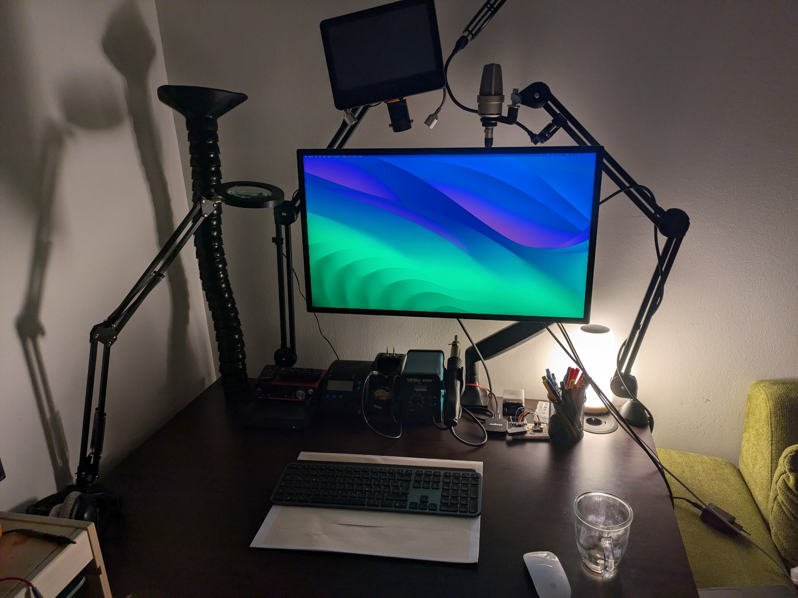

The list of all my tools (with purchase links):

- [ERSA RDS80 soldering station](https://www.ersa-shop.com/produkt/rds80-elektronisch-geregelte-loetstation-80w/). One of the higher-priced amateur soldering stations, but it's a workhorse. I use the [832KDLF 2.2mm chisel tip](https://www.reichelt.at/at/de/shop/produkt/loetspitze_0832kdlf_2_2_mm_meisselfoermig_gerade-19360) almost exclusively. Also get the [dry cleaner metal wool](https://www.amazon.de/dp/B00725AW18). It's vastly superior to the included sponge for cleaning the soldering iron tip.
- [armack typ32-3 0.5mm solder wire](https://www.amazon.de/armack-L%C3%B6tdraht-Typ32-3-%C3%98-100g/dp/B07JY712QD), which works for pretty much anything, including hand soldering SMD components. I use 350C° on the soldering station. Lead-free.
- [Yihua 85D hot air soldering stations](https://www.amazon.de/YIHUA-858D-Entl%C3%B6tstation-einstellbarer-Temperaturkontrolle/dp/B0BYSKPJQX), a cheap and effective hot air "gun" for reflowing or desoldering components.
- [Miniware MHP50 hot plate](https://www.amazon.de/MINIWARE-MHP50-Nano-Ceremic-Beschichtung-TemperaturHei%C3%9F-L%C3%B6tstation/dp/B0CRDYCHXS), a marvelous little thing for soldering SMD components. Since most of my PCB designs are pretty small, I now mostly solder with this. More on that later.
- [Sn42 Bi58 soldering paste](https://www.amazon.de/-/en/BEEYUIHF-Lead-free-Soldering-Lead-Free-Temperature/dp/B0BLNJMTRF/) used in conjunction with the hot plate to solder SMD components. The paste is usually applied via a [stencil (EEVblog Tutorial)](https://www.youtube.com/watch?v=qyDRHI4YeMI). For some components, or if I forgot to order a stencil along with the PCB, I use a tooth pick to apply the paste to the pads. This is a low temperature paste. I usually set the hot plate to 165C° without using a temperature profile, as recommended by the manufacturer. Works for me.
- [No clean lead-free Flux](https://www.amazon.de/dp/B0BQ32Q4FW). I usually have no need for that, because the flux in both the solder and the solder paste usually works just fine. There's probably better flux pastes. It's definitely not "no-clean". Get some [isopropanol](https://www.amazon.de/dp/B0C4FKV9HY) and a cotton swab to clean the flux residue off the PCB.
- [Soldering wick](https://www.amazon.de/dp/B0CQQVRTDX). I use this to clean the hot plate after soldering if needed. Never succeeded using those to desolder anything. Hot air guns are better for that.
- [Magentic third hand](https://www.amazon.de/dp/B07JWFJX9V). Used to hold components while soldering. I barely use them.
- [Silicone soldering mat](https://www.amazon.de/dp/B0D49K7KKD). Essential, unless you hate your desk. I specifically chose this one without any compartments. I found mats with compartments to be a pain to clean and the compartments often get in the way.
- [ATTEN ST1101D fume extractor with HEPA filter](https://www.reichelt.at/at/de/shop/produkt/loetrauchabsaugung_st-1101d_160_w-364827), which is a must have if you want to keep your lungs intact. I solder in a small room at home with a big window. This has a 3 layer HEPA filter. Fume extractors often recommended to hobbyists are nothing more like a fan plus an active carbon filter, which is not effective at all. This includes the Weller ZeroSmog Shield Pro, which is an extremely expensive and ineffective joke.
- [Andonstar AD249S-M digital microscope](https://www.amazon.de/-/en/dp/B09VPP5G59). I'm old and this is essential for SMD soldering for me. I've modded this to be easier to use by designing a 3D printed contraption that allows me to mound the microscope to a [Rode PSA1 articulated arm](https://www.amazon.de/dp/B001D7UYBO) which is mounted to my desk. Super easy to position the microscope. More on that later.
- [Jubor 10x LED magnifying lamp](https://www.amazon.de/-/en/dp/B0BLGD8D3G). I barely use this anymore, because my modded microscope is so good. You might get away with just this piece of equipment.
- [Alientek DP100 digital power supply](https://en.alientek.com/Product_Details/45.html). Great for powering test setups on a breadboard or individual components. Super compact. You don't necessarily need this, but I like it.
- [Digital multimeter](https://www.amazon.de/dp/B09SPYTP84). Again, there are probably many better options, but this cheap one works for me. You absolutely need a multimeter for debugging.
- [YJOCK 360W USB C multimeter](https://www.amazon.de/dp/B0D941P128). Most of my designs can be powered via USB-C. This little gadget allows me to measure the current draw of my designs easily.
- [Saleae Logic Pro 8 logic analyzer](https://www.saleae.com/products/saleae-logic-pro-8). You definitely won't need this. Before this project, I was developing my own embedded programming framework to handle various protocols for driving displays, audio and so on. So this came in handy a LOT to figure out whether it was my shoddy code, crappy connections, bad wiring, or a bad component.
- [KLEIN TOOLs TI290 thermal imager](https://www.kleintools.co.uk/catalog/thermal-imagers/rechargeable-pro-thermal-imaging-camera-49000-pixels-wi-fi-data-transfer). Helps me to identify hotspots on the PCB, likely due to bad soldering, a bad component, or a bad design. Touch is often enough to figure things out though, so you won't need this either. Probably.
- [Side cutters](https://www.amazon.de/-/en/GJ706BL-Electronic-Precision-Electronics-Jewellery/dp/B09SL2TCH7), [(ESD) Tweezers](https://www.amazon.de/dp/B07DFLFYDK), [long nose pliers](https://www.amazon.de/dp/B07477NW8P), [electronic repair screwdriver set](https://www.amazon.de/dp/B07V3TDP49),
- [Crimping pliers set](https://www.amazon.de/dp/B09QCRC9HP). Being able to crimp a connector to a wire is essential, especially if you do wiring inside custom enclosures. Many people will tell you to get some super expensive crimping pliers. Maybe they are better, but after following some YouTube tutorials and some practice, I can crimp pretty much any type of connector.
- [Wire stripper](https://www.amazon.de/-/en/10-22AWG-Stripper-Multifunctional-Professional-Craftsmanship/dp/B06X9875Z7). Same deal as with crimping pliers. I found this super simple and cheap pliers to be much more effective than dedicated wire strippers. Can also act as a wire cutter.
- [Silicone electric wires, 22 AWG](https://www.amazon.de/dp/B08R9WLLSZ). I love these. They are flexible and won't burn up if you touch them with a soldering iron. For some applications you may want thinner silicone wires. These worked fine for all my use cases so far. The important part is the silicone. You want to have lots of wires at home!
- [Shrink tubing](https://www.amazon.de/dp/B0B48LM9SQ). Because you don't want any exposed wires.
- [M1-M1.7 Screws](https://www.amazon.de/dp/B0CSJVZK9R), [M2-M3 screws](https://www.amazon.de/dp/B07XCB4MMW). Just get lots of screws. You can never have enough of them. Self tapping are pretty good if you want to screw into parts 3D printed with PLA (sample size: me).
- [Breadboards](https://eater.net/breadboards). Essential for prototyping.I use the boards from BusBoard. Follow the last link to learn why quality matters.
- [0805 SMD resistor and capacitor sample book](https://www.amazon.de/dp/B0795DX46R). This has saved me days of waiting for the mailman, when I ordered the wrong components for my PCB designs. The components aren't super high quality, but can avoid tears until your next order arrives.
- [Any old electronics learning set](https://www.amazon.de/s?k=electronic+components+set). You want LEDs, buttons, throughhole resistors and capacitors, switches, etc. Basically anything you can stick into a breadboard. This helps with prototyping. I got a few different kits as I learned and build up a little library of components that way.
- [A 3D printed](https://eu.store.bambulab.com/en-at/collections/3d-printer/products/x1-carbon). I understand that BambuLab has gotten a bad rap over the past few months. And I do own a Prusa printer as well. However, I'm old, and time is precious. And the X1 Carbon "just works". It's literally plug and play and produces excellent results without any need for tinkering. I'm sorry.

Now, my recent blog entries may have given you the idea that I'll teach you everything needed to reach this stage. I'm afraid that's not the case. It would take considerable resources, which I'd rather spend on my family and personal projects.

However, the above list of tools and skills is a good starting point once you're past the "made an LED blink with an Arduino" stage. Many talented people have described (SMD) soldering, PCB design, and 3D modeling in depth, either in books or videos, much better than I could. See my previous posts for recommendations.

Studying existing designs is also a fantastic way to learn, just as with software. For example, all [Adafruit products](http://adafruit.com) are open source, letting you study their schematics and PCB designs. Want to design a power management circuit? Check out their [PowerBoost 1000](https://www.adafruit.com/product/2465) schematics and PCB layout files. Similarly, when creating my ESP32-based boards, I drew inspiration from [Unexpected Maker](https://unexpectedmaker.com/) and [Waveshare](https://waveshare.com) designs. E.g. check out the [Waveshare ESP32-S3 Mini schematics](https://www.waveshare.com/wiki/ESP32-S3-Tiny) .

My final recommendation is to get away from Arduino as soon as you possibly can. It's a great way to learn, but eventually, you'll need to go one level deeper. That opens up a whole new world of possibilities. Like porting DOOM to the ESP32-S3 and have it run at 44FPS.

<video src="./media/doom_fixed.mp4" controls style="width:100%;height:auto;display:block;margin:0 auto;" loading="lazy">
</video>

Eventually, you'll write your own Arduino like framework to handle all the low level stuff, like communicating with SPI displays, driving audio or neopixels, etc. My entry into this is [mcugdx](https://github.com/badlogic/mcugdx/), a simple C-API on top of [ESP-IDF](https://github.com/espressif/esp-idf) that can already do a lot (on ESP32-S3 at least). You can also find the above DOOM port in the [mcugdx examples](https://github.com/badlogic/mcugdx/tree/main/examples/doom). I don't currently give support or documentation. If you know your way around ESP-IDF, you should be able to figure it out, given the examples and the sdkconfig files found in the repository.

In the remainder of this post, I'll go through the design process of Boxie, walk you through the schematics and PCB layout, show you how I came up with the 3D printed enclosure design, and give an overview of the software I wrote to make it all work.

## Like a Game Boy, but for audiobooks
I started by thinking about how I wanted the boy to interact with the device. I'm in love with the Game Boy form factor, so I wanted something similar in size and shape. It needed to be battery powered for portability.

Instead of the Tonie Box's volume-controlling ears, I wanted a simple knob. The Tonie Box requires hard smacks to change chapters or songs, which rarely works and often knocks the Tonie figure off. I opted for simple navigation buttons instead.

As for content storage, the Tonie Box keeps audio on an SD card, with Tonie figures acting as RFID tags that trigger specific audio files. This requires internet connectivity for downloading files and potentially gives the company usage data.

I wanted none of that. The device should be completely offline, with content delivered "physically" like the cassette tapes of my youth. A Game Boy cartridge form factor was perfect, but with a twist. Unlike a Game Boy where the cartridge label partially disappears into the slot, I wanted the cartridge label to remain fully visible.

This decision came from watching my boy in the car. When we listen to audiobooks through Android Auto and Spotify, he intently focuses on the cover art displayed on the dashboard. These covers, showing story characters, are distinct for each book. Having the cartridge visible lets him see the artwork while listening.

Yes, a protruding cartridge is a potential breaking point, but I'll make the design sturdy enough to handle it.

For reliability, I wanted the device to be as fail-safe as possible. No power button needed, inserting a cartridge turns it on, removing it turns it off. It should survive inevitable drops, which means using durable NiMH batteries instead of LiPos.

In summary, the device needs to be:

- Portable and battery powered via a safe battery type (NiMH)
- Playback content from cartridges inserted at the top of the device, with the cartridge label always fully visible
- Have a volume control knob and buttons for navigation
- Turn on when a cartridge is inserted and turn off when the cartridge is removed, thereby saving battery
- Never ever connect to the internet

## The cartridge
Since I use an ESP32-S3 as the brain, I opted for micro SD cards as the medium to store audio files. It's super easy to access a FAT filesystem on an SD card via ESP-IDF. Just wire up the SD card's pins to the ESP32-S3's GPIOs and use the SD card API.

To elicit that Game Boy cartridge feel and to make inserting and removing the cartridge easy and sturdy, I designed a custom PCB that holds and exposes the micro SD card's pins, and a 3D printed cover onto which I could stick the label. You can view the end result in this instructional video for my SO, so she can assemble cartridges as well:

<video src="./media/cartridge_320.mp4" controls style="width:320px;height:auto;display:block;margin:0 auto;" loading="lazy">
</video>

The PCB is a trivial 2 layer board. A micro SD card socket holds the card. Each of the pins is exposed to its corresponding big pad at the bottom of the PCB. Four M2 screw holes let me screw on the 3D printed cover.

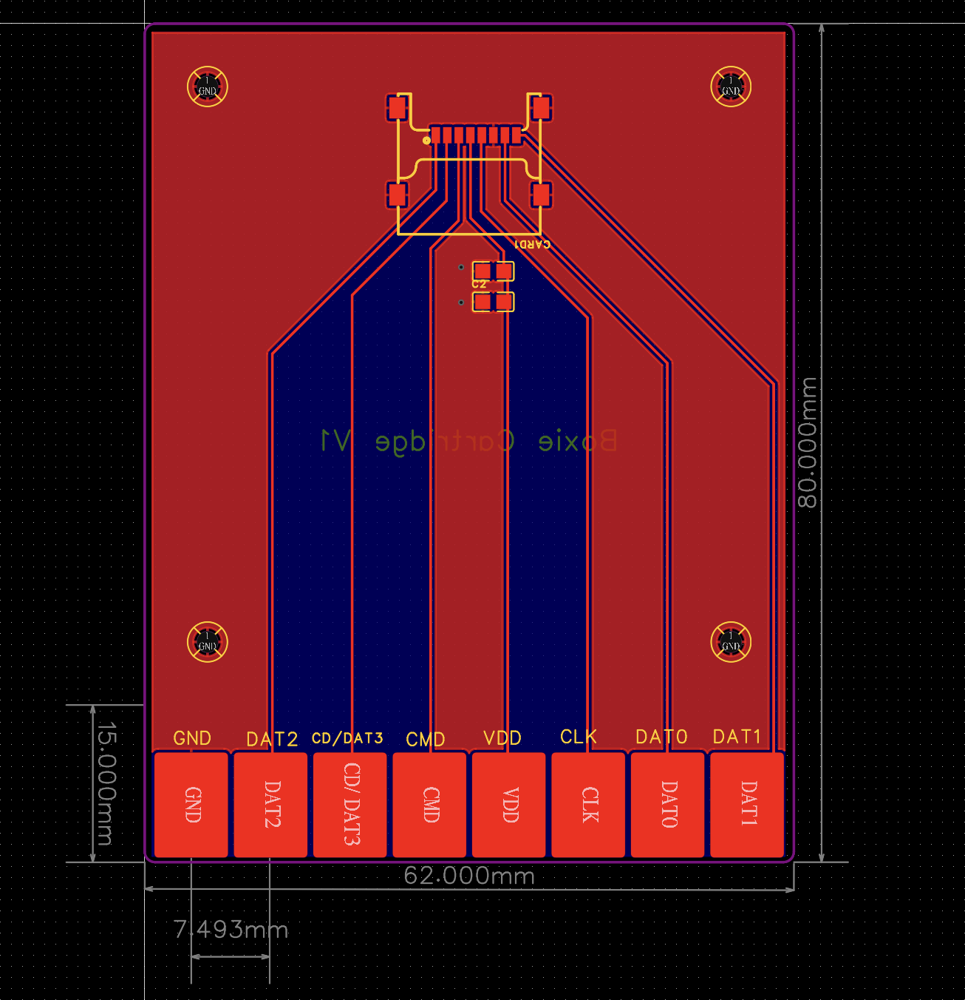

To decide on the size, I drew a bunch of rectangles on millimeter grid paper and picked the one that looked right. Grid paper is your best friend when getting a feel for sizes!

I designed the cover in Fusion 360. I exported the PCB design from EasyEDA as a STEP file and imported it. I created a sketch at the top of the PCB, projected the PCB outline onto it, and extruded it to a depth that looked good. Finally, I added a cutout for the SD card socket, screw holes, and an indented area for the label. That took 5 minutes.

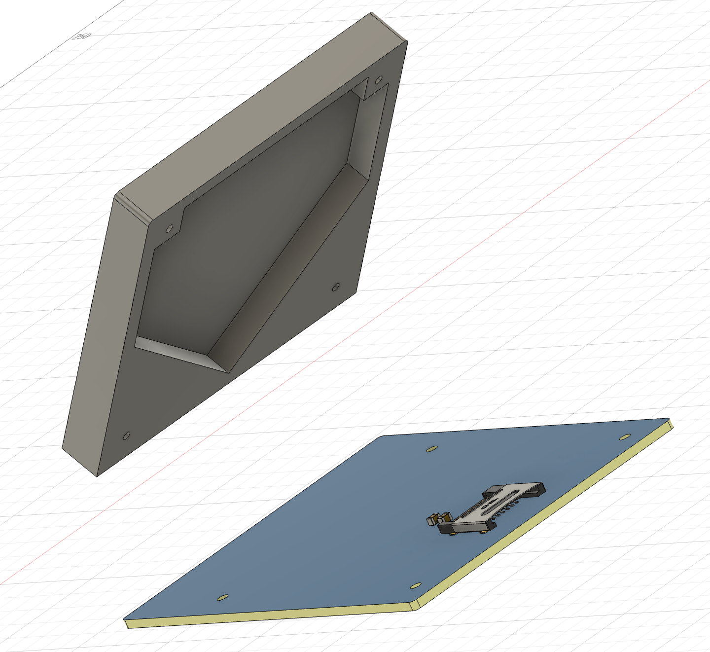

I sent off the PCB design to JLCPCB and ordered a batch of 100 PCBs, along with 100 SD card sockets from LCSC. I also printed 30 covers on my 3D printer.

I then proceeded to hand solder 100 SD card sockets onto 100 PCBs, cursing myself that I didn't order a stencil and didn't use JLCPCB's assembly service. It took 2 nights. I used a toothpick to apply the solder paste to the pads.

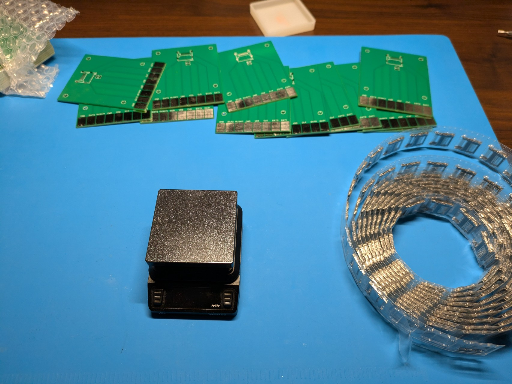
<video src="./media/cartridge_2_320.mp4" controls style="width:320px;height:auto;display:block;margin:0 auto; margin-bottom: 1em;" loading="lazy"></video>
<video src="./media/cartridge_1_320.mp4" controls style="width:320px;height:auto;display:block;margin:0 auto; margin-bottom: 1em;" loading="lazy"></video>

Yeah, I'm dumb. You might have noticed the 2 capacitor pads on the PCB layout above. I ended up not populating those, which saved a bit of time.

## The cartridge slot connector
How do I connect the cartridge pads to the ESP32-S3? The Game Boy uses a traditional edge connector, with gold plated contacts on the cartridge and a corresponding connector in the slot.

Since I didn't know how to create "chamfered gold fingers" in EasyEDA or get JLCPCB to manufacture such PCBs, I tried a different approach. But not before failing first.

The cartridge design was inspired by [Abe's project](https://www.youtube.com/watch?v=END_PVp3Eds&t=748s), which uses pogo pins on the cartridge reader to contact the cartridge pads:

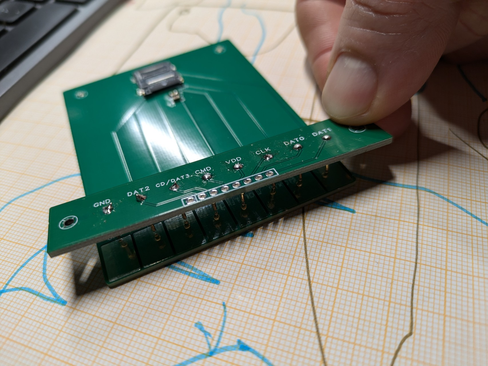

This didn't work at all. Getting the vertical spacing correct was extremely difficult, and even with decent spacing, inserting a cartridge was too tough for a 3 year old. The soldered pogo pins also bent easily.

After some thinking about the "3 year old friendly" requirement, I came up with this:

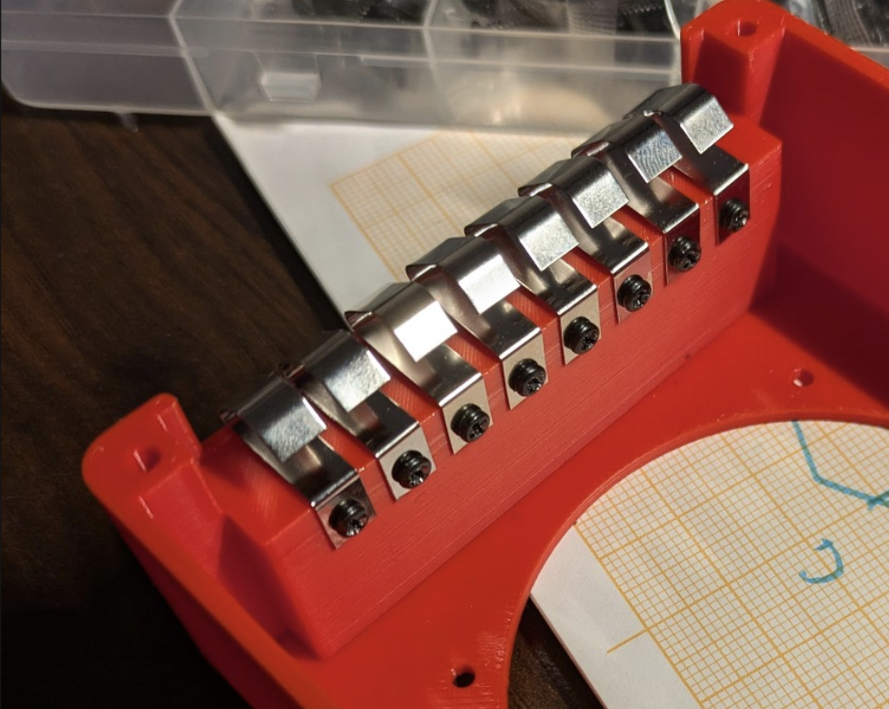
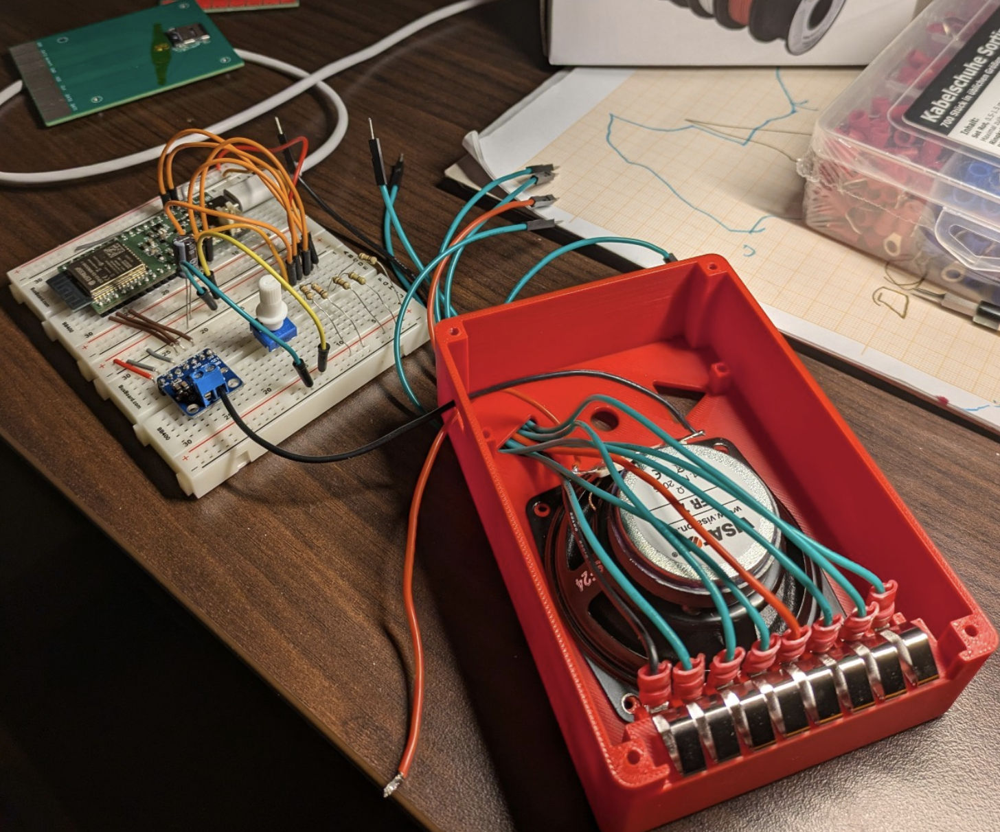

I used battery springs, which are sturdy enough to handle a 3 year old's enthusiasm. Instead of soldering, I use ring terminals crimped onto wires and screwed onto the battery springs in the 3D enclosure.

The result is easy to assemble, easy to repair, and (so far) indestructible. Here's the first cartridge insertion test:

<video src="./media/firsttry_320.mp4" controls style="width:320px;height:auto;display:block;margin:0 auto;" loading="lazy">
</video>

The device's internals were still on a breadboard at this point, as I hadn't figured out the enclosure design yet.

## Selecting a DAC, amp and speaker
For mono music playback from an SD card, I needed a digital to analog converter (DAC) to transform and amplify digital audio from the ESP32-S3 to drive the speaker.

I chose the popular [MAX98357A](https://www.analog.com/media/en/technical-documentation/data-sheets/max98357a-max98357b.pdf). Adafruit sells a [breakout board](https://www.adafruit.com/product/3006) for it, and there are many clones available.

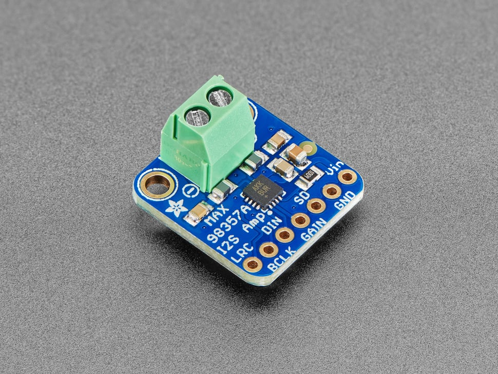

The MAX98357A is a mono amplifier delivering up to 3W into a 4 Ohm speaker at 5V. Perfect for this project. It uses the [I2S protocol](https://en.wikipedia.org/wiki/I%C2%B2S), which my mcugdx framework already supported.

Given the amp specs, I went on a hunt for a good speaker. I ordered a few spec compliant speakers from Amazon and discovered the art of speaker enclosure design.

<video src="./media/speaker-1_320.mp4" controls style="width:100%;height:auto;display:block;margin:0 auto; margin-bottom: 1em;" loading="lazy"></video>
<video src="./media/speaker-2_320.mp4" controls style="width:100%;height:auto;display:block;margin:0 auto;" loading="lazy">
</video>

I settled on a Visaton FR 7/4, which offers good bandwidth and better sound quality than the Tonie Box speaker.

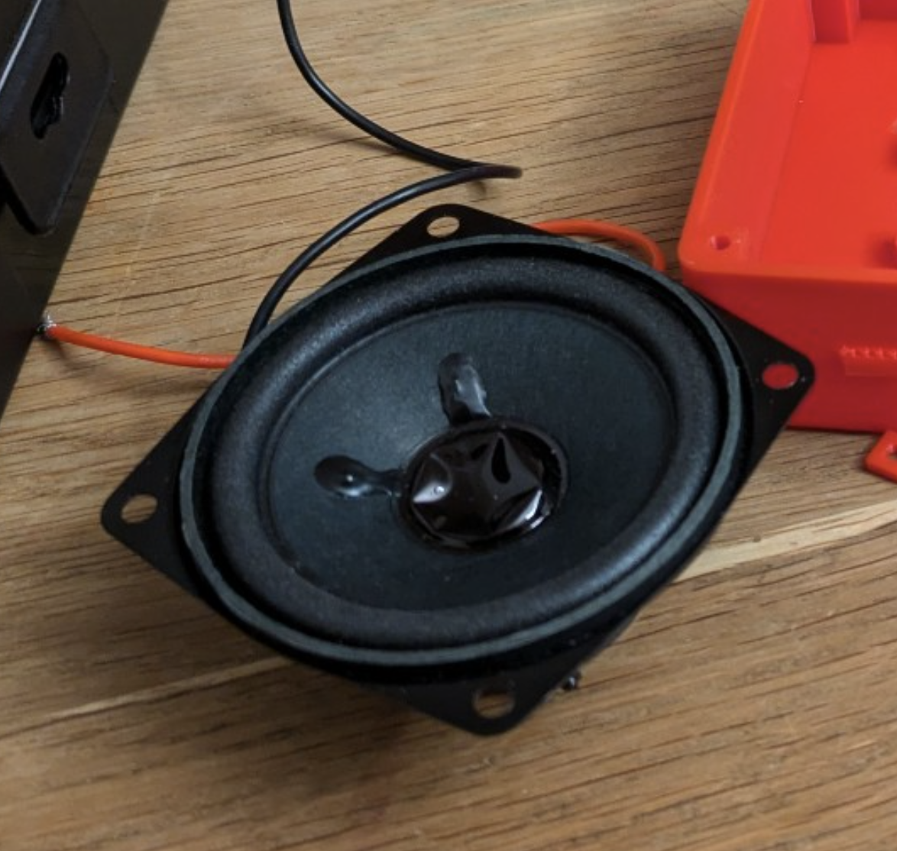

## ESP32-S3 board with power management and battery charging
Before starting this project, I actually dabbled in designing my own ESP32-S3 board. There are many great boards on the market, with those from [Waveshare](https://www.waveshare.com/esp32-s3-tiny.htm) and [Unexpected Maker](https://unexpectedmaker.com) being my favorite. But I wanted to learn how to design such a board, should I ever need something that's not available on the market.

Turns out, I needed exactly that. None of the existing boards support charging NiMH batteries. They often don't have undervoltage protection built-in, but instead rely on measuring the voltage via GPIO and then switching the ESP32-S3 into deep sleep. I wanted to avoid that. Some also don't work well with both USB-C and a battery connected simultaneously. A requirement for my device, as I don't want to unplug the batteries just to connect a USB-C cable for flashing new software or debugging.

I went through a few iterations and eventually ended up with this:

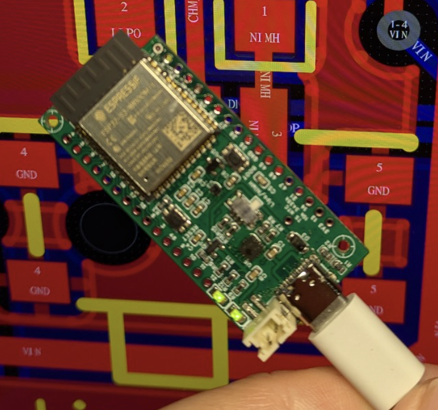

The board serves as a foundation for all my project designs. Its features aren't specific to this project, but rather include capabilities I've found useful across all my projects:

- Charging 3x AAA NiMH or a single cell 3.7V LiPo battery via USB-C at 0.5A. Battery chemistry is selected via a dip switch. Optional overheating protection via thermistor.
- Shares the power coming in via USB-C between battery charging and the rest of the device
- Exposure of all available GPIOs
- Under voltage lock out IC that cuts of power if the voltage is below 3.08V
- Low drop out voltage regulator 160mA @ 1A, fixed at 3.3V output
- USB-C flashing and debugging (comes for free with ESP32-S3 if you wire up the correct USB-C pins to the ESP32-S3)

Here's the full schematic:

Let me walk you through the schematic real quick.

### USB-C
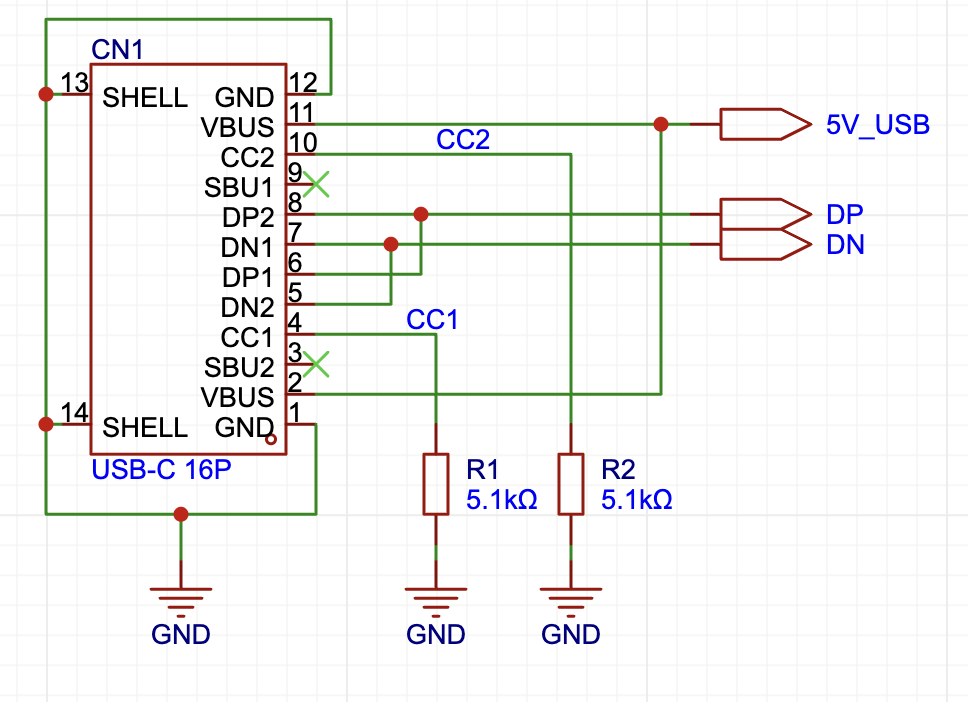

Connecting a USB-C cable powers the battery charger and the device. The 5.1k Ohm resistors on the CC1 and CC2 pins allow the device to draw 0.5A if connected to a USB 2 source, or 0.9A if connected to a USB 3 source. The USB-C connector provides 5V to the system if connected to a USB source like my laptop.

For debugging and flashing, the DN and DP pins are connected to the ESP32-S3 GPIOs 19 and 20. The ESP32-S3 has built-in USB capabilities that handle all the communication. When routing these traces on the PCB, it's important to maintain equal length for both signals (known as a differential pair) to ensure proper USB signal integrity.

### ESP32-S3
There are various variants of the ESP32-S3. I picked one with a built-in antenna, 8MB of flash, and 8MB of PSRAM. That's been sufficient for all my projects so far. And I don't need to wire up those components myself. Here's how it is wired up.

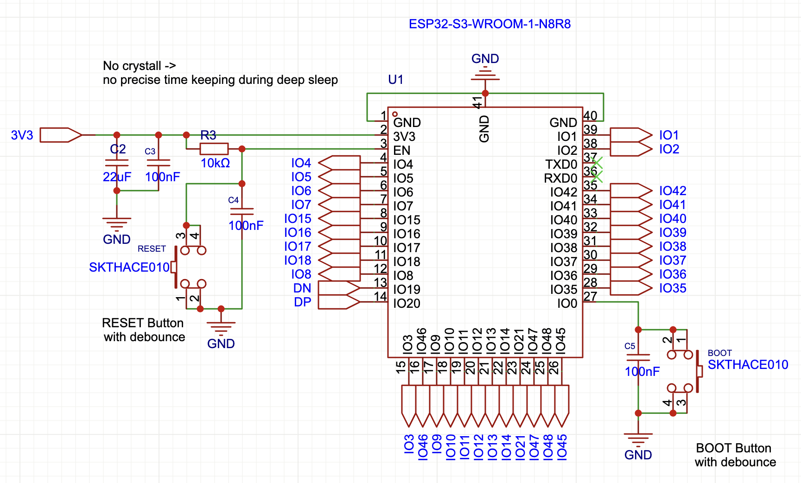

This mostly follows the recommendation in the [ESP32-S3 hardware design guidelines](https://docs.espressif.com/projects/esp-hardware-design-guidelines/en/latest/esp32s3/esp-hardware-design-guidelines-en-master-esp32s3.pdf). I didn't include a crystal needed for accurate deep sleep timing, as I never need that feature.

C1 and C3 are decoupling capacitors. R3 is a pull-up on the enable pin, that gets "overwritten" if the reset button is pressed, which grounds the pin and resets the device. C4 is a debounce capacitor for the reset button. A similar button setup is found for the boot button on the left side. Pretty simple!

The GPIOs are exposed at the edge of the PCB.

### Battery charging via BQ25171-Q1
I spent a long time trying to find an IC that can charge both NiMH and LiPo batteries. I eventually settled for the [BQ25171-Q1](https://www.ti.com/lit/ds/symlink/bq25171-q1.pdf), by Texas Instruments.

Here's the part of the schematic that deals with battery charging:

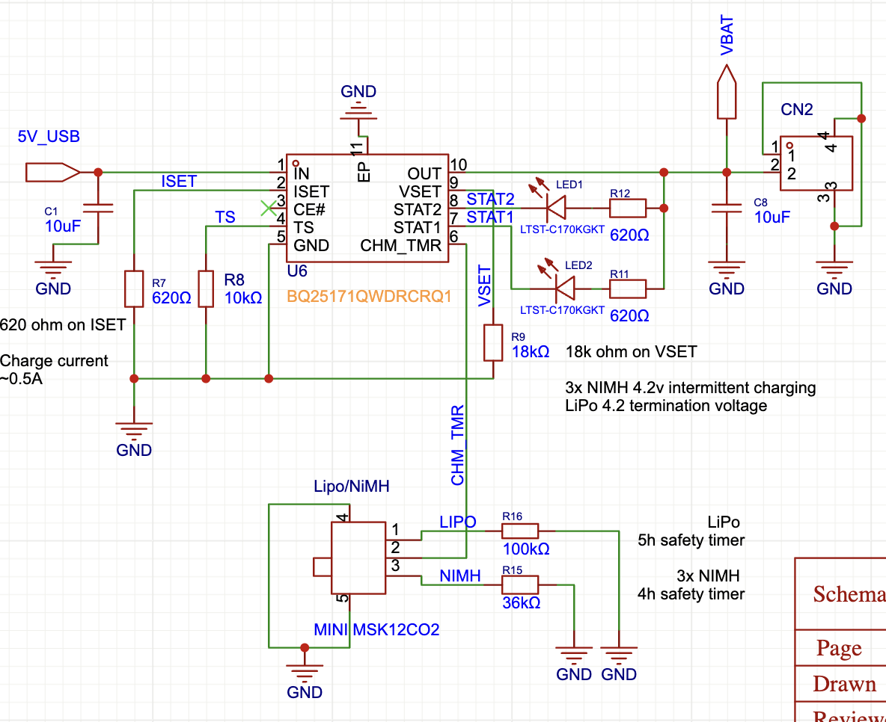

CN2 on the right side is a 2 pin 2mm PH connector, to which the battery is connected. VBAT is the battery voltage. On the left side of this block you find 5V_USB, which is the 5V from the USB-C connector. If USB-C is not connected, then VBAT powers the system, while the charger IC does basically nothing. If USB-C is connected, then 5V_USB powers the charger IC, which charges the battery. The battery is cut off from the system in that case, which we'll see in the next section.

The remainder of the schematic consists of components to configure the charger IC.

R7 connected to ISET sets the charge current to approximately 0.5A. R8 pulls the TS pin down to ground, disabling battery temperature monitoring. The PCB layout has provisions to wire up an NTC thermistor instead of soldering the R8 pull-down resistor.

The CHM_TMR pin is connected to a dip switch, which selects one of two resistors. R16 signals to the IC that we want to charge a single-cell LiPo battery at maximally 4.2V, with a 5 hour safety timer. The IC will actually terminate charging earlier and follow the usual LiPo charging curve. R15 signals to the IC that we want to charge 3 NiMH batteries in series, with a max charging voltage of 4.2V and a 4 hour safety timer. This configuration will not disable charging when the voltage reaches 4.2V, but instead keep charging until the safety timer is hit (or the optional thermistor signals that the battery is too hot).

The VSET pin is connected to a 18k Ohm resistor, which sets the maximal charging voltage to 4.2V for both battery chemistries.

Finally, STAT1 and STAT2 are connected to LEDs, which are connected to VBAT via 620 Ohm resistors. STAT1 and STAT2 are open-drain outputs; the IC will pull them low when the LEDs should light up.

### Power management
The system can either be powered by USB-C or by the battery. The USB-C voltage is 5V, while the battery voltage can range anywhere from 3-4.2V. The ESP32-S3 requires 3.3V, so we need to regulate the power source voltage down. We also want to prevent the battery from discharging below 3.08V, so we need a voltage monitor that can power down the ESP32-S3. Here's how that's done:

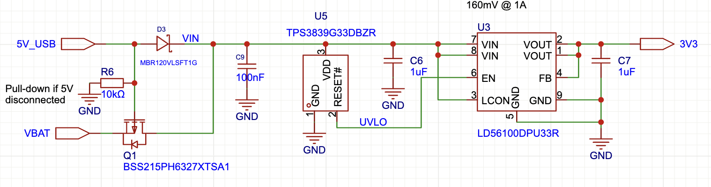

On the left side of the schematic, you see 5V_USB and VBAT. VBAT goes through a P-channel transistor. If USB-C is connected, the gate is pulled high, which will prevent power from the battery from reaching the system. If USB-C is not connected, the gate is pulled low, meaning that power from VBAT can reach the remainder of the system. This is a little trick I saw in the Unexpected Marker's ESP32-S3 Feather board. It's really simple power path management!

For extra safety, a schottky diode is placed after 5V_USB, just in case power from VBAT or some capacitor manages to sneak through for some reason.

C9 is a decoupling capacitor suggested by the [TPS3839](https://www.ti.com/cn/lit/ds/symlink/tps3839.pdf?ts=1745522482975&ref_url=https%253A%252F%252Fpro.easyeda.com%252F) datasheet. That is an ultra low power supply voltage monitor. If the voltage drops below 3.08V, it pulls its RESET pin low. That reset pin is connected to the EN pin of the low drop out voltage regulator to its right. If it is low, the voltage regulator is disabled, cutting off power to the system, thereby not draining the battery further. This is likely not strictly necessary, as the ESP32-S3 and other connected ICs will brown out well before the battery drains below 3.08V. But it's a good safety net.

The low drop out voltage regulator is a [LD56100](https://atta.szlcsc.com/upload/public/pdf/source/20220927/260C14BB568125F608A31F1F8EA3901A.pdf). It can provide 1A of current with a dropout voltage of only 120mV. The audio player draws no more than 60mA even with the speaker at max volume. That results in an even lower dropout voltage, which means we can make good use of most of the battery capacity.

The final output of this block is a clean 3.3V voltage, which powers the ESP32-S3 and the audio amp and speaker.

### PCB Layout
After digging through countless datasheets and wiring everything up in the schematic, I was finally able to start laying out the PCB. It's like advanced Tetris. I really enjoy it (even though I'm not good at it). Here's how I translated the schematic into a printable layout:

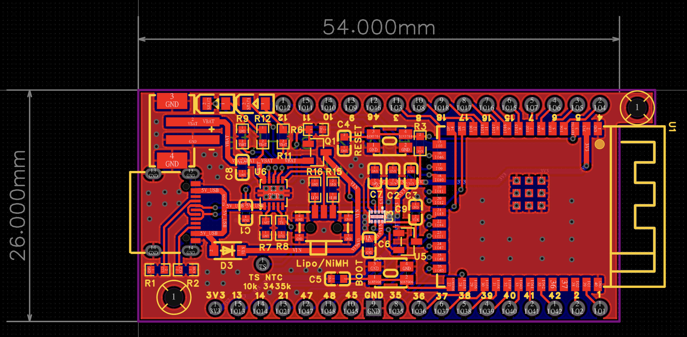
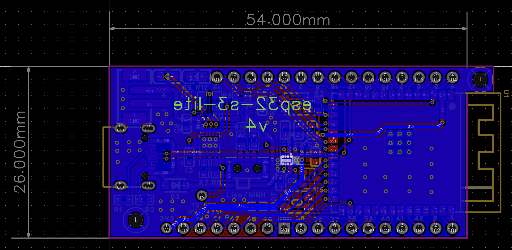

It's a 4 layer board, with two ground planes in the middle. The top hosts the circuits described above, while the bottom exposes most of the GPIOs. The board is breadboard friendly and also has screw holes for mounting in an enclosure. The power traces are thick enough to actually handle up to 1A of current, should the need arise. Though that kind of power could not be delivered via USB-C.

If you squint, you can see the differential pair for the USB signals. There are probably a gazillion things that could be done better, but it works and doesn't blow up, which is good enough for me. I'm pretty sure this wouldn't pass any kind of certification necessary to sell it as part of a commercial electronic device.

### Soldering the board
I ordered a stencil along with the PCBs, which makes applying solder paste much easier compared to the toothpick method I used for the cartridge PCBs.

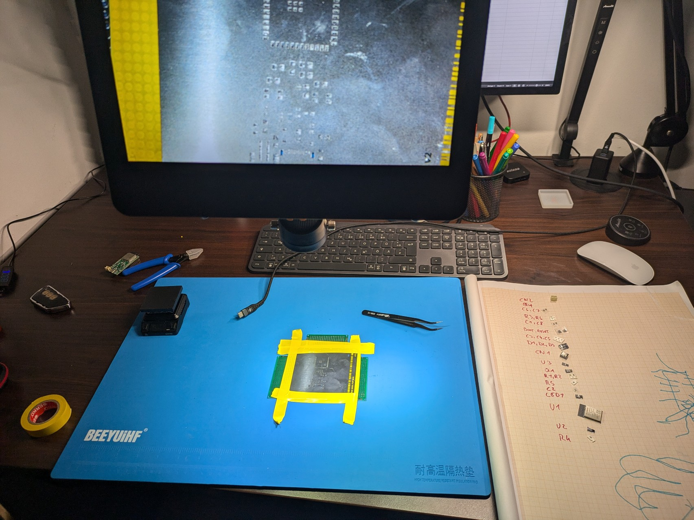

Once the paste is applied, I start by dropping capacitors, resistors, tactile switches and other components with big pads onto the board. I then turn on my heating plate and let it melt the solder paste.

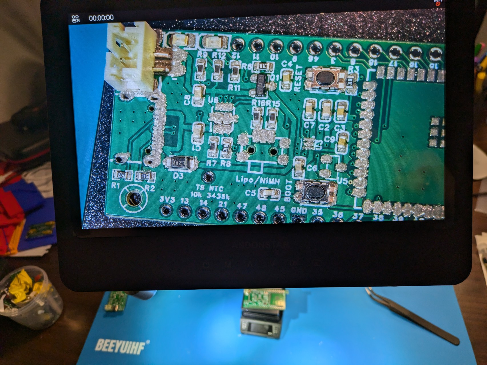

With the "easy" components out of the way, I inspect the solder on the pads for trickier components, like the ESP32-S3, the 1.2mm by 1.6mm LDO voltage regulator, and the USB-C connector. Chances are the solder paste has melted into a blob or formed bridges between pads. This tends to happen when too much paste is applied, especially on extremely tiny sub-millimeter pads. I use solder wick or my trusty toothpick to fix any bridges.

Only when I deem the solder on the pads to be good do I drop the "tricky" components onto the board and hope for the best.

Once everything is soldered, I flash a simple LED blinking sketch to make sure the board is working. If it's not, I use my multimeter to painstakingly check for expected voltages across the board. I also use my thermal camera to check for overheating components.

## Buttons, knobs and enclosure
I designed the enclosure pretty early on in the process, based on the speaker and cartridge dimensions, and the cartridge slot mechanism. The enclosure consists of a top and bottom half, which are held together by M3 screws.

The top has cutouts for the buttons, volume knob, speaker. It also has a mounting bracket for the battery springs which serves as connectors to the cartridge pads. A separate mesh cover is mounted on top the speaker hole to protect the speaker from my boy's destructive tendencies.

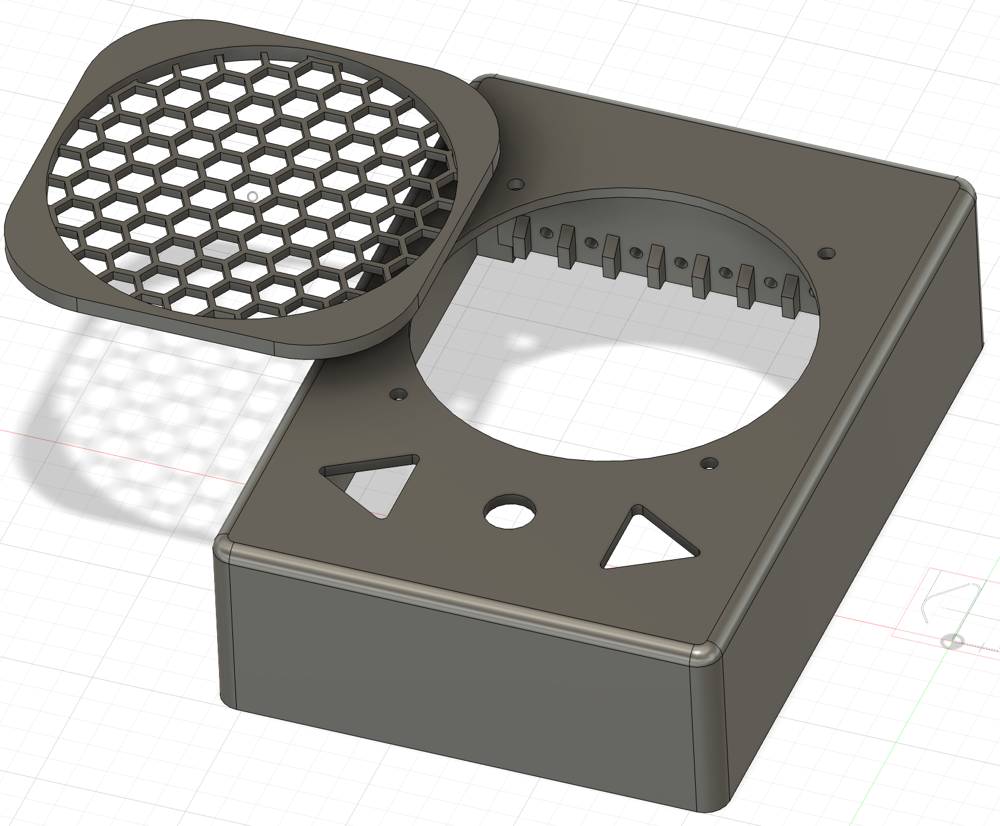

The buttons and knob are simple shapes, with their bottoms extruded, so they don't fall out of the enclosure through the cut outs. In case of the buttons, they sit atop simple tactile switches. The knob has a center cutout so it can be slid onto the potentiometer beneath it.

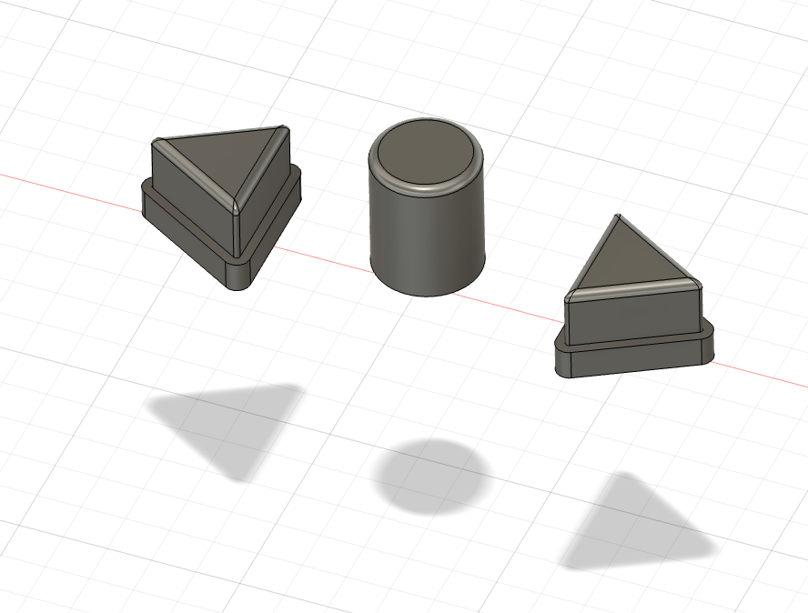
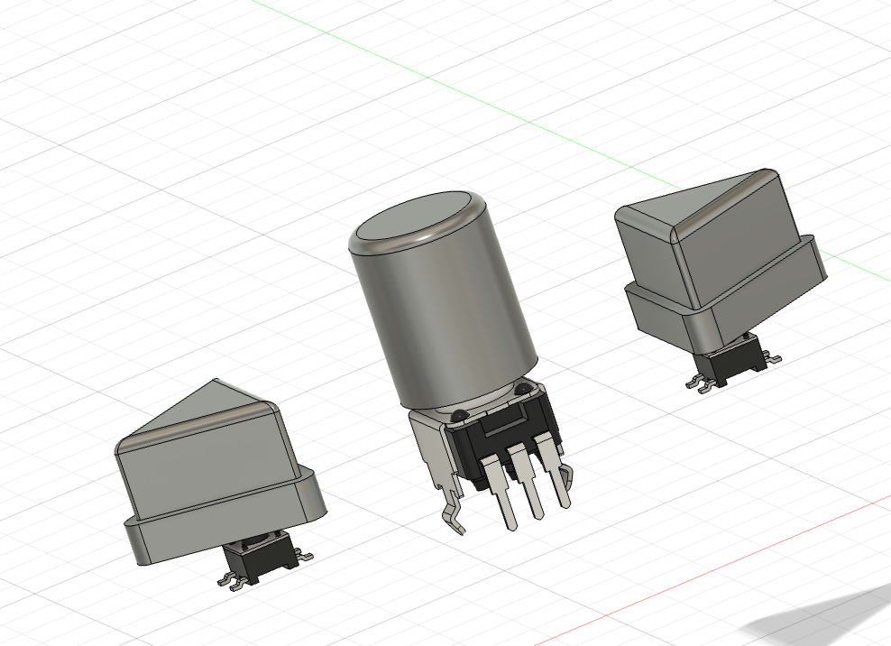

Turning the top upside down reveals two mounting structures to which a PCB can be screwed beneath the button cutouts. More on that PCB in the next section. You can also see spacers and screw holes for the battery springs, which make up the cartridge slot mechanism. There's also a cutout on the side for the USB-C connector for the ESP32-S3 board.

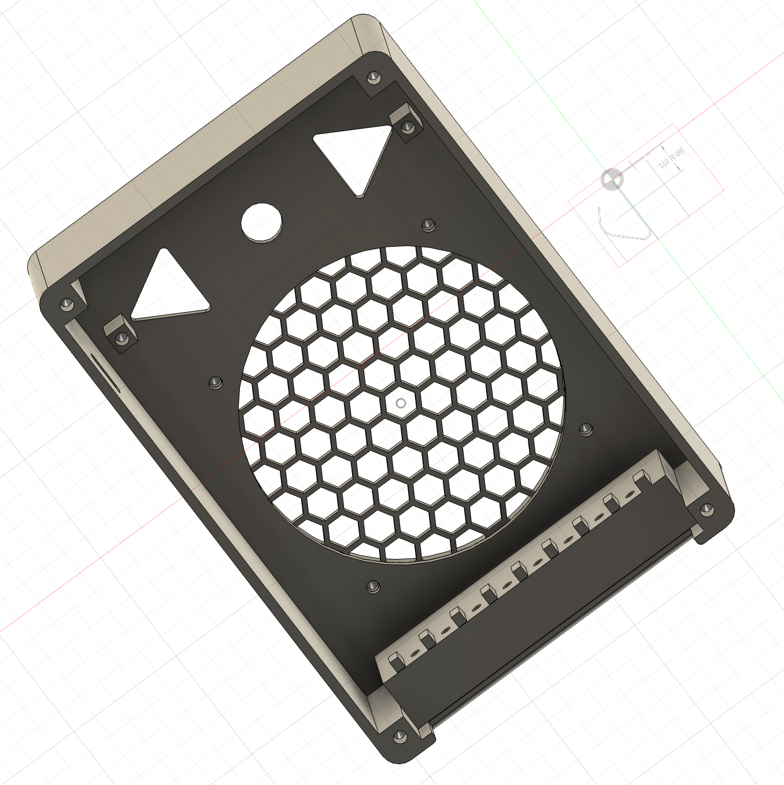

The bottom is pretty unremarkable. It features a bay for the 3 AAA NiMH batteries, a few spacers to make positioning the top on the bottom easier, and a weird little contraption consisting of what looks like a rod and two screw holes. Here's what that's for.

<video src="./media/switch_320.mp4" controls style="width:320px;height:auto;display:block;margin:0 auto;" loading="lazy"></video>

When a cartridge is inserted, the rod is pushed down, which pushes a switch that connects the battery to the ESP32-S3 board. It's a silly looking mechanism, but it has a few benefits. In the first iteration, I positioned the switch next to the cartridge slot. However, getting the position right was tricky. Also, routing the power wire around the magnet of the speaker led to interesting issues I was unable to debug or fix.

<video src="./media/broken_320.mp4" controls style="width:320px;height:auto;display:block;margin:0 auto;" loading="lazy">
</video>

The rod solution just works.

## The mother board
As you can see in the last video, the innards of the device were still living on a breadboard at this point. The ESP32-S3 board, the amp, and the buttons and knob needed to be mounted inside the enclosure somehow. I had already designed mounting brackets on the top half of the enclosure, taking into account the size of the tactile switches, the potentiometer, and their 3D printed covers. This allowed me to measure the remaining space in the enclosure inside Fusion 360, based on which I sized a carrier PCB or motherboard. Here's the schematic:

To the left is the MAX98357A audio amplifier breakout board. The ESP32-S3 board is at the center. At the bottom are the tactile switches and the potentiometer. And to the right are the connections to the battery springs of the cartridge slot. Everything is wired to appropriate pins on the ESP32-S3 board. The SD card traces also feature pull-ups as necessary.

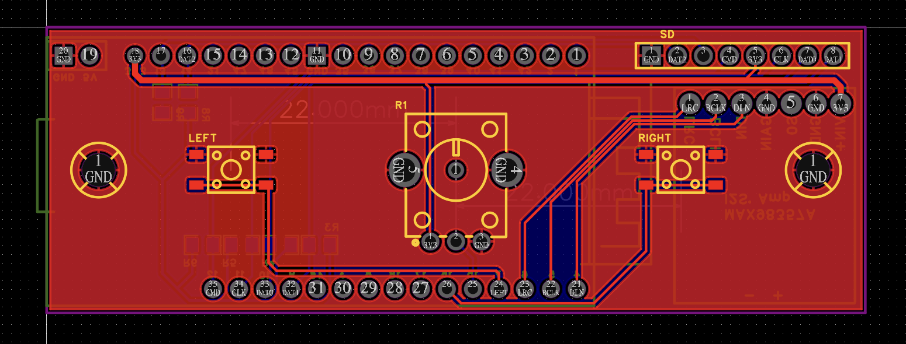
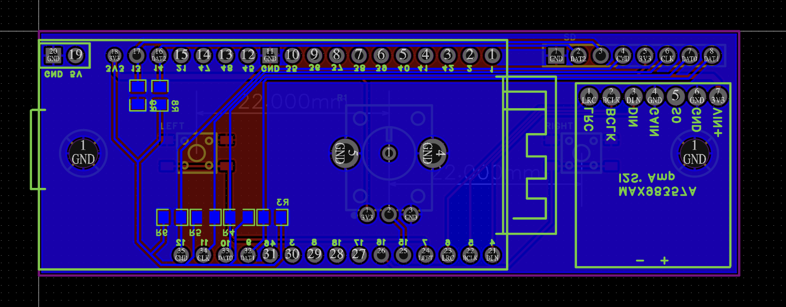

It's a 2-layer board. The top layer houses the tactile switches and the potentiometer. The bottom layer has 2.54mm headers into which I can plug the MAX98357A breakout board and the ESP32-S3 board. In the top right are pads for the SD card connections which are wired to the battery springs of the cartridge slot.

Here's the motherboard with tactile switches, potentiometer, and headers soldered to it:

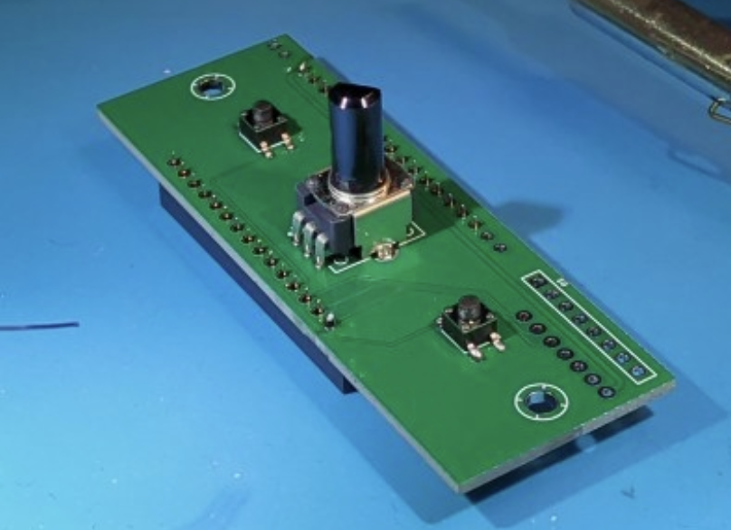

And here it is with the MAX98357A breakout board and the ESP32-S3 board plugged in:

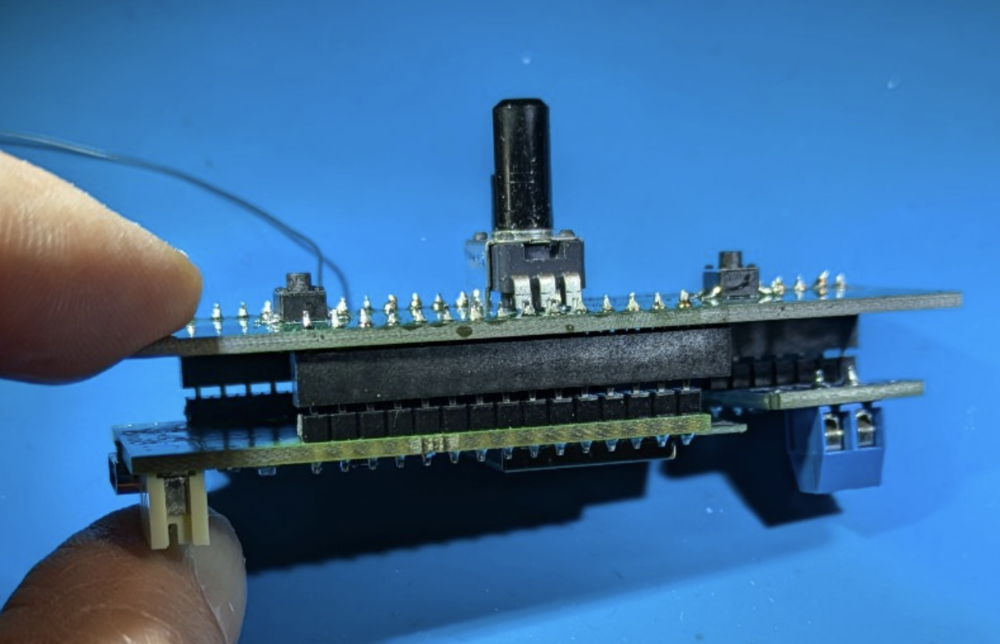

The motherboard is screwed to the top half of the enclosure and wired up with the cartridge slot mechanism.

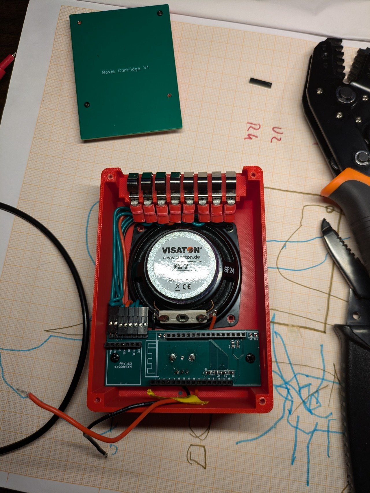

Then I plug in the ESP32-S3 board and the MAX98357A breakout board and wire up the speaker to the amp, and the battery to the ESP32-S3 board.

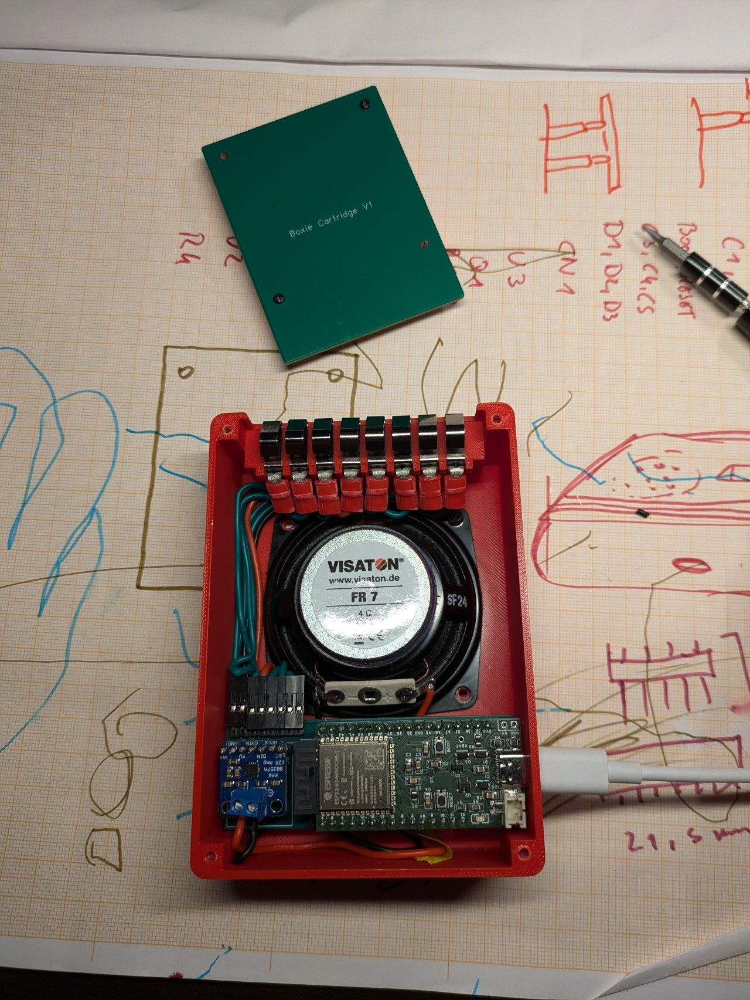

(Note that the ESP32-S3 board is an earlier iteration but the principle is the same.)

The trick to getting this all lined up is importing 3D models of all components into Fusion 360.

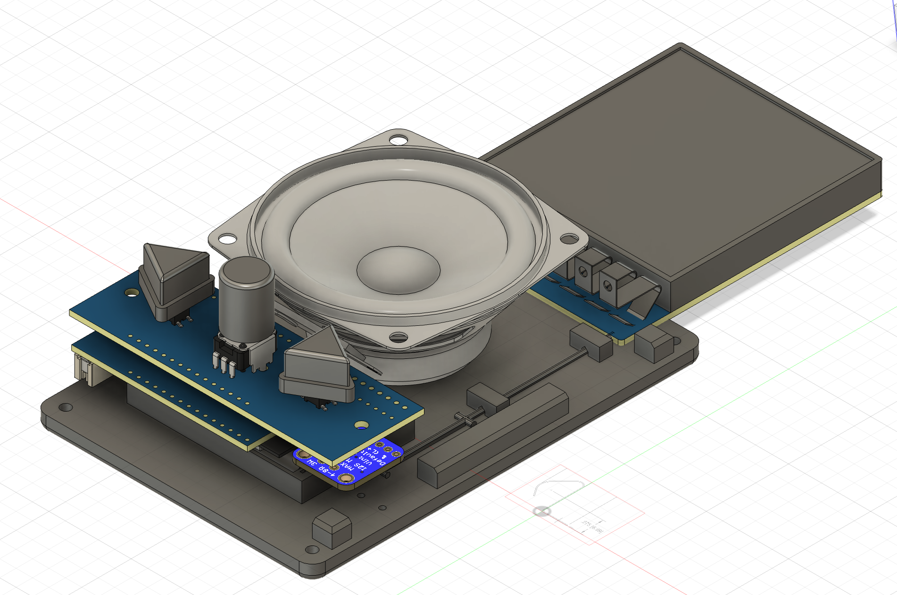

EasyEDA allows exporting a 3D model of the PCB, including the components (if they have 3D models). This allows me to experiment with component placement and orientation, try out different PCB layouts, etc. That saves me enormous amounts of time and frustration.

## Software
The software is straightforward and based on my mcugdx framework. The entire source code is a [single 390 LOC file](https://github.com/badlogic/mcugdx/blob/main/examples/boxie/main/main.cpp) that uses the "easy" mcugdx API to:

- Check if an SD card is present
- List the MP3 files on the SD card and sort them by name
- Start playback of the first file on the SD card
- React to button presses and the volume knob

You can dig into the [mcugdx sources](https://github.com/badlogic/mcugdx/tree/main/src) to see how to implement all this under the hood on top of ESP-IDF.

## Mario, how do I build this myself?
I'm glad you asked. It's definitely not for the faint of heart. Assuming you have everything needed to solder SMD components, wires, M1-M3 screws, and basic tools like pliers (see recommended items above), here's what you need specifically for this project:

- [3D model of the enclosure](./project/boxie.3mf) Ready to print. Import into your slicer, enable supports (for USB-C cutout), and print with PLA. Should work with any popular 3D printer. For modifications, use this [Fusion 360 file](./project/boxie.f3z).
- [3D model of the cartridge cover](./project/cartridge-cover.3mf) Print multiple copies by duplicating in your slicer. Can use 10% infill or lower. The cover is also in the Fusion 360 enclosure file above.
- [Cartridge PCB Gerber files](./project/cartridge-gerber.zip) 2-layer board design for manufacturers like JLCPCB, PCBWay, or Aisler. For modifications, import this [EasyEDA Pro project](./project/cartridge.epro) into EasyEDA or KiCad 9+. Optional: Have JLCPCB assemble the board using the BOM below instead of hand-soldering.
- [Cartridge BOM](./project/cartridge-bom.xlsx). All components needed to assemble the cartridge. Features LCSC part numbers (where I buy them) as well as manufacturer name and part number if you want to order them some place else. The BOM includes 2 decoupling caps, which according to my real world testing can be omitted.
- [Motherboard PCB Gerber files](./project/motherboard-gerber.zip). Another 2 layer board ready to be send to a PCB manufacturer. Here's the [EasyEDA Pro project](./project/motherboard.epro) if you want to modify it.
- [Motherboard BOM](./project/motherboard-bom.xlsx). All the components you need to assemble the motherboard, with LSCS and manufacturer info.
- [ESP32-S3 board Gerber files](./project/esp32-board-gerber.zip) and corresponding [EasyEDA Pro project](./project/esp32-board.epro). This is a 4 layer board, so make sure your PCB manufacturer can do that.
- [ESP32-S3 board BOM](./project/esp32-board-bom.xlsx). All the components you need to assemble the motherboard, with LSCS and manufacturer info.
- [Micro Switch](https://www.amazon.de/dp/B082WXT4R8). This is used together with the 3D printed rod to connect the battery to the ESP32-S3 board. See the videos and images above. You will have to cut off the little hook at the end of the metal part to make it fit.
- [Keystone Electronics 5231 battery springs](https://www.conrad.at/de/p/keystone-electronics-5231-einzelkontakt-1x-mignon-aa-a-cr-2-cr-123-9-v-block-oberflaechenmontage-smd-l-x-b-x-h-15-651312.html). These are the springs used to connect the cartridge pads to the and ultimately the SD card inside the cartridge with the ESP32-S3. The 3D enclosure is specifically designed to fit these springs, including spacers so they can't shift and touch each other.
- [TE Connectivity 34140 ring terminals](https://www.conrad.at/de/p/te-connectivity-34140-ringkabelschuh-querschnitt-max-1-60-mm-loch-o-2-36-mm-teilisoliert-rot-1-st-808203.html). These are used to connect the battery spring with wires that lead to the motherboard. They are crimped to wires and then screwed onto the top part of the enclosure together with the battery springs. I then bend them downwards. See the videos and images above.
- [Right angle male 2.54mm pin headers](https://www.adafruit.com/product/1540). These are soldered to the motherboard in the area marked with SD. The wires coming from the ring terminals are then crimped with female Dupont housings and slid onto the pin headers.
- [sourcing map AAA battery spring plates (8mmx9mm)](https://www.amazon.de/dp/B0B1HPVML4). These are inserted into the battery compartment in the bottom part of the enclosure to hold the AAA batteries in place and connect them up.
- [sourcing map AAA battery negative to positive spring plates (21mmx9mm)](https://www.amazon.de/dp/B07JGMVB2K). Same as above, but for the other compartments.
- [MAX98357A audio amplifier breakout board](https://www.adafruit.com/product/3006). I like to support Adafruit, so if it's within your budget, buy from them. Otherwise, you can find a bunch of knock offs on Amazon or AliExpress. Just make sure the pin out is the same, otherwise you'll have a lot of fun debugging.
- [2.54mm short female headers](https://www.adafruit.com/product/3008). These are soldered to the motherboard, so I can plug and unplug the MAX98357A breakout board and ESP32-S3 board. I couldn't source them anywhere other than Adafruit, ymmv.
- [Visaton FR 7 4 Ohm speaker](https://www.visaton.de/de/produkte/chassis/breitband-systeme/fr-7-4-ohm). Hopefully selfexplanatory. It's wires are screwed into the terminals on the MAX98357A breakout board. Again, see the videos and images above.
- [3 AAA rechargable NiMH batteries](https://www.amazon.de/-/en/dp/B000IGW3JC)
- [Intenso Micro SDHC memory card Class 44GB](https://www.amazon.de/dp/B00195G388). I've only tested these SD cards. Success rate with other SD cards may vary. I did not have any luck with Class 10 cards. Might be an ESP-IDF issue. Didn't bother to investigate.
- [Label paper](https://www.avery-zweckform.com/produkt/universal-etiketten-6125). Print audiobook covers on it, stick them to the cartridge cover front.

Assembly steps for the player:
- Print enclosure parts
- Solder the motherboard and ESP32-S3 board
- Mount speaker and cover to top enclosure
- Mount motherboard to top enclosure
- Install ESP32-S3 and MAX98357A boards
- Prepare 8 silicon wires (22AWG, 20cm each):
  - Crimp ring terminals on one end
  - Attach terminals and springs to enclosure
  - Route wires around speaker
  - Trim to length and add Dupont housings for motherboard connections
- Cut the hook of the micro switch
- Screw it into the bottom part of the enclosure, right to the battery compartment
- Connect the bottom battery plate (positive terminal) to the middle pin of the micro switch by soldering a short silicon wire (22AWG) between them
- Solder another 10cm silicon wire (22AWG) to the right pin of the micro switch
- Solder another 10cm silicon wire (22AWG) to the top battery plate (negative terminal)
- Crimp a JST-PH 2.0mm female terminal to each of the 10cm silicon wires
- Slide the crimped wire ends into a JST-PH 2.0mm housing. Make sure the negative and positive terminals correspond to the negative and positive pins on the JST-PH 2.0mm female socket on the ESP32-S3 board! The board has a - and + signs on the pads of the socket! Don't fuck this up!
- Connect the JST-PH connector to the corresponding JST-PH 2.0mm female socket on the ESP32-S3 board
- Insert the batteries into the battery compartment
- Insert the rod into the bottom part of the enclosure
- Connect the device via USB-C to your computer. Once it is recognized as a UART/JTAG device, press the boot button the ESP32-S3 board
- Screw the top and bottom part of the enclosure together

You can now flash the [boxie firmware](https://github.com/badlogic/mcugdx/tree/main/examples/boxie) to the ESP32-S3 board. Clone the repo, then use the [ESP-IDF CLI](https://docs.espressif.com/projects/esp-idf/en/stable/esp32/api-guides/tools/idf-py.html) to compile and flash the firmware. Tested with ESP-IDF v5.3.2. The `sdkconfig.defaults` file is set up for the custom ESP32-S3 board.

Assembly steps for the cartridge:
- Print cartridge cover
- Prepare audiobook/music cover (59mm x 62mm) on label paper
- Solder SD card socket to PCB
- Load audio files onto SD card (MP3 only, playback follows filename order)
- Insert SD card and attach cover

## Future work
I need to add a headphone jack to the device. The jack must have a pin that signals the ESP32-S3 when headphones are connected. When connected, I'll need to disable the MAX98357A amplifier by pulling its SD pin low. This requires a reworked motherboard and some voltage management for the SD pin when no headphones are present. The jack would be positioned opposite the USB-C port, requiring a minor enclosure modification.

I also need an IC to convert the I2S signal (currently sent to the MAX98357A) to a headphone output. I haven't researched options yet. The motherboard will need additional routing to send the I2S signal from the ESP32-S3 to both the MAX98357A and this new IC. Suggestions welcome!

## Bonus content: USB cartridge reader
I designed a USB cartridge reader for convenience. Instead of unscrewing a cartridge's cover to access the SD card, the reader lets me modify files by simply plugging the cartridge into my laptop via USB, where it appears as a mass storage device.

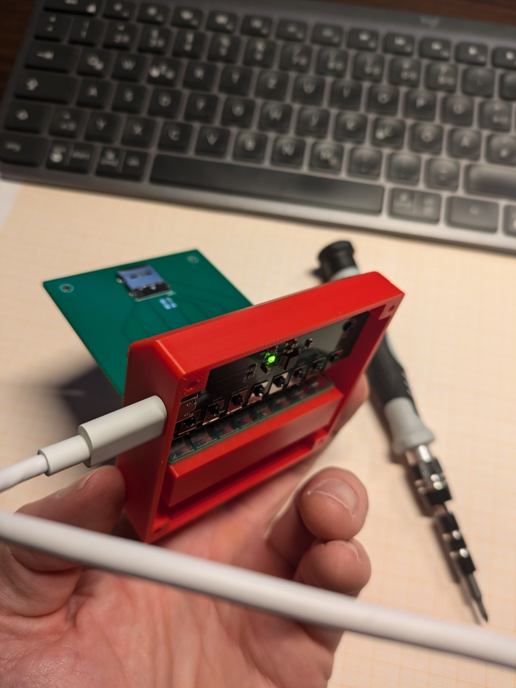

Here's the schematic:

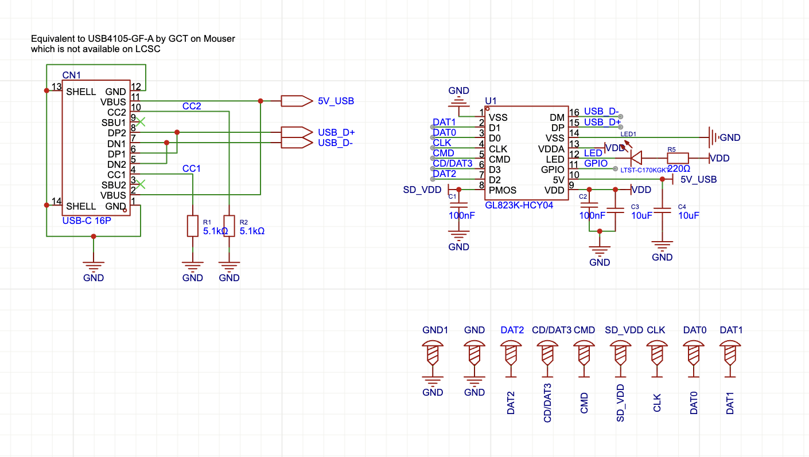

It's essentially a wrapper around a [Genesys Logic GL823K IC](https://atta.szlcsc.com/upload/public/pdf/source/20190212/C284879_D3054E8AA735401C3047DCECFFFED6D3.pdf), a USB 2.0 SD/MSPRO Card reader controller.

I rarely use it since I typically insert SD cards directly into my laptop before assembling cartridges. Still, it was a fun side project.

## Bonus content: modding the Andonstar AD249S-M digital microscope
The microscope comes like this originally:

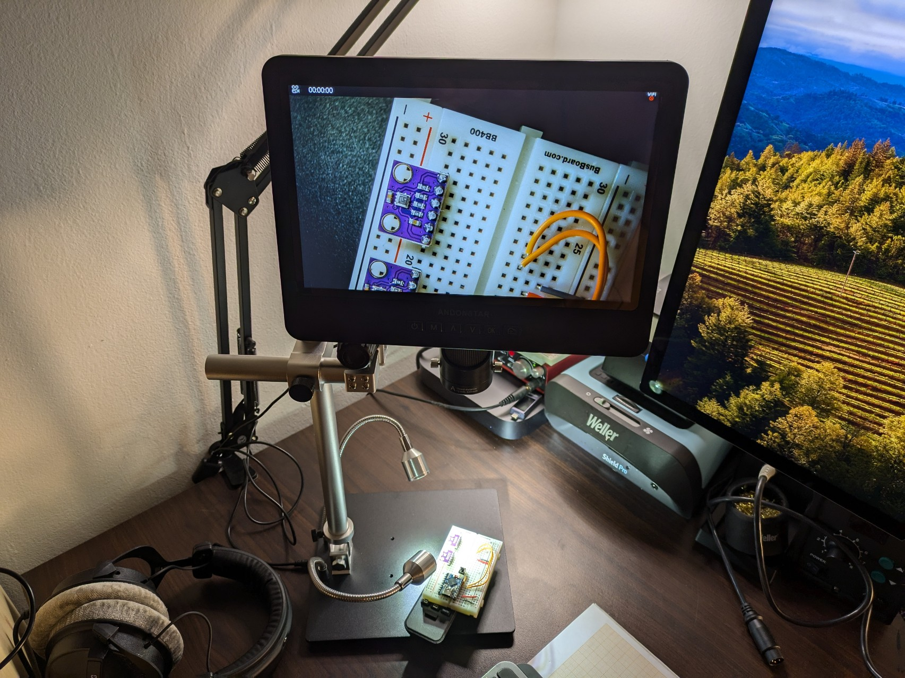

I preferred mounting it on a [Rode PSA1 articulated arm](https://www.amazon.de/-/en/R%C3%B8de-PSA1-articulated-arm-stand/dp/B001D7UYBO/) attached to my desk. This gives me nearly unlimited movement across my work area.

The microscope stand includes a control PCB for the LED lights.

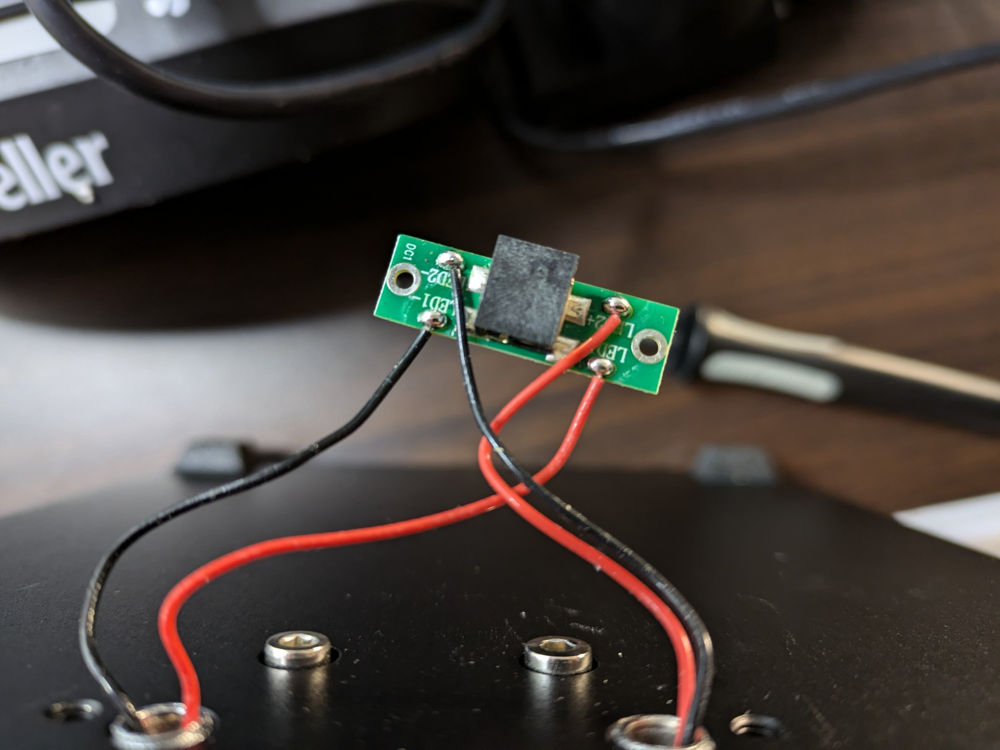

I disassembled it and removed the control PCB and LED light arms.

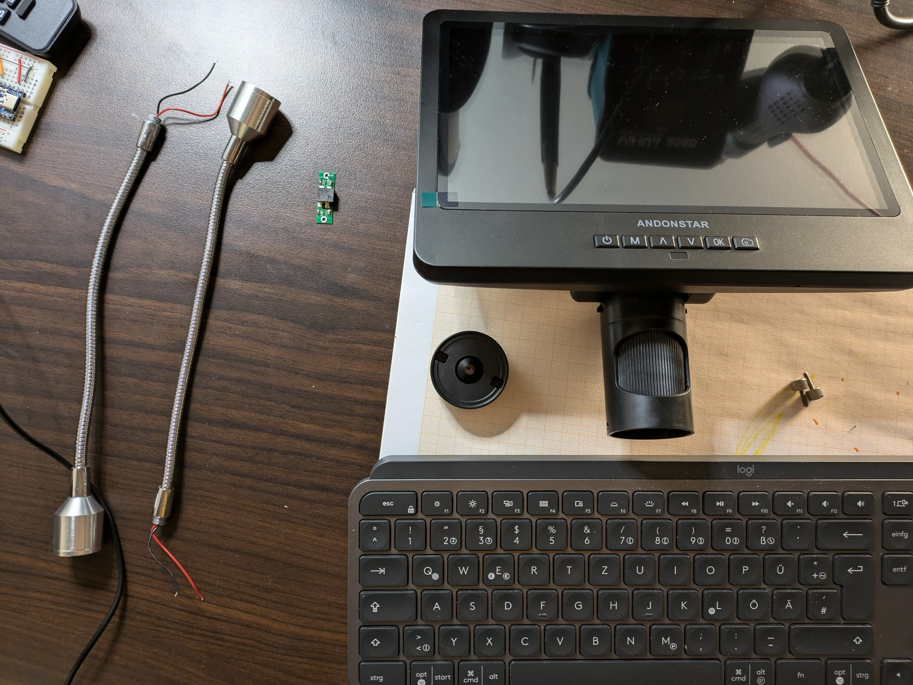

I then designed and 3D printed a mount that attaches to the PSA1 arm, houses the control PCB, and accommodates the LED light arms.

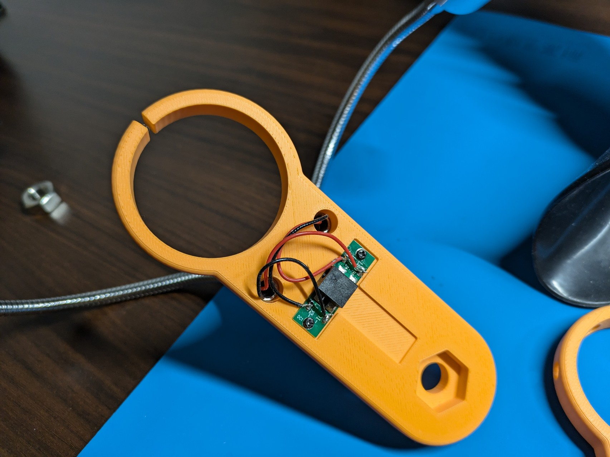

<video src="./media/microscope_320.mp4" controls style="width:100%;height:auto;display:block;margin:0 auto;" loading="lazy">
</video>

Note: The final version uses a different fastening mechanism with a screw and wing nut, but this demonstrates the concept.

Here's the [3MF file](./project/andonstar-bracket.3mf) for the mount, ready for 3D printing. I used PLA with BambuLab slicer defaults.

<%= render("../../_partials/post-footer.html") %>