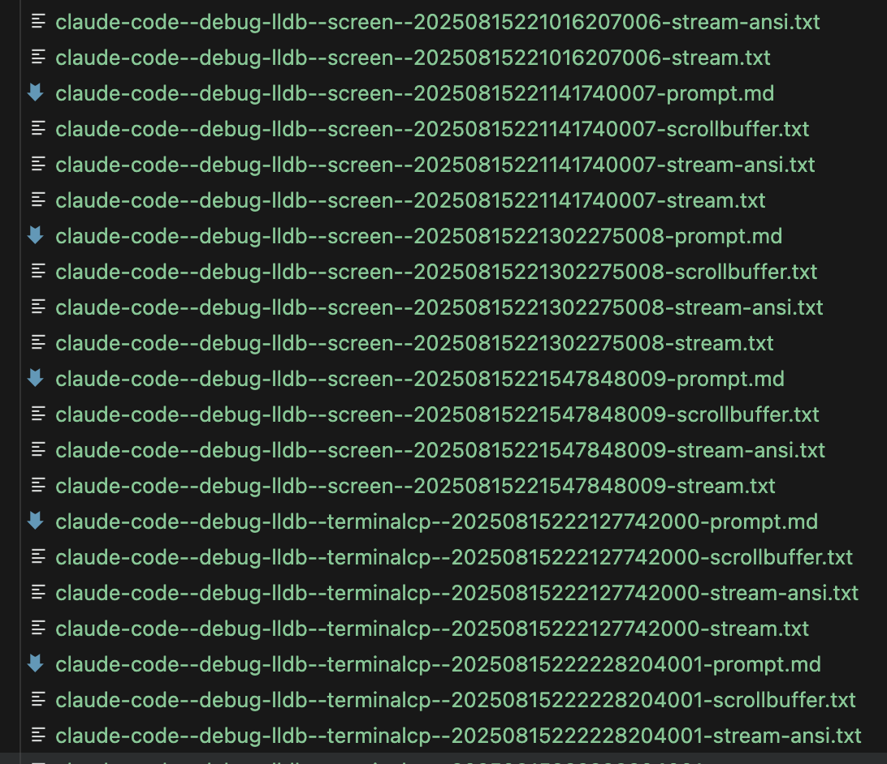
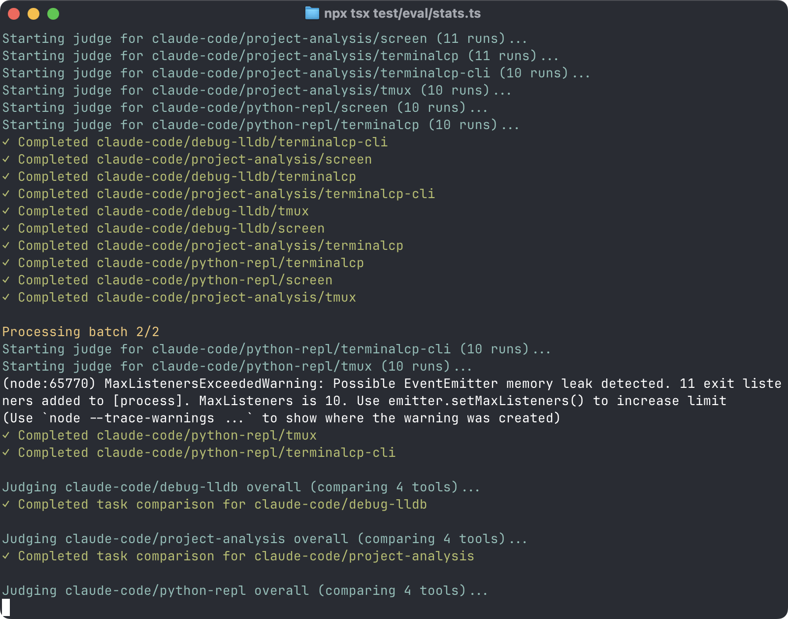

<%
	meta("../../meta.json")
	meta()
	const path = require('path');
	const fs = require('fs');
	url = url + "/posts/" + path.basename(path.dirname(outputPath)) + "/";
%>
<%= render("../../_partials/post-header.html", { title, image, url }) %>

<div class="toc">
%%toc%%
</div>

[MCP servers](https://modelcontextprotocol.io) (MCPs for short) are all the rage. However, practitioners using agentic coding tools are usually skeptical. Many MCPs flood the context window with unnecessary output or offer dozens of tools, degrading your agent's performance by [poisoning the context](/posts/2025-06-02-prompts-are-code/#toc_0). Many practitioners (myself included) resort to letting coding agents directly call CLI tools instead. But what if we're wrong?

## MCPs as thin wrappers

Just like a lot of meetings could have been emails, a lot of MCPs could have been CLI invocations. For example, there's the [GitHub MCP Server](https://github.com/github/github-mcp-server), which reimplements functionality that's already available in the [GitHub CLI](https://cli.github.com/). There's little benefit of using that MCP compared to telling your coding agent to use its shell tool to run the GitHub CLI directly. In fact, most often the GitHub MCP Server will lead to much worse results than just letting the agent run the command line tool directly.

Another popular choice is [Context7](https://context7.com/), which provides code snippets to help agents use popular libraries. I found [some of my own libraries](https://context7.com/libgdx/libgdx) in there and the snippets are utterly useless. What works better is having Claude clone the dependency's repository, then let a sub-agent analyze it and generate a concise user manual for the task at hand.

But it depends on the MCP and available CLI tools. Sometimes there are no easy-to-use CLI tools, making MCPs sensible. Other times CLI tools are too verbose. MCP servers are also the only option for LLM clients without a built-in shell tool. And stateful tools are easier to implement as MCPs than CLIs since MCP servers are stateful by default.

I wanted to quantify the difference by writing an MCP server and a corresponding CLI that can be used with Claude Code and for which there are equivalent standard CLI tools Claude encountered during training. I then wrote a hacky evaluation framework to assess:
- what costs more
- what takes more time
- which approach has higher success rates
- whether the inherent knowledge about standard tools beats in-context learning about a previously unseen tool

## Building a CLI and MCP server

I started by building a tool that's inherently useful to myself: [terminalcp](https://github.com/badlogic/terminalcp/tree/ac9272ed03a40e4d9666ded80667688b16a7a16a), a (less capable) tmux alternative with an MCP server that lets agents control terminal applications (debuggers, REPLs, vim, htop) like Playwright controls browsers.

Here's a quick example of terminalcp in action using the CLI version to debug an executable with lldb and observing the session in a second terminal window:

<video src="media/terminalcp.mp4" controls loop loading="lazy">
</video>

And here's the terminalcp MCP server version used by Claude Code to debug the same executable with lldb:

<video src="media/terminalcp-mcp.mp4" controls loop loading="lazy">
</video>

Note how I can attach to the lldb session from another terminal instance and co-debug with Claude.

You can bore yourself to death by watching the [making of the v0 of terminalcp](https://www.youtube.com/live/Pd1kP9WJhEo) or check out the [source code](https://github.com/badlogic/terminalcp/tree/ac9272ed03a40e4d9666ded80667688b16a7a16a). Here's a quick rundown:

- [TerminalManager](https://github.com/badlogic/terminalcp/blob/ac9272ed03a40e4d9666ded80667688b16a7a16a/src/terminal-manager.ts) is the core: uses [node-pty](https://github.com/microsoft/node-pty) to spawn processes in pseudo terminals and [xterm.js](https://xtermjs.org/) to render ANSI sequences.
- [TerminalServer](https://github.com/badlogic/terminalcp/blob/ac9272ed03a40e4d9666ded80667688b16a7a16a/src/terminal-server.ts) runs as a persistent daemon, auto-spawned when needed. Talks to clients via Unix socket (works on Windows too, thanks Node.js).
- [TerminalClient](https://github.com/badlogic/terminalcp/blob/ac9272ed03a40e4d9666ded80667688b16a7a16a/src/terminal-client.ts) handles communication between the MCP/CLI and the server.
- The [MCP server](https://github.com/badlogic/terminalcp/blob/ac9272ed03a40e4d9666ded80667688b16a7a16a/src/mcp-server.ts) just forwards LLM tool calls to the terminal server. Dead simple.
- [CLI logic](https://github.com/badlogic/terminalcp/blob/ac9272ed03a40e4d9666ded80667688b16a7a16a/src/index.ts) I stuffed into index.ts. Parses arguments, handles special keys (up, down, etc.) using tmux-style symbolic key names and control sequences.
- [AttachClient](https://github.com/badlogic/terminalcp/blob/ac9272ed03a40e4d9666ded80667688b16a7a16a/src/attach-client.ts) lets users attach to running sessions as shown in the videos.

I tried to keep terminalcp token-efficient. The server replies with plain text, not JSON (in case of the MCP server, that plain text still gets wrapped in JSON-RPC messages, whoop whoop). The MCP server exposes a single `terminalcp` tool instead of one per command. This is not just voodoo. In an older version of the Claude Code documentation, Anthropic actually mentioned that there's a limit to the number of tools you should expose to the LLM, otherwise it gets confused (I can no longer find that reference). You can also find this [old Claude Sonnet 3.7 cookbook](https://github.com/anthropics/anthropic-cookbook/blob/main/tool_use/parallel_tools_claude_3_7_sonnet.ipynb) where they introduce a batch tool so that Claude can call multiple tools in parallel.

Finally, the commands let you pick only the output you need. `stdout` can return just the last N lines of the rendered terminal scrollback buffer. `stream` can strip ANSI codes and return only new output since the last call with `since_last`. Here are all the commands, both the MCP tool arguments as JSON and the corresponding CLI invocation:

```bash
# start - spawn a process with optional name and working directory
{"action": "start", "command": "python3 -i", "name": "repl", "cwd": "/home/user"}
terminalcp start repl "python3 -i"

# stop - kill one or all processes
{"action": "stop", "id": "repl"}  # or just {"action": "stop"} for all
terminalcp stop repl  # or just terminalcp stop for all

# stdin - send input to a process
{"action": "stdin", "id": "repl", "data": "print('hello')\r"}
terminalcp stdin repl "print('hello')" ::Enter

# stdout - get rendered terminal screen with optional line limit
{"action": "stdout", "id": "repl", "lines": 50}
terminalcp stdout repl 50

# stream - get raw output, optionally incremental with since_last
{"action": "stream", "id": "repl", "since_last": true, "strip_ansi": false}
terminalcp stream repl --since-last --no-strip-ansi

# list - list all sessions
{"action": "list"}
terminalcp ls

# term-size - get terminal dimensions
{"action": "term-size", "id": "repl"}
# Not exposed in CLI

# version - check compatibility
{"action": "version"}
terminalcp version

# kill-server - shut everything down
{"action": "kill-server"}
terminalcp kill-server
```

Finally, here's the tool description that the MCP server reports to the MCP client like Claude Code:

````markdown
Control background processes with virtual terminals. IMPORTANT: Always clean up processes with "stop" action when done.

Examples:
  Start dev server: {"action": "start", "command": "npm run dev", "cwd": "/path/to/project"}
  Send text with Enter: {"action": "stdin", "id": "proc-123", "data": "npm test\r"}
  Send arrow keys: {"action": "stdin", "id": "proc-123", "data": "echo hello\u001b[D\u001b[D\u001b[Dhi \r"}
  Send Ctrl+C: {"action": "stdin", "id": "proc-123", "data": "\u0003"}
  Stop process: {"action": "stop", "id": "proc-abc123"}
  Stop all processes: {"action": "stop"}

  Get terminal screen: {"action": "stdout", "id": "proc-123"}  # Current view + scrollback
  Get last 50 lines: {"action": "stdout", "id": "proc-123", "lines": 50}
  Get all output ever: {"action": "stream", "id": "proc-123"}  # From process start
  Get new output only: {"action": "stream", "id": "proc-123", "since_last": true}  # Since last stream call

Output modes:
  stdout: Terminal emulator output - returns the rendered screen as user would see it.
          Limited to 10K lines scrollback. Best for: interactive tools, TUIs, REPLs, debuggers.

  stream: Raw process output - returns all text the process has written to stdout/stderr.
          Strips ANSI codes by default (set strip_ansi: false to keep). No limit on history.
          With since_last: true, returns only new output since last stream call on this process.
          Best for: build logs, test output, monitoring long-running processes.

Common escape sequences for stdin:
  Enter: \r or \u000d
  Tab: \t or \u0009
  Escape: \u001b
  Backspace: \u007f
  Ctrl+C: \u0003
  Ctrl+D: \u0004
  Ctrl+Z: \u001a

  Arrow keys: Up=\u001b[A Down=\u001b[B Right=\u001b[C Left=\u001b[D
  Navigation: Home=\u001b[H End=\u001b[F PageUp=\u001b[5~ PageDown=\u001b[6~
  Delete: \u001b[3~ Insert: \u001b[2~
  Function keys: F1=\u001bOP F2=\u001bOQ F3=\u001bOR F4=\u001bOS
  Meta/Alt: Alt+x=\u001bx (ESC followed by character)

Interactive examples:
  Vim: stdin "vim test.txt\r" → stdin "iHello\u001b:wq\r" → stdout
  Python: start "python3 -i" → stdin "2+2\r" → stdout
  Build monitoring: start "npm run build" → stream (since_last: true) → repeat
  Interrupt: stdin "sleep 10\r" → stdin "\u0003" (Ctrl+C)

Note: Commands run via bash -c. Use absolute paths, not aliases.
````

This isn't quite perfect yet. For example, `stdin` could let you specify a pattern to watch for in the output and wait for it with a timeout, then return the new output. This would save a round trip between client and server. But it works well enough for my evaluation.

## Designing the evaluation

My aim wasn't to create a fully scientific evaluation. For that, you should check out [Eugene Yan's blog](https://eugeneyan.com/writing/llm-evaluators/), which has fantastic information. I just aim at getting some basic stats with which I can annoy people at a party.

Here's the bird's eye view: I defined three tasks requiring terminal control (start process, send input, get output) and four tools to test: terminalcp MCP server, terminalcp CLI, tmux, and screen. The [task definitions](https://github.com/badlogic/terminalcp/tree/ac9272ed03a40e4d9666ded80667688b16a7a16a/test/eval/tasks) and [tool definitions](https://github.com/badlogic/terminalcp/tree/ac9272ed03a40e4d9666ded80667688b16a7a16a/test/eval/tools) are simple markdown files. Tool definitions include some frontmatter that defines how to add them to Claude Code's toolset if necessary, as well as how to clean up after a run that used this tool. These are the inputs to my evaluation framework.

The super hacky [evaluation framework](https://github.com/badlogic/terminalcp/tree/ac9272ed03a40e4d9666ded80667688b16a7a16a/test/eval) works like this:

1. **Run the tests**: For each task and tool combination, the framework spawns a fresh Claude Code instance with a clean config (no custom MCPs, no CLAUDE.md files). Each task/tool combination is run 10 times since LLMs are non-deterministic. The framework combines the task and tool definitions into a single prompt with instructions to output TASK_COMPLETE or TASK_FAILED markers. The Claude Code instance is driven via TerminalManager so the test runner can nudge Claude if it stalls. At the end of each run, it issues `/cost` to capture time, tokens, and cost.

2. **Capture everything**: Each run produces multiple output files:
   - The prompt that was sent
   - The terminal scrollback buffer (what you'd see on screen)
   - The raw ANSI stream (with and without escape codes)

3. **Extract statistics**: Parses outputs for success/failure markers, cost, time, and token usage by model.

4. **Judge with Claude**: The framework uses Claude Code to judge each task/tool combination, reading outputs and assessing what worked, what failed, and why. It also suggests improvements for the task. In a second pass, Claude ranks all tools for each task with analysis, insights, and recommendations.

The framework can run evaluations in parallel, repeat them multiple times for consistency, and handles cleanup between runs. A full run produces a lot of files.



Which is why I use Claude as a judge to give me some initial insights I can then use to navigate the files for manual analysis.

Let's have a quick look at the tools and task definitions.

### Tool definitions

I try to make the tool definitions follow the exact same structure, so the comparison is fair. This includes instructions for special keys, multiline input, scrollback handling, and other operations the agent needs to perform with the tool to complete the tasks. The goal is to give each tool equal footing via in-context information.

The terminalcp MCP server already reports the tool description, so I only added a few more hints. Here's the full definition:

```markdown
---
{
  "type": "mcp",
  "mcpServers": {
    "terminalcp": {
      "type": "stdio",
      "command": "npx",
      "args": ["tsx", "src/index.ts", "--mcp"]
    }
  }
}
---

### Quick Start (Typical Workflow)
1. Start session: `{"action": "start", "command": "command args", "name": "NAME"}`
2. Send input: `{"action": "stdin", "id": "NAME", "data": "input\r"}`
3. Get current viewport: `{"action": "stdout", "id": "NAME"}`
4. Clean up: `{"action": "stop", "id": "NAME"}`

### Important Notes
- **Only stop sessions you started by name**
- **stdout = viewport + scrollback**: Shows clean rendered terminal
- **stdout with lines**: `{"action": "stdout", "id": "NAME", "lines": N}` for last N lines
- **stream = raw output**: Contains all output since start (avoid for TUIs)
- Use `\r` for Enter, `\u001b[A/B/C/D` for arrows, `\u0003` for Ctrl+C
- **TIP**: For interactive programs, use stdout after operations complete for clean view
```

The terminalcp CLI tool definition is bigger since I need to explain the command syntax:

```markdown
---
{
  "type": "cli",
  "cleanup": "npx tsx src/index.ts stop || true"
}
---

### Quick Start (Typical Workflow)
1. `npx tsx src/index.ts start NAME command args` - Start session
2. `npx tsx src/index.ts stdin NAME "input" ::Enter` - Send input
3. `npx tsx src/index.ts stdout NAME` - Get current viewport (clean, rendered)
4. `npx tsx src/index.ts stop NAME` - Clean up when done

### Core Commands

- **Start session**: `npx tsx src/index.ts start NAME command args`
  - Returns session ID (the NAME you provided)
  - Example: `npx tsx src/index.ts start repl python3 -i`

- **List sessions**: `npx tsx src/index.ts ls`
  - Shows: ID, status (running/stopped), working directory, command

- **Send input**: `npx tsx src/index.ts stdin NAME "input" ::Enter`
  - Batch multiple: `npx tsx src/index.ts stdin NAME "cmd1" ::Enter "cmd2" ::Enter "cmd3" ::Enter`
  - Special keys: `::C-c` (Ctrl+C), `::Up`/`::Down`/`::Right`/`::Left` (arrows), `::PageUp`/`::PageDown`
  - Example: `npx tsx src/index.ts stdin repl "2+2" ::Enter`
  - **Multiline (Python auto-indents)**: `npx tsx src/index.ts stdin repl "def greet(name):" ::Enter "return f'Hello {name}'" ::Enter ::Enter`

- **Get output**:
  - **Current viewport** (RECOMMENDED - clean, rendered view): `npx tsx src/index.ts stdout NAME`
  - **Last N lines**: `npx tsx src/index.ts stdout NAME N`
  - **Full scrollback**: `npx tsx src/index.ts stdout NAME 10000` (up to 10,000 lines max)

- **Stop session**: `npx tsx src/index.ts stop NAME`

### Important Notes
- **Only stop sessions you started by name**
- **stdout = viewport + scrollback**: Shows clean rendered terminal (up to 10,000 lines)
- **stdout N = last N lines**: Efficient for checking recent output
- **TIP**: For interactive programs, use stdout after operations complete for clean view

You are free to run `npx tsx src/index.ts --help` if you require more information on the tool.
```

The tmux tool definition follows the same structure, mapping each terminalcp operation to its tmux equivalent:

```markdown
---
{
  "type": "cli",
  "cleanup": "tmux kill-server || true"
}
---

### Quick Start (Typical Workflow)
1. `tmux new-session -d -s NAME "command" \; set remain-on-exit on` - Start session
2. `tmux send-keys -t NAME "input" Enter` - Send input
3. `tmux capture-pane -t NAME -p` - Get current viewport (clean, rendered)
4. `tmux kill-session -t NAME` - Clean up when done

### Core Commands

- **Start session**: `tmux new-session -d -s NAME "command args" \; set remain-on-exit on`
  - `-d` detached mode, `-s` session name
  - **IMPORTANT**: Use `remain-on-exit on` to capture output after process ends
  - Example: `tmux new-session -d -s repl "python3 -i" \; set remain-on-exit on`

- **List sessions**: `tmux list-sessions` or `tmux ls`

- **Send input**: `tmux send-keys -t NAME "input" Enter`
  - Batch multiple: `tmux send-keys -t NAME "cmd1" Enter "cmd2" Enter "cmd3" Enter`
  - Special keys: `C-c` (Ctrl+C), `Up`/`Down`/`Right`/`Left` (arrows), `PageUp`/`PageDown`
  - Example: `tmux send-keys -t repl "2+2" Enter`
  - **Multiline (Python auto-indents)**: `tmux send-keys -t repl "def greet(name):" Enter "return f'Hello {name}'" Enter Enter`

- **Get output**:
  - **Current viewport** (RECOMMENDED - clean, rendered view): `tmux capture-pane -t NAME -p`
  - **Last N lines**: `tmux capture-pane -t NAME -p -S -N`
  - **Full scrollback**: `tmux capture-pane -t NAME -p -S -`

- **Check if alive**: `tmux list-panes -t NAME -F "#{pane_dead}"` (0=alive, 1=dead)

- **Kill session**: `tmux kill-session -t NAME`

### Important Notes
- **Only kill sessions you started by name**
- **capture-pane = viewport only**: Shows current screen (clean, rendered), perfect for TUIs/REPLs
- **capture-pane -S - = full scrollback**: Clean rendered history
- **remain-on-exit on**: Essential for capturing output after process ends
- **TIP**: For interactive programs, use capture-pane after operations complete for clean view

You are free to run `tmux --help` if you require more information on the tool.
```

The screen tool definition follows the same pattern, except there's a bug in screen v4.0.3 that requires a one-time workaround command to enable hardcopy:

```markdown
---
{
  "type": "cli",
  "cleanup": "for session in $(screen -ls | grep -o \"[0-9]*\\\\.[^ ]*\"); do screen -S \"$session\" -X quit; done || true"
}
---

### Quick Start (Typical Workflow)
1. `rm -f screenlog.0 && screen -dmS NAME -L command args` - Start session
2. `expect -c 'spawn screen -r NAME; send "\001d"; expect eof' >/dev/null 2>&1` - Enable hardcopy (once per session)
3. `screen -S NAME -X stuff $'input\n'` - Send input
4. `screen -S NAME -p 0 -X hardcopy output.txt && cat output.txt` - Get current viewport (clean, rendered)
5. `screen -S NAME -X quit` - Clean up when done

### Core Commands

- **Start session**: `screen -dmS NAME -L program args`
  - `-d` detached mode, `-m` force new session, `-S` session name, `-L` enable logging
  - **IMPORTANT**: Remove old `screenlog.0` first: `rm -f screenlog.0`
  - Example: `rm -f screenlog.0 && screen -dmS repl -L python3 -i`

- **List sessions**: `screen -ls`

- **Send input**: `screen -S NAME -X stuff $'input\n'`
  - REQUIRED: Use $'...' syntax for proper escape sequences
  - Batch multiple: `screen -S NAME -X stuff $'cmd1\ncmd2\ncmd3\n'`
  - Special keys: `$'\003'` (Ctrl+C), `$'\e[A]'/`$'\e[B]'/`$'\e[C]'/`$'\e[D]'` (Up/Down/Right/Left arrows)
  - Example: `screen -S repl -X stuff $'2+2\n'`
  - **Multiline (Python auto-indents)**: `screen -S repl -X stuff $'def greet(name):\nreturn f\'Hello {name}\'\n\n'`

- **Get output**:
  - **Current viewport** (RECOMMENDED - clean, rendered view):
    ```bash
    # First time per session (v4.0.3 bug workaround):
    expect -c 'spawn screen -r NAME; send "\001d"; expect eof' >/dev/null 2>&1
    # Then use hardcopy normally:
    screen -S NAME -p 0 -X hardcopy output.txt && cat output.txt
    ```
  - **Last N lines** (raw with ANSI codes): `tail -N screenlog.0`
  - **Full scrollback** (raw with ANSI codes): `cat screenlog.0`

- **Kill session**: `screen -S NAME -X quit`

### Important Notes
- **Only kill sessions you started by name**
- **hardcopy = viewport only**: Shows current screen (clean, rendered), perfect for TUIs/REPLs
- **screenlog.0 = full raw output**: Contains all ANSI codes since session start
- **v4.0.3 hardcopy bug**: Run expect workaround once per session
- **TIP**: For interactive programs, use hardcopy after operations complete for clean view

You are free to run `screen --help` if you require more information on the tool.
```

### Task definitions

I created three tasks that exercise different aspects of terminal control. They should speak for themselves. Probably the most interesting one is the project analysis task where the agent needs to command OpenCode and navigate its TUI.

**Task 1: Debug with LLDB (debug-lldb.md)**

```markdown
The program `evaluation-results/demo-buggy` crashes when executed. Use LLDB to:
- Start the program under the debugger
- Identify where and why it crashes
- Examine variables, memory, and call stack
- Report the root cause of the crash
```

**Task 2: Python REPL (python-repl.md)**

```markdown
Start a Python REPL and complete these steps:

1. Calculate 42 * 17 and verify the result appears
2. Import math module and calculate math.factorial(10)
3. Create list comprehension: [x**2 for x in range(10)]
4. Define a function that checks if a number is prime (enter it line by line with proper indentation)
5. Test your prime function with the number 97 and report whether it's prime
6. Exit the REPL cleanly

After each input, check the output to confirm your command executed correctly before proceeding to the next step.

Finally, get all the output and summarize the results, including whether 97 is prime.
```

**Task 3: Project analysis (project-analysis.md)**

````markdown
Start opencode with the anthropic/claude-sonnet-4-20250514 model, switch to GPT OSS 120B using the /models command, and ask it to analyze the project. You MUST capture the COMPLETE response.

1. Start opencode with the specified model:
   ```
   opencode --model anthropic/claude-sonnet-4-20250514
   ```

2. Once opencode is running, use the /models slash command to switch to GPT OSS 120B:
   ```
   /models
   ```
   When the models dialog opens, type "GPT OSS 120B" to filter the list, then select GPT OSS 120B by pressing enter.

3. After successfully switching models, prompt it to analyze the project:
   ```
   Read README.md explain what this project does
   ```

4. Capture the model's COMPLETE response. This will require scrolling upwards to capture all output using stdout with sufficient lines parameter.

5. Report the full summary provided by the model.

IMPORTANT: If you cannot successfully switch to GPT OSS 120B, the task has failed. Report that the model switching failed and do not proceed with the analysis.
````

### Example evaluation prompt

Here's what the evaluation framework actually sends to Claude Code when combining a task and tool definition. This is the prompt for the Python REPL task with tmux:

````markdown
## Task

Start a Python REPL and complete these steps:

1. Calculate 42 * 17 and verify the result appears
2. Import math module and calculate math.factorial(10)
3. Create list comprehension: [x**2 for x in range(10)]
4. Define a function that checks if a number is prime (enter it line by line with proper indentation)
5. Test your prime function with the number 97 and report whether it's prime
6. Exit the REPL cleanly

After each input, check the output to confirm your command executed correctly before proceeding to the next step.

Finally, get all the output and summarize the results, including whether 97 is prime.

## Tool

You must use **Tmux** to complete this task.

### Quick Start (Typical Workflow)
1. `tmux new-session -d -s NAME "command" \; set remain-on-exit on` - Start session
2. `tmux send-keys -t NAME "input" Enter` - Send input
3. `tmux capture-pane -t NAME -p` - Get current viewport (clean, rendered)
4. `tmux kill-session -t NAME` - Clean up when done

### Core Commands

- **Start session**: `tmux new-session -d -s NAME "command args" \; set remain-on-exit on`
  - `-d` detached mode, `-s` session name
  - **IMPORTANT**: Use `remain-on-exit on` to capture output after process ends
  - Example: `tmux new-session -d -s repl "python3 -i" \; set remain-on-exit on`

- **List sessions**: `tmux list-sessions` or `tmux ls`

- **Send input**: `tmux send-keys -t NAME "input" Enter`
  - Batch multiple: `tmux send-keys -t NAME "cmd1" Enter "cmd2" Enter "cmd3" Enter`
  - Special keys: `C-c` (Ctrl+C), `Up`/`Down`/`Right`/`Left` (arrows), `PageUp`/`PageDown`
  - Example: `tmux send-keys -t repl "2+2" Enter`
  - **Multiline (Python auto-indents)**: `tmux send-keys -t repl "def greet(name):" Enter "return f'Hello {name}'" Enter Enter`

- **Get output**:
  - **Current viewport** (RECOMMENDED - clean, rendered view): `tmux capture-pane -t NAME -p`
  - **Last N lines**: `tmux capture-pane -t NAME -p -S -N`
  - **Full scrollback**: `tmux capture-pane -t NAME -p -S -`

- **Check if alive**: `tmux list-panes -t NAME -F "#{pane_dead}"` (0=alive, 1=dead)

- **Kill session**: `tmux kill-session -t NAME`

### Important Notes
- **Only kill sessions you started by name**
- **capture-pane = viewport only**: Shows current screen (clean, rendered), perfect for TUIs/REPLs
- **capture-pane -S - = full scrollback**: Clean rendered history
- **remain-on-exit on**: Essential for capturing output after process ends
- **TIP**: For interactive programs, use capture-pane after operations complete for clean view

You are free to run `tmux --help` if you require more information on the tool.

## Completion

Complete the task using only the tool specified above.
- If successful, output: TASK_COMPLETE
- If unsuccessful, output: TASK_FAILED and explain what went wrong
````

### Running the evaluation

The evaluation runs through a simple CLI where I specify which task/tool combinations to test and how many repetitions. The framework generates prompts for each combination, spawns Claude Code via TerminalManager, and monitors execution. If Claude stalls, it gets nudged to continue. Once complete, it captures costs and saves all outputs.

Here's what that looks like:

<video src="media/run.mp4" controls loading="lazy">
</video>

Since I'm evaluating terminal multiplexers, I can attach to the session and watch what Claude is doing.

### Statistics and judgments

After all runs complete, a second CLI command parses the outputs, extracts statistics, and has Claude judge each task/tool combination and rank the tools.



All of that gets written to a final evaluation-summary.json file which looks something like this:

```json
{
  "claude-code": {
    "debug-lldb": {
      "judgeNotes": "## Tool Comparison for debug-lldb\n\n### Rankings\nRank the tools from best to worst based on:\n1. Success rate: All tools tied at 100%\n2. Efficiency (tokens/turns): \n   - 1st: tmux (avg 0.3729 cost, 1m 28.7s)\n   - 2nd: terminalcp-cli (avg 0.3865 cost, 1m 37.2s)  \n   - 3rd: terminalcp (avg 0.4804 cost, 1m 22.2s)\n   - 4th: screen (avg 0.6003 cost, 1m 46.2s)\n3. Ease of use:\n   - 1st: terminalcp\n   - 2nd: tmux\n   - 3rd: terminalcp-cli\n   - 4th: screen\n4. Overall effectiveness:\n   - 1st: tmux\n   - 2nd: terminalcp\n   - 3rd: terminalcp-cli\n   - 4th: screen\n\n### Best Tool: tmux\nTmux performed best for this task due to its combination of lowest cost ($0.3729 avg), consistent clean execution, and efficient debugging workflow without unnecessary steps or workarounds.\n\n### Tool-by-Tool Analysis\n- **screen**: Most expensive ($0.6003 avg) and required expect workaround for hardcopy bug, but provided reliable debugging with thorough analysis. Several runs unnecessarily examined source code before debugging, reducing efficiency.\n- **terminalcp**: Simple and straightforward terminal interface with good efficiency, though some runs included unnecessary file reading. Second fastest average duration at 1m 22.2s despite higher token usage than tmux.\n- **terminalcp-cli**: CLI-based approach had occasional session management issues (\"Process not found\" errors) and some inefficient multi-session runs. Middle-tier performance with reasonable cost but longest average duration.\n- **tmux**: Most efficient with lowest cost and consistent clean execution across all runs. No workarounds needed and minimal unnecessary steps, with only one run setting an unneeded breakpoint.\n\n### Key Insights\nAll tools achieved 100% success rate for this debugging task, showing that terminal multiplexers are reliable for LLDB integration. The main differentiators were efficiency and ease of use, with simpler interfaces (terminalcp, tmux) outperforming more complex ones (screen, terminalcp-cli) in terms of cost and execution time.\n\n### Recommendation\nTmux should be preferred for LLDB debugging tasks due to its lowest cost, fastest average execution time, and cleanest implementation without requiring workarounds or experiencing session management issues.",
      "screen": {
        "judgeNotes": "Now I have read all the evaluation files for claude-code using screen on the debug-lldb task. Let me provide my assessment in the required format:\n\n## Overall Performance\nThe agent consistently succeeded in all 10 runs, correctly identifying the NULL pointer dereference crash in the demo-buggy program using LLDB through Screen. Performance was reliable with thorough debugging analysis in each run.\n\n## What Went Well\n- Successfully started LLDB sessions through Screen in all runs\n- Correctly identified the crash location (demo-buggy.c:26 in add_score function)\n- Accurately diagnosed the root cause (NULL pointer dereference of scores field)\n- Properly examined variables, memory, and call stack as requested\n- Consistently used the expect workaround for Screen's hardcopy bug\n- Provided detailed technical analysis including memory addresses and variable states\n- Properly cleaned up Screen sessions after completion\n\n## What Went Wrong\n- Some runs unnecessarily examined the source code files before debugging (runs 3, 4, 8, 9)\n- Occasional redundant tool calls when examining variables\n- Minor inconsistency in debugging approach (some set breakpoints, others ran directly)\n- Some runs were more verbose than necessary in their analysis\n\n## Run-by-Run Analysis\n- Run 20250815220002898000: Pass - Clean execution with efficient debugging and clear root cause analysis\n- Run 20250815220123424001: Pass - Thorough debugging with proper variable examination and detailed analysis\n- Run 20250815220303961002: Pass - Good execution but included unnecessary file listing before debugging\n- Run 20250815220434495003: Pass - Comprehensive analysis but unnecessarily read source code first\n- Run 20250815220625079004: Pass - Very detailed debugging with breakpoints and step-by-step analysis\n- Run 20250815220855669005: Pass - Efficient debugging with clear identification of the NULL pointer issue\n- Run 20250815221016207006: Pass - Good execution with proper variable examination and concise analysis\n- Run 20250815221141740007: Pass - Clean debugging session with thorough variable inspection\n- Run 20250815221302275008: Pass - Most comprehensive run with breakpoints and detailed stepping through code\n- Run 20250815221547848009: Pass - Efficient debugging with proper cleanup and comprehensive final analysis\n\n## Recommendations\nFocus on directly debugging the binary without reading source code first unless specifically needed. Standardize the debugging approach to either use breakpoints consistently or run directly to the crash. Reduce verbosity in analysis while maintaining technical accuracy. Consider batching related debugging commands to reduce the number of tool calls needed.",
        "runs": [
          {
            "agent": "claude-code",
            "task": "debug-lldb",
            "tool": "screen",
            "timestamp": "20250815220002898000",
            "success": true,
            "totalCost": 0.4039,
            "totalDurationWall": "1m 19.2s",
            "models": {
              "claude-3-5-haiku": {
                "input": 34100,
                "output": 679,
                "cacheRead": 0,
                "cacheWrite": 0
              },
              "claude-sonnet": {
                "input": 108,
                "output": 2100,
                "cacheRead": 637000,
                "cacheWrite": 40300
              }
            }
          },
          ... 9 more runs ...
      },
      "terminalcp": {
        "judgeNotes": "Now I've read all the files as instructed. Let me provide my assessment in the exact format requested:\n\n## Overall Performance\nThe agent successfully completed the LLDB debugging task in all 10 runs, consistently identifying the null pointer dereference crash in the add_score function. Performance was reliable with correct use of the terminalcp tool and appropriate LLDB commands to examine variables, memory, and call stack.\n\n## What Went Well\n- Successfully started LLDB sessions using terminalcp in all runs\n- Correctly identified the crash location (line 26, add_score function) in every run\n- Properly examined the Student structure and identified the NULL scores pointer\n- Used appropriate LLDB commands (run, print, bt, frame select) effectively\n- Correctly cleaned up sessions with stop command in all runs\n- Provided accurate root cause analysis identifying NULL pointer dereference\n- Maintained consistent workflow: start → run → examine → analyze → stop\n\n## What Went Wrong\n- Run 3 and 4 unnecessarily read source files before debugging (Read tool usage)\n- Some runs used verbose list commands to view source code when not essential\n- Run 4 stepped through create_student function unnecessarily, making session longer\n- Minor inconsistencies in session naming (lldb_debug, lldb-debug, debug_session, lldb)\n- Some runs included excessive detail in final analysis when conciseness would suffice\n\n## Run-by-Run Analysis\n- Run 20250815222127742000: Pass - Clean execution with concise, accurate analysis\n- Run 20250815222228204001: Pass - Good debugging, noted additional off-by-one bug in calculate_average\n- Run 20250815222333672002: Pass - Thorough analysis including intentional bug comment discovery\n- Run 20250815222509136003: Pass - Read source unnecessarily but completed task correctly\n- Run 20250815222634596004: Pass - Read binary first, used breakpoints and stepping (overcomplicated)\n- Run 20250815222855081005: Pass - Clean execution with good variable examination\n- Run 20250815223010524006: Pass - Efficient debugging with clear root cause identification\n- Run 20250815223125966007: Pass - Good use of list commands to view source context\n- Run 20250815223251410008: Pass - Multiple list attempts but successfully completed task\n- Run 20250815223426868009: Pass - Clean, efficient execution with proper analysis\n\n## Recommendations\nFocus on using only LLDB through terminalcp as specified in the task requirements without additional file reading. Maintain consistent session naming conventions. Keep final analysis concise while covering all essential points. Avoid unnecessary stepping through code when the crash information is sufficient for root cause analysis.",
        "runs": [
          {
            "agent": "claude-code",
            "task": "debug-lldb",
            "tool": "terminalcp",
            "timestamp": "20250815222127742000",
            "success": true,
            "totalCost": 0.3008,
            "totalDurationWall": "59.2s",
            "models": {
              "claude-3-5-haiku": {
                "input": 2000,
                "output": 78,
                "cacheRead": 0,
                "cacheWrite": 0
              },
              "claude-sonnet": {
                "input": 130,
                "output": 1900,
                "cacheRead": 555100,
                "cacheWrite": 27400
              }
            }
          },
          ... 9 more runs ...
```

You may have noticed that the structure would allow for evaluating other coding agents as well. I've started work on that because I'd really like to see how Gemini CLI and OpenCode fare. We'll see if I have time to do that.


## The Results

After 120 evaluation runs (3 tasks × 4 tools × 10 repetitions), here's what emerged:

<div id="evaluation-tables">
  <div style="text-align: center; padding: 2em;">Loading evaluation results...</div>
</div>

### Token Usage

<div style="margin: 2em 0; height: 400px;">
  <canvas id="sonnetTokenChart"></canvas>
</div>

<div style="margin: 2em 0; height: 400px;">
  <canvas id="haikuTokenChart"></canvas>
</div>

<div style="margin: 2em 0; height: 400px;">
  <canvas id="cacheTokenChart"></canvas>
</div>

<script>
<%= fs.readFileSync(path.join(path.dirname(inputPath), "media/_chart.min.js"), "utf8") %>
</script>

<script>
<%= fs.readFileSync(path.join(path.dirname(inputPath), "media/evaluation-tables.js"), "utf8") %>
</script>

### Key Findings

1. **MCP vs CLI truly is a wash**: Both terminalcp MCP and CLI versions achieved 100% success rates. The MCP version was 23% faster (51m vs 66m) and 2.5% cheaper (\$19.45 vs \$19.95).

2. **Screen completely failed on project analysis**: Screen had 0% success on the project analysis task - it couldn't switch models in OpenCode's TUI. This dropped its overall success rate to 67%.

3. **MCP's hidden advantage: no security checks**: The lower Haiku token usage for terminalcp MCP (35k vs 1.3-2M) reveals that CLI tools trigger Claude Code's [malicious command detection](https://mariozechner.at/posts/2025-08-03-cchistory/#toc_1) on every bash invocation. MCP bypasses this overhead entirely. It also means fewer round trips to Anthropic's servers.

4. **Task complexity determines the winner**: For simpler tasks (LLDB debugging, Python REPL), tmux actually beats terminalcp on cost by 10-22%. But for complex tasks requiring more back-and-forth (project analysis), terminalcp's cleaner output gives it a 39% cost advantage over tmux. Overall totals are close: terminalcp at \$19-\$20, tmux at \$22.

## Reproducing the Results

You can download the [full evaluation results](media/evaluation-results.zip) if you want to dig into the details. The framework writes out the raw ANSI stream from each run. You can even playback the Claude Code sessions with cat:

<video src="media/cat.mp4" controls loop loading="lazy">
</video>

### Easy mode: Run individual prompts

Just take any `-prompt.md` file from the evaluation results and feed it into Claude Code. Make sure you have the required tools installed:
- **terminalcp**: Clone repo, run `npm install`, then run Claude Code in the cloned repo dir
- **tmux**: Install via package manager (`brew install tmux`, `apt-get install tmux`, etc.)
- **screen**: Usually pre-installed on Linux/macOS

### Full mode: Run the complete evaluation

Clone the repo and run the evaluation framework:

```bash
git clone https://github.com/badlogic/terminalcp
cd terminalcp
git checkout ac9272ed03a40e4d9666ded80667688b16a7a16a
npm install

# Run ALL evaluations (3 tasks × 4 tools × 10 repetitions)
npx tsx test/eval/run.ts

# Or run specific combinations
npx tsx test/eval/run.ts --agents claude --tasks python-repl --tools tmux --repeat 10

# Generate statistics after runs complete
npx tsx test/eval/stats.ts
```

Available options:
- `--agents`: Agent to use (for now just: claude)
- `--tasks`: Task names (debug-lldb, python-repl, project-analysis) or file paths
- `--tools`: Tool names (terminalcp, terminalcp-cli, tmux, screen) or file paths
- `--repeat`: Number of repetitions per combination (default: 1)
- `--parallel`: Number of parallel evaluations (default: 1)

For the debug-lldb task you need to have LLDB installed. For the python-repl task, you need to have Python 3+ installed. For the project-analysis task, you need to install [opencode](https://opencode.ai) and you'll need `GROQ_API_KEY` set in your environment as the task uses GPT-OSS 120B through Groq in opencode.

## So, MCP or CLI?

The answer is, at least for this specific case, it doesn't matter as much as you'd think. What actually matters:

1. **Tool design**: A well-designed, token-efficient tool can beat standard tools. Terminalcp's clean output and simple interface outperformed tmux and screen despite their training data advantage.

2. **Documentation quality**: Clear, concise instructions with examples can perform equally well as being in the training data. The terminalcp tool descriptions were enough to achieve 100% success rates.

3. **Token efficiency**: Both MCP and CLI can be token-efficient if designed well. The problem with many MCPs isn't the protocol - it's that they're badly designed wrappers that dump unnecessary JSON everywhere.

My takeaway? Maybe instead of arguing about MCP vs CLI, we should start building better tools. The protocol is just plumbing. What matters is whether your tool helps or hinders the agent's ability to complete tasks.

That said, if you're building a tool from scratch and your users already have a shell tool available, just make a good CLI. It's simpler and more portable. Plus, the output of your CLI can be further filtered and massaged just by piping it into another CLI tool, which can increase token efficiency at the cost of additional instructions. That's not possible with MCPs.

Once you have a well-designed, token-efficient CLI tool, adding an MCP server on top of it is very straightforward.

<%= render("../../_partials/post-footer.html", { title, url }) %>