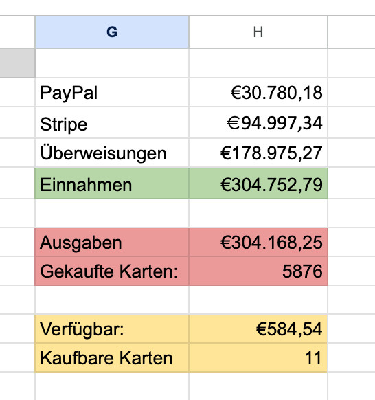
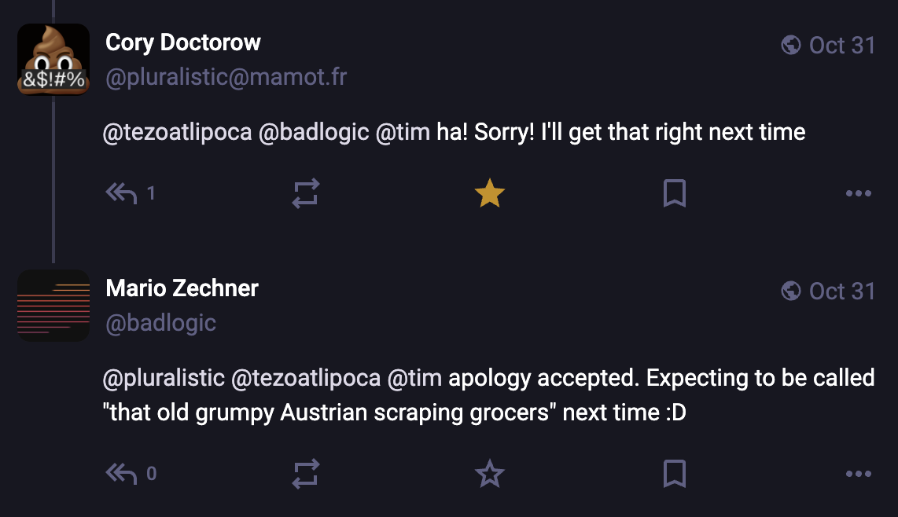
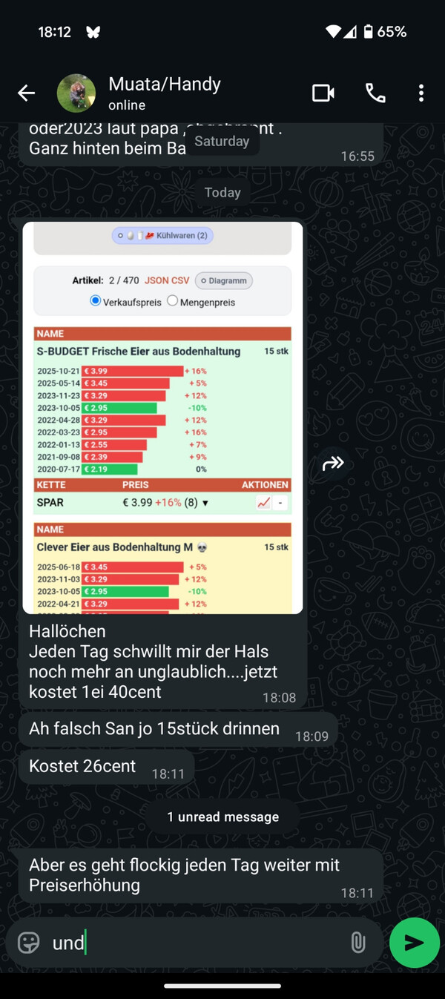
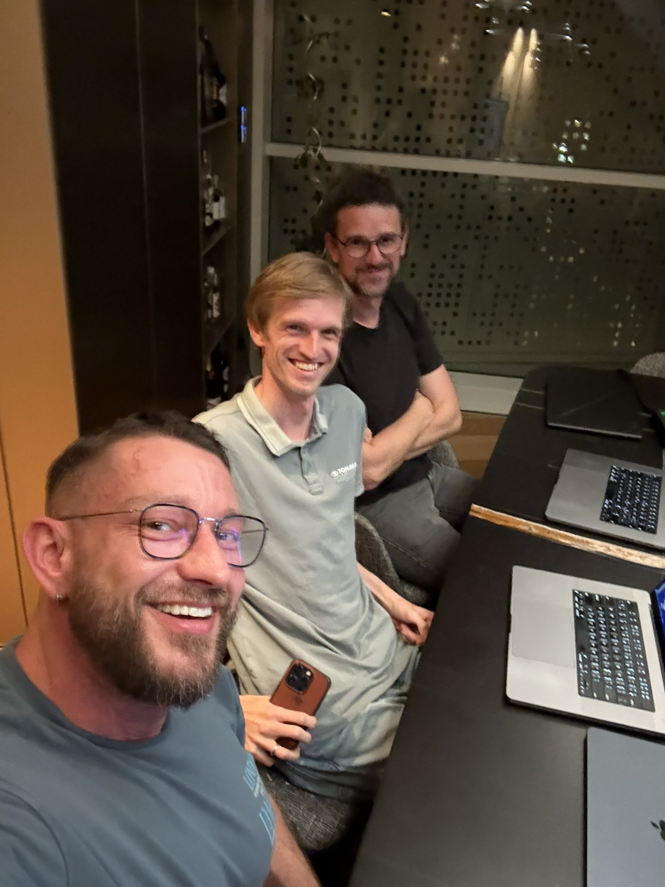

<%
	meta("../../meta.json")
	meta()
	const path = require('path');
	url = url + "/posts/" + path.basename(path.dirname(outputPath)) + "/";
%>
<%= render("../../_partials/post-header.html", { title, image, url, caption }) %>

<h1 class="toc-header">Table of contents</h1>

%%toc%%

It's been one and a half years since I did a [year in review](/posts/2024-07-15-two-years-in-review/), which actually covered two years. As 2025 comes to a close, I figured I want to get an overview of what I did this year with my life outside of family and business. As usual, it was a mix of technical stuff, hacktivism, and general bullshittery. I figured I'd just write it all out in a hopefully concise way. For me, to have a memory of what happened. For you, to possibly find interesting bits and pieces that are useful to you as well.

If you have a look at the header image, you will see a bit of a gap for March and February. Reason being: I have become old. I suppose that's the most interesting observation about this year for me. My body is falling apart slowly. I spent some time in the hospital and then needed quite a bit of time to recover, which meant I didn't have the energy outside of family stuff to do anything really. That explains the gap in my GitHub contributions.

Anyways, with all of that out of the way, here we go. Let's start with the one project I'm most proud of.

## Boxie
Back in summer of 2024 I decided to learn electronics so I can build gadgets for my little boy. This culminated in Boxie, an always offline audio player for our then three year old. I've written about it [extensively](/posts/2025-04-20-boxie/). Here's the result:

<video src="/posts/2025-04-20-boxie/media/boxie_320.mp4" controls loading="lazy">
</video>

It was quite a journey, going from the basic blinking LED to self-designed printed circuit boards, buying all the gear like a crazy person, and getting comfortable soldering SMT components. And obviously I had to port Doom to an embedded system as well.

<video src="/posts/2025-04-20-boxie/media/doom_fixed.mp4" controls loading="lazy">
</video>

I'm happy to report that our little one is still using it daily and now has a treasure chest of about 72 cartridges, each with audio plays of his favorite shows, audio books, and music.

Anytime something breaks, which happens surprisingly little, the boy and I get to unscrew the device together, look inside its internals, and dig around in them. It is my hope that this early exposure to tech will spark in him the interest to learn how these things work, just like my Game Boy sparked that interest in me.

## Cards for Ukraine

<figure>

</figure>

I'm happy to report that this year we crossed the €300,000 line with [Cards for Ukraine](https://cards-for-ukraine.at) (you can read the [origin story](/posts/2024-07-15-two-years-in-review/#toc_0)). Lots of small donations and one big donation by an anonymous donor helped us reach this goal.

We were able to send out two batches, one in May (190 cards) and one in October (308 cards), which were sent to as many Ukrainian families in Austria. Tanja is still writing her [Substack](https://tanjamaier.substack.com/) and often asks for donations in her posts. I on the other hand still try to entertain the internet with stupid projects, and at the end of each social media post, I beg for donations for the association. Still kind of works, but obviously after three years of war and the recession, people's purses are not as open as they used to be.

## heisse-preise.io
[heisse-preise.io](https://heisse-preise.io) ([origin story](/posts/2024-07-15-two-years-in-review/#toc_6)) keeps chugging along. On Christmas Eve 2024, SPAR decided to close their API, which broke data collection for their products. I noticed it in March and didn't bother fixing it. In May I finally got around to it. There's now a data gap from December 24, 2024 to May 14, 2025 for SPAR products. The joys of scraping.

I've been advocating for years to get the Austrian government to implement the BWB's (Federal Competition Authority) recommendation from 2023: legalize scraping of grocery price data and require retailers to expose EAN codes. The grocers already expose their data via APIs, and the BWB found they use these APIs themselves for "systemic price matching." Consumers should have the same access. But Minister Kocher left for the OeNB before implementing anything, and the new government is equally incapable or unwilling to just fix that one legal issue. This would not only enable price comparison sites to stand on good legal footing, but also open the data up for scientific investigation. No university will touch my data without that legal guarantee.

On a fun note, Cory Doctorow talked to [The Verge](https://www.theverge.com/podcast/809081/enshittification-cory-doctorow-platforms-ai-monopoly-big-tech-interview) and called me "the kid in Austria who scraped all the web prices of the two major grocers." I'm 41 years old.

<figure>

</figure>

<figure>

</figure>

The coolest thing about heisse-preise.io remains that my mom uses it to get herself into a rage about prices.

<figure>

<figcaption>"Hello. Every day my blood pressure rises even more at the unbelievable... now 1 egg costs 40 cents. Oh wait, there's 15 in there. Costs 26 cents. But it keeps going up every day with the price increases."</figcaption>
</figure>

## Messing with AI
I've been playing with large language models since the beginning of 2023, shortly after ChatGPT was released. See my [previous year in review](/posts/2024-07-15-two-years-in-review/) for projects like [AMS Berufsinfomat](/posts/2024-07-15-two-years-in-review/#ams-berufsinfomat), [Generative AI workshop](/posts/2024-07-15-two-years-in-review/#generative-ai-workshop), [Leitkulturomat](/posts/2024-07-15-two-years-in-review/#leitkulturomat), and [KärntenGPT](/posts/2024-07-15-two-years-in-review/#k%C3%A4rntengpt).

Over the last three years a lot has happened. We've basically switched from asking ChatGPT or Claude on their respective websites for some functions to having semi-autonomous agents run on our machines in YOLO mode. Since the second quarter of this year I fully embraced this kind of workflow and documented it here on the blog: [Prompts are Code](/posts/2025-06-02-prompts-are-code/), [MCP vs CLI](/posts/2025-08-15-mcp-vs-cli/), and [What if you don't need MCP](/posts/2025-11-02-what-if-you-dont-need-mcp/). Early on I also recorded a [1.5 hour long video](https://www.youtube.com/watch?v=sq6a3WC5_Ns) detailing how I work with coding agents. Looking back at that, my workflow has significantly changed. I'll eventually write that up in a separate blog post. Suffice it to say, it's still far from being perfect, but it *feels* much more streamlined, stable, and productive. Emphasis on *feels*. Because that's all we have, vibes.

In his recent [blog post](https://lucumr.pocoo.org/2025/12/22/a-year-of-vibes/), Armin segmented coding agent users into two camps: the ones that keep them on a tight leash and stay in the loop, and the ones who orchestrate armies of agents. I'm falling into the former camp, maybe because I'm old. Despite my best efforts, I could never get armies of agents to work for me at all, apart from maybe research tasks. Having them write large amounts of code has so far been a recipe for disaster for me. Maybe the secret is just not looking at the code they produce and hoping for the best. I don't feel me being in the loop hinders my productivity compared to people with armies of agents. I'd also like to point out that not a lot of army of agents people have actually published their work, whereas I try to open source as much of my shit as possible and document it. So maybe there's a lesson in there somewhere.

Before I dive into a few select "AI" projects, I think my summary of a year of working with coding agents is: nobody knows yet how to do this properly. We are all just throwing shit at the wall, declaring victory, while secretly crying over all the tech debt we introduced into our codebases by letting agents run amok. If somebody claims they have found the solution, don't trust them, they have not. But there seem to be a few principles crystallizing that lead to more predictable outcomes, even if those outcomes are still far from reliable.

### Texty

<video src="media/texty.mp4" controls loading="lazy">
</video>

Texty, built in January 2025 before coding agents in their current form were a thing, was my first entirely vibe coded project. I'm dyslexic, so my grammar and spelling is just horrendous. I wanted a simple tool that works in the apps I use to write text: my browser and mobile apps.

All Texty does is show a tiny button next to whatever text editing field has focus. Click it, and it extracts the text, lets you spell and grammar check it via an LLM, then puts the corrected text back into the field. I built this as both a [browser extension](https://github.com/badlogic/texty-browser) and an [Android app](https://github.com/badlogic/texty). The Android version uses the Accessibility Service so it can observe all running apps, inspect their UI, and interact with UI components.

I used this for a few months until I got fed up with the workflow. It was just too cumbersome, and the accessibility service makes apps noticeably slower.

The real benefit of building Texty for me was that it was my first foray into "agentic engineering" (aka LLM take the wheel). Before Texty, I would use Cursor just for tab completion and sometimes for rewriting functions. With Texty, I wanted to see how far an LLM could go building a project with minimal human intervention. While I had to fix up a bunch of things manually, the simplicity of the extension and app allowed the LLM to actually succeed in building the thing I wanted. I hadn't taken a look at the fantastically complex accessibility service API, and I'm hopeful I never will.

### Hacking Claude Code
While I was a heavy Claude Code user during my Claude Code phase, I got curious about how it actually works. So I did what any reasonable person would do: I patched the binary to disable its anti-debugging checks, monkeypatched fetch to intercept all API calls, and started poking around.

Some fun findings (for the Claude Code version back then):
- Claude Code uses Haiku to generate those little whimsical "please wait" messages. For every. token. you. input.
- It also uses Haiku to check if a bash command contains injection attacks. One LLM judging whether another LLM's output is dangerous. What could go wrong?
- The `/cost` command is disabled for Max plan users because apparently we don't need to know numbers. Numbers are bad for us. I patched that too.
- The system prompt told Claude to clean up test files, which explained why it kept deleting things it shouldn't. They removed that.
- They added emoji restrictions three separate times across different tools because everybody hates when LLMs inject emojis everywhere.

I wrote up the full details in two blog posts: [Hacking Claude Code](/posts/2025-08-03-cchistory/) and [Claude Code Anti-debugging](/posts/2025-08-06-cc-antidebug/). I also built [cchistory.mariozechner.at](https://cchistory.mariozechner.at) where you can see diffs between any two Claude Code versions' system prompts and tool definitions.

Before Claude Code had hooks and other extensibility features, I built a bunch of tools to help with my workflows: [claude-trace](https://github.com/badlogic/lemmy/tree/main/apps/claude-trace) to record all API requests and see everything Claude hides (system prompts, tool outputs, raw API data), [claude-bridge](https://github.com/badlogic/lemmy/tree/main/apps/claude-bridge) to use other LLM providers with Claude Code, [cc-antidebug](https://github.com/badlogic/cc-antidebug) to disable anti-debugging and enable `/cost` for Max users, [cccost](https://github.com/badlogic/cccost) for accurate real-time cost tracking, and [claude-notify](https://github.com/badlogic/claude-notify) to get system notifications when Claude needs input.

I've since abandoned Claude Code and written my own coding agent harness, which has served me well over the past months. More on that later.

### Exploring and Abandoning MCP

<video src="media/vs-claude.mp4" controls loading="lazy">
</video>

I might be losing my hacker cred, but I actually like VS Code for code exploration, viewing diffs, and other navigational tasks. When working with Claude Code, I wanted it to be able to open, highlight, and diff files for me in VS Code as it works through things. Back in April, there wasn't a Claude Code VS Code extension yet. The only way to make Claude Code interact with VS Code back then was by building an MCP server. So I built [vs-claude](https://github.com/badlogic/vs-claude), a VS Code extension with an integrated MCP server. That allowed any Claude instance on my machine to access any VS Code window, open files, highlight lines, and show diffs. It worked okayish.

Building that extension and associated MCP server gave me a pretty good handle on what's possible. So naturally I started building more MCP servers, like [mailcp](https://github.com/badlogic/mailcp) for Gmail integration, which all things considered was pretty fucking terrible. It basically just shat a bunch of JSON into the context of the agent. And while it worked, it was definitely far from being ideal.

That was also the project that made me realize that MCP server outputs can only be transformed, filtered, or composed by the LLM inside its context. Which is fucking terrible, especially compared to the kinds of composability and context space preservation you can achieve by chaining multiple commands via its bash tool.

After this realization, I started writing more CLI tools the LLM can invoke and easily compose via bash. The first baby steps were [lsp-cli](https://github.com/badlogic/lsp-cli), which extracts symbol information from codebases using Language Server Protocol. I used this as part of an agent-based workflow in a brownfield project where it was quite effective. But it's not the LLM that's invoking it directly. It's a little CLI that prepares context for the LLM to work off of. If you want to know more, check out the [Prompts are Code](/posts/2025-06-02-prompts-are-code/) blog post.

In general, I haven't found LSP servers to be all that helpful to an LLM, be it for code exploration or reporting errors. I found setting up forced type checking, linting, and what have you as part of a commit hook to be far more effective at making the agent fix its errors, without filling up your context window with possibly irrelevant LSP diagnostics.

In the summer of 2025, AI social media was full of MCP talk, which didn't align with my own experience with MCP and CLI tools. That prompted me to see what actually performs better with the current gen of agents. I tried to numerically assess that with a [very non-scientific evaluation](/posts/2025-08-15-mcp-vs-cli/). The result: it doesn't matter so much for many use cases whether it's MCP or CLI, especially those where composability doesn't play a role. What matters more is that whatever tool you use, it doesn't shit a ton of tokens into your context. Since CLI tools are significantly easier to create, maintain, and debug, I eventually abandoned all MCP servers and shared my conclusions in [What if you don't need MCP?](/posts/2025-11-02-what-if-you-dont-need-mcp/)

I also built a bunch of Google CLI tools so my agent can access Gmail ([gmcli](https://github.com/badlogic/gmcli)), Calendar ([gccli](https://github.com/badlogic/gccli)), and Drive ([gdcli](https://github.com/badlogic/gdcli)), which entirely replaced mailcp and other ad hoc tools I wrote for those use cases.

### Yakety

<figure>
<video src="media/yakety.mp4" controls loading="lazy">
</video>
<figcaption>Yakety promotional material generated by Veo 3</figcaption>
</figure>

[Peter](https://x.com/steipete) introduced me to the wonderful world of instructing your coding agent by voice. Back when I started doing this, there were already a handful of options on the market, such as [Whisperflow](https://whisperflow.com/). But all of them require very intrusive permissions on macOS, such as key logging and permanent access to your audio input devices. While I'm sure that the products available on the market aren't nefarious, they would be an excellent vector to exfiltrate tons of useful data from you.

So I figured, since I had previous experience with [Whisper](https://github.com/openai/whisper), I'd just build my own little voice transcription app. And that's what [Yakety](https://github.com/badlogic/yakety) is. It runs fully local, you can select whatever Whisper model you want, and it only records while you hold down the hotkey. Press FN (macOS) or Right Ctrl (Windows), speak, release, and the transcription gets pasted into whatever app has focus.

I originally planned for this to be a commercial product with a pay once, get updates for life kind of policy, including the source code. That idea kind of fizzled out as I got distracted by other things. I've since stopped using voice dictation for working with my coding agent. Most of the time I need to specify file paths and other stuff to build up the context, and voice transcription doesn't lend itself well to that work. Also, I type very fast. I still use Yakety to this day, but not for coding. I mostly use it for writing, like this very blog post. Here's [a YouTube video of the first one and a half hours](https://www.youtube.com/live/U45RZNVOGwM) of me writing this blog post.

Is it as fancy as the others? No. But I know exactly what it's doing, and starting today it's [open source](https://github.com/badlogic/yakety) and probably full of bitrot. Enjoy!

### VibeTunnel

<figure>

<figcaption>Dorks</figcaption>
</figure>

Sometime in June, [Peter](https://steipete.me) invited [Armin](https://lucumr.pocoo.org/) and myself to his beautiful flat in Vienna, where we set out to build a thing within 24 hours. We didn't have any idea what to build initially, so we just took to a whiteboard and started throwing ideas at it. The one thing that stuck was: we would all like to be able to control Claude Code, the coding agent we all used back then, through our mobile phones on the go. There wasn't really anything like that on the market, either as a product or open source. So we thought, how hard can it be if the three of us just sit together for 24 hours with infinite numbers of Clawds working for us. And so [VibeTunnel](https://github.com/AmantusTech/vibetunnel) was born.

The whole thing was an experiment in ad hoc vibe coding. We worked like a Skunk Works team, assigning different parts of the project to each of us. Details are blurry, but I think Armin was assigned the backend, Peter was assigned a dedicated macOS app, and I was assigned the frontend, the thing I'm least capable of. While Peter and Armin worked on their respective parts, I threw together a backend so my frontend had something to work with, especially the terminal streaming. Armin was writing the backend in Rust, naturally, only to find that the Node.js version actually worked better. We ended up with a Frankenstein that worked but was basically unmaintainable.

<video src="media/vibetunnel.mp4" controls loading="lazy" style="max-height: 75vh;">
</video>

Despite that, it was an extremely fun experiment. The three of us had a great time hanging out in real life, as we usually just shoot the shit on the internet. After we dissolved, Peter tried to keep VibeTunnel running, turned it into an open source project, but at that point the project was probably too complex for anyone to jump on board. Peter has since created [Clawdis](https://clawdis.ai/), which is just a much better version of VibeTunnel that directly integrates with WhatsApp and other chat apps. It too is a spaceship, and I haven't dared looking into the repository yet, but it seems to work a lot better than VibeTunnel, at least for him.

### Sitegeist and Cellgeist

TODO: Sitegeist (browser AI agent), Cellgeist (Excel AI add-in). Also discuss JailJS here.

### GEWI Data Pipeline Tutorials

TODO: Teaching Steph ([@steedl.bsky.social](https://bsky.app/profile/steedl.bsky.social)) to use Claude Code for linguistics research. YouTube video series (German). Reproducible data transformation, analysis, and visualization pipelines from Excel data. [YouTube playlist](https://youtu.be/YcK37Fy24uw), [GitHub repo](https://github.com/badlogic/prefix-reduction).

### pi coding agent

TODO: pi coding agent story, terminal-bench ranking. Also discuss Lemmy as precursor here.

## Investigating Slop in the Wild

TODO: Austrian media LLM usage (OE24, Heute, Exxpress, RTR funding), fobizz school AI tools (Sophie Scholl chatbot), Government chatbots (Kremsi, Feldi, Tirol bot), Clinara medical transcription, Coalition protocols leak, StoryOne book generator (FAZ AI slop), Facial recognition hiring paper debunk.

## Workshops and Talks

TODO:
- GenAI Workshop (YouTube live stream, also for companies including Profil)
- Agentic Coding workshop (for software companies)
- CC Anonymous Vienna talk (Hacking Claude Code)
- LLM Meetup Graz (Hacking Claude Code)
- GrazJS talk (Sitegeist/browser AI)

## Other Notable Projects

TODO: Parliament Watch, Carinthian Honors Dashboard, Coalition Protocol leaks, armin-is-wrong blog post.

## Small tools and utilities
I mass produce mass garbage. Here's a list of public tools and utilities I built this year. Most of them are half-baked, barely documented, and will probably break if you look at them wrong.

**pi coding agent** (see also [blog post](/posts/2025-11-30-pi-coding-agent/)):
- [pi-mono](https://github.com/badlogic/pi-mono) - The main agent toolkit: CLI, unified LLM API, TUI & web UI, Slack bot
- [pi-skills](https://github.com/badlogic/pi-skills) - Skills for pi (compatible with Claude Code and Codex CLI)
- [pi-terminal-bench](https://github.com/badlogic/pi-terminal-bench) - Harbor adapter for Terminal-Bench evaluations
- [pi-rewind-hook](https://github.com/badlogic/pi-rewind-hook) - Hook for rewinding file changes during coding sessions
- [pi-guis](https://github.com/badlogic/pi-guis) - GUI experiments for pi
- [pi](https://github.com/badlogic/pi) - CLI for managing vLLM deployments on GPU pods

**LLM/Agent tooling** (see also blog posts: [Prompts are Code](/posts/2025-06-02-prompts-are-code/), [JailJS](/posts/2025-10-05-jailjs/), [MCP vs CLI](/posts/2025-08-15-mcp-vs-cli/), [What if you don't need MCP](/posts/2025-11-02-what-if-you-dont-need-mcp/)):
- [lemmy](https://github.com/badlogic/lemmy) - Wrapper around tool-using LLMs for agentic workflows
- [lsp-cli](https://github.com/badlogic/lsp-cli) - Extract symbol information from codebases using LSP
- [agent-tools](https://github.com/badlogic/agent-tools) - CLI tools for coding agents
- [jailjs](https://github.com/badlogic/jailjs) - JavaScript AST interpreter for sandboxed execution
- [browser-tools](https://github.com/badlogic/browser-tools) - Chrome DevTools Protocol automation

**Google CLI tools:**
- [gmcli](https://github.com/badlogic/gmcli) - Minimal Gmail CLI
- [gccli](https://github.com/badlogic/gccli) - Minimal Google Calendar CLI
- [gdcli](https://github.com/badlogic/gdcli) - Minimal Google Drive CLI

**TUI/UI libraries:**
- [tui](https://github.com/badlogic/tui) - Terminal UI framework with differential rendering
- [babbletui](https://github.com/badlogic/babbletui) - Minimal TUI library for chat interfaces
- [mini-lit](https://github.com/badlogic/mini-lit) - Lit-based component library with CVA styling

**Dev utilities:**
- [hotserve](https://github.com/badlogic/hotserve) - Minimal hot-reload development server
- [create-app](https://github.com/badlogic/create-app) - CLI for creating deployable apps with Caddy + Docker
- [proxy](https://github.com/badlogic/proxy) - Simple HTTP proxy server with CORS support
- [vs-claude](https://github.com/badlogic/vs-claude) - VS Code extension for Claude Code integration
- [rsync-win](https://github.com/badlogic/rsync-win) - Rsync for Windows with additional flags

**Austrian civic stuff:**
- [parlament-watch](https://github.com/badlogic/parlament-watch) - Track Austrian parliament attendance
- [carinthian-honors](https://github.com/badlogic/carinthian-honors) - Gender analysis of Carinthian state honors
- [news-scraper](https://github.com/badlogic/news-scraper) - Scraper for Austrian newspapers

**Random:**
- [tuner](https://github.com/badlogic/tuner) - Free guitar tuner, no tracking, no ads
- [walker](https://github.com/badlogic/walker) - macOS reminder to walk every 45 minutes
- [chatoly](https://github.com/badlogic/chatoly) - YouTube chat overlay for macOS that stays on top
- [maketalk](https://github.com/badlogic/maketalk) - CLI for creating video presentations with title cards
- [speech-trainer](https://github.com/badlogic/speech-trainer) - Speech training web app for kids
- [cremer-archive](https://github.com/badlogic/cremer-archive) - Archive of Matthias Cremer's photo blog
- [ssid-logger](https://github.com/badlogic/ssid-logger) - Android app logging Wi-Fi SSID changes
- [web-recap](https://github.com/badlogic/web-recap) - Turn browser history into AI-ready insights
- [talks](https://github.com/badlogic/talks) - Source code for my talks
- [prefix-reduction](https://github.com/badlogic/prefix-reduction) - Linguistic analysis of Austrian dialect verb prefixes (with @steedl)

<%= render("../../_partials/post-footer.html", { title, url }) %>
